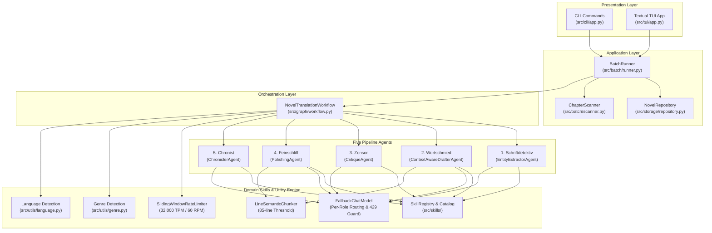
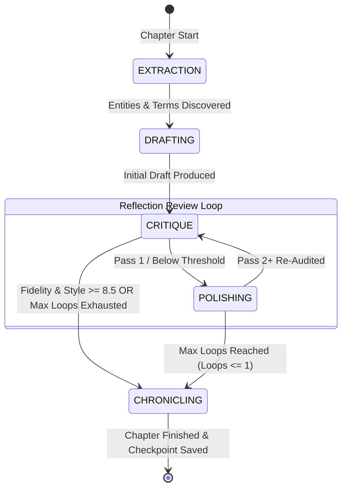

# AGENT.md: Operational Guide & Architectural Handbook for AI Agents

Welcome to **NouSetsu** (`novel_translation_Agent`). This document is the definitive technical handbook and operational guide for AI coding assistants, autonomous agents, and human contributors working on this codebase.

---

## 1. System Identity & Mission

**NouSetsu** is an enterprise-grade, document-level, cross-chapter literary translation framework for East Asian webnovels and light novels (Japanese, Chinese, Korean) into publication-quality literary English prose.

Unlike simplistic segment-by-segment machine translation systems, NouSetsu orchestrates five specialized agents within a cyclic **LangGraph** reflection review workflow. It maintains persistent series memory via a **Novel Bible**, enforces strict terminology and voice registers, adapts to genre tropes, and features built-in API quota protection and thread-safe cancellation.

---

## 2. Layered Architecture



---

## 3. The Five Pipeline Agents (German Designations)

Each agent in the pipeline is given an official German designation reflecting its precise literary role:

| Stage | German Codename | Agent Class | Source File | Core Responsibility |
|:---:|:---|:---|:---|:---|
| **1** | **Schriftdetektiv** | [`EntityExtractorAgent`](file:///D:/Code/novel_translation_Agent/src/agents/extractor.py) | `src/agents/extractor.py` | **The Detective**: Analyzes raw chapter text *before* translation to identify unknown character names, cultivate power realms, and discover terms not yet registered in the Novel Bible. |
| **2** | **Wortschmied** | [`ContextAwareDrafterAgent`](file:///D:/Code/novel_translation_Agent/src/agents/drafter.py) | `src/agents/drafter.py` | **The Wordsmith**: Produces the initial full translation draft, resolving zero-anaphora (omitted pronouns/subjects), applying distinct dialogue registers, and strictly using active glossary terms. |
| **3** | **Zensor** | [`CritiqueAgent`](file:///D:/Code/novel_translation_Agent/src/agents/critic.py) | `src/agents/critic.py` | **The Inspector**: Line-by-line auditor scoring fidelity and style (0–10), detecting skipped sentences (omissions), verifying glossary compliance, and writing actionable critique notes. |
| **4** | **Feinschliff** | [`PolishingAgent`](file:///D:/Code/novel_translation_Agent/src/agents/polisher.py) | `src/agents/polisher.py` | **The Stylist**: Rewrites drafted prose into publication-grade English, purging machine-translation tropes ("couldn't help but", "as expected of"), optimizing cadence, and enhancing emotional depth. |
| **5** | **Chronist** | [`ChroniclerAgent`](file:///D:/Code/novel_translation_Agent/src/agents/chronicler.py) | `src/agents/chronicler.py` | **The Memory Keeper**: Summarizes chapter events for rolling context, tracks character status shifts (injuries, deaths, breakthroughs), and compiles metadata audit records into `.novel/metadata.json`. |

---

## 4. LangGraph Multi-Pass Reflection Review Cycle



### Key Review Rules
1. **Pass 1 Transition**: The raw draft is audited by `Zensor`, which issues critique notes. `Feinschliff` polishes the text into the first candidate.
2. **Pass 2+ Re-Audit**: `Zensor` inspects the polished text directly against the raw source text.
3. **Quality Threshold Exit**: Both `fidelity_score >= 8.5` and `style_score >= 8.5` must be satisfied to trigger early exit.
4. **Best-Candidate Regression Guard**: If subsequent review passes score lower than an earlier pass, the system automatically retains the highest-scoring candidate (`best_polished_text` and `best_audit`).

---

## 5. Agent Skills Architecture (`src/skills/`)

The Agent Skills System provides modular, pluggable domain instructions that enhance agent capabilities without code modifications.

### Skill Data Model ([`src/skills/models.py`](file:///D:/Code/novel_translation_Agent/src/skills/models.py))
```python
class AgentSkill(BaseModel):
    name: str                  # Unique identifier (e.g. zero_anaphora_resolution)
    agent: str                 # Target: extractor, drafter, critic, polisher, chronicler, all
    title: str                 # Human-readable title
    description: str           # Short summary
    content: str               # Directives injected into agent system prompt
    languages: List[str]       # ["all"] or ["Japanese", "Chinese", "Korean"]
    genres: List[str]          # ["all"] or ["xianxia", "isekai", "litrpg", "romance"]
    priority: int              # Higher priority appears earlier in prompt (default: 100)
    enabled: bool              # Toggle switch (default: True)
    source: str                # "builtin" or "file:<filename>"
```

### Built-in Skills Catalog (17 Skills)
- **Extractor (`Schriftdetektiv`)**: `entity_disambiguation`, `cultivation_realm_extractor`, `relationship_mapper`.
- **Drafter (`Wortschmied`)**: `zero_anaphora_resolution`, `character_voice_differentiation`, `idiom_localization`, `litrpg_system_framing`.
- **Critic (`Zensor`)**: `omission_detector`, `glossary_enforcer`, `hallucination_guard`, `tone_consistency_auditor`.
- **Polisher (`Feinschliff`)**: `translationese_filter`, `prose_cadence_enhancer`, `show_dont_tell`, `dialogue_flow`.
- **Chronicler (`Chronist`)**: `lore_world_state_tracker`, `character_status_tracker`, `continuity_auditor`.

### Custom Markdown Skill Files ([`src/skills/catalog/`](file:///D:/Code/novel_translation_Agent/src/skills/catalog/))
Custom skills can be added simply by creating a `.md` file with YAML frontmatter in `src/skills/catalog/`:
```markdown
---
name: custom_skill_name
agent: drafter
title: Custom Skill Title
description: What this skill does
languages: ["Japanese", "Chinese", "all"]
genres: ["xianxia", "fantasy"]
priority: 85
---
### Custom Directives:
- Specific guidance injected directly into the agent system prompt.
```

### Smart Activation Engine
Active skills are dynamically filtered based on:
1. **Target Agent**: Matches agent name or `"all"`.
2. **Source Language**: Resolves against detected/configured language (`Japanese`, `Chinese`, `Korean`, or `"all"`).
3. **Novel Genre**: Resolves against configured or heuristically detected genre (`xianxia`, `isekai`, `litrpg`, `romance`, `general`).

---

## 6. Storage, State Machine & Checkpoints

```text
<project_root>/
├── .novel/
│   ├── config.yaml          # ProjectConfig (languages, paths, model, rate limits, genre)
│   ├── metadata.json        # Unified ProjectMetadataDocument with all chapter audits
│   ├── bible/
│   │   └── bible.yaml       # NovelBible (characters, glossary, style guide, genre)
│   ├── checkpoints/         # Stage checkpoint recovery files
│   └── summaries/           # ChapterSummary archives
├── raw_chapters/            # Raw novel files (e.g. 0001.txt)
└── translated_chapters/     # Final translated markdown outputs
```

### Lifecycle States
- `NONE` -> `EXTRACTION` -> `DRAFTING` -> `CRITIQUE` -> `POLISHING` -> `CHRONICLING` -> `COMPLETED`.
- If interrupted by the user or an unrecoverable error, the state transitions to `PAUSED` or `FAILED`.
- `StageArtifacts` (`extracted_terms`, `extracted_characters`, `draft_text`, `critique_notes`, `polished_text`) are serialized to disk, allowing resuming work immediately from the paused stage without re-extracting or re-drafting.

---

## 7. Rate Limiting, Safety & Threading

1. **Sliding Window Limiter** ([`src/utils/rate_limiter.py`](file:///D:/Code/novel_translation_Agent/src/utils/rate_limiter.py)):
   - Enforces a 60-second sliding window for 32,000 TPM and 60 RPM.
   - Rejects or delays calls exceeding capacity, calculating precise backoff sleep intervals until the window clears.
2. **Offline Token Estimator**:
   - Accurately counts CJK ideographs, Hangul syllables, Kana characters (1.3x token ratio) and Latin words (1.4x word-to-token ratio) in `<1ms`.
3. **Window Rollover Backoff & Automatic Model Fallback**:
   - Upstream HTTP 429 or `RESOURCE_EXHAUSTED` errors trigger `FallbackChatModel` failover from primary model (e.g. `gemini-3.1-flash-lite`) to designated fallback model (e.g. `gemini-3.5-flash-lite`).
   - Sleep intervals between 25s and 65s allow quota windows to rollover gracefully.
4. **Line-Based Semantic Chunking** ([`src/utils/chunker.py`](file:///D:/Code/novel_translation_Agent/src/utils/chunker.py)):
   - Chapters exceeding `chunk_threshold_lines` (default: 85 lines) are partitioned into ~70-line semantic chunks with 3-line overlap.
   - Drafter and Polisher process chunks sequentially with running context, preventing token truncation.
5. **Thread-Safe Cancellation**:
   - Supported via `threading.Event` across all worker threads.
   - Triggered via CLI `SIGINT` (Ctrl+C) or TUI `X` shortcut / button.
   - Raises `BatchStoppedException`, halting cleanly and saving `StageStatus.PAUSED` checkpoints.

---

## 8. Essential Developer & Agent Commands

All commands should be run using `uv`:

```bash
# Install / sync dependencies
uv sync

# Run complete test suite (107 tests across 21 modules)
uv run pytest

# Run specific test modules
uv run pytest tests/test_skills.py
uv run pytest tests/test_review_loop.py
uv run pytest tests/test_stop.py
uv run pytest tests/test_rate_limiter.py

# Initialize a new novel project
uv run python -m src.cli.app init --title "My Novel" --genre isekai --source-lang Japanese

# Run folder-to-folder batch translation
uv run python -m src.cli.app batch --limit 5 --genre xianxia

# Inspect registered domain skills
uv run python -m src.cli.app skills
uv run python -m src.cli.app skills --agent drafter --genre xianxia

# Launch the interactive Textual TUI dashboard
uv run python -m src.cli.app tui
```

---

## 9. Non-Negotiable Coding Standards for AI Agents

When modifying this repository, AI agents MUST adhere strictly to these conventions:

1. **Windows Console Encoding**:
   Always include UTF-8 console reconfiguration on Windows at application entry points:
   ```python
   if sys.platform == "win32":
       try:
           sys.stdout.reconfigure(encoding="utf-8")
           sys.stderr.reconfigure(encoding="utf-8")
       except Exception:
           pass
   ```
2. **UI Framework Preferences**:
   - For terminal output formatting, tables, and progress bars: ALWAYS use **Rich** (`rich.console`, `rich.table`, `rich.panel`, `rich.progress`).
   - For full-screen terminal interactive dashboards: ALWAYS use **Textual** (`textual.app`, `textual.containers`, `textual.widgets`).
3. **Pydantic v2 Compatibility**:
   - Use `model_validate(data)` instead of deprecated `parse_obj()`.
   - Use `model_dump()` instead of deprecated `dict()`.
4. **Deterministic Unit Testing**:
   - Never call external LLM APIs during unit tests.
   - Always utilize `MockNovelLLM` from `src.agents.llm` to provide deterministic, fixture-independent responses.
5. **Preserving Agent Signature Compatibility**:
   - Never remove existing keyword or positional arguments from agent methods (`extract`, `draft`, `evaluate`, `polish`, `chronicle`).
   - Mocks in existing tests may define explicit parameters (e.g. `mock_polish(draft_text, critique_notes, active_glossary, bible)`). Ensure all additions have defaults or are passed via the `bible` model to preserve backward compatibility.
6. **Thread Safety & Mutual Exclusion**:
   - Background tasks must respect `stop_event.is_set()` and sleep in small interruptible slices (e.g. `100ms`).
   - TUI operations must enforce mutual exclusion: only one batch worker thread may run at a time.
