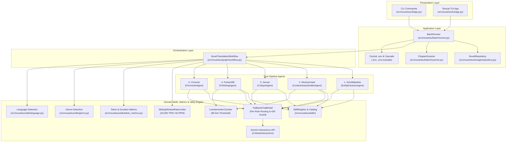
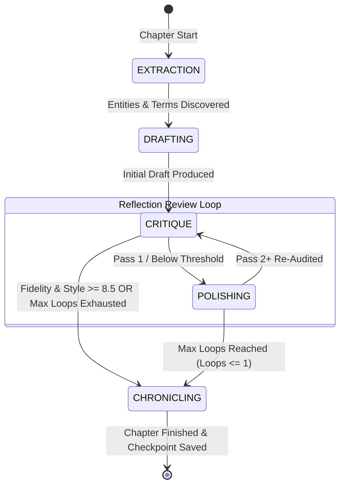

# AGENT.md: Operational Guide & Architectural Handbook for AI Agents

Welcome to **NouSetsu** (`novel_translation_Agent`). This document is the definitive technical handbook and operational guide for AI coding assistants, autonomous agents, and human contributors working on this codebase.

---

## 1. System Identity & Mission

**NouSetsu** is an enterprise-grade, document-level, cross-chapter literary translation framework for East Asian webnovels and light novels (Japanese, Chinese, Korean) into publication-quality literary English prose.

Unlike simplistic segment-by-segment machine translation systems, NouSetsu orchestrates five specialized agents within a cyclic **LangGraph** reflection review workflow. It maintains persistent series memory via a **Novel Bible**, enforces strict terminology and voice registers, adapts to genre tropes, and features built-in API quota protection and thread-safe cancellation.

---

## 2. Layered Architecture



---

## 3. The Five Pipeline Agents (German Designations)

Each agent in the pipeline is given an official German designation reflecting its precise literary role:

| Stage | German Codename | Agent Class | Production Model | Source File | Core Responsibility |
|:---:|:---|:---|:---|:---|:---|
| **1** | **Schriftdetektiv** | [`EntityExtractorAgent`](file:///D:/Code/novel_translation_Agent/src/nousetsu/agents/extractor.py) | `gemini-3.1-flash-lite` | `src/nousetsu/agents/extractor.py` | **The Detective**: Analyzes raw chapter text *before* translation to identify unknown character names, cultivate power realms, and discover terms not yet registered in the Novel Bible. |
| **2** | **Wortschmied** | [`ContextAwareDrafterAgent`](file:///D:/Code/novel_translation_Agent/src/nousetsu/agents/drafter.py) | `gemini-3.5-flash-lite` | `src/nousetsu/agents/drafter.py` | **The Wordsmith**: Produces the initial full translation draft, resolving zero-anaphora (omitted pronouns/subjects), applying distinct dialogue registers, and strictly using active glossary terms. |
| **3** | **Zensor** | [`CritiqueAgent`](file:///D:/Code/novel_translation_Agent/src/nousetsu/agents/critic.py) | `gemma-4-26b-a4b-it` | `src/nousetsu/agents/critic.py` | **The Inspector**: Line-by-line auditor scoring fidelity and style (0–10), detecting skipped sentences (omissions), verifying glossary compliance, and writing actionable critique notes. |
| **4** | **Feinschliff** | [`PolishingAgent`](file:///D:/Code/novel_translation_Agent/src/nousetsu/agents/polisher.py) | `gemini-3.5-flash-lite` | `src/nousetsu/agents/polisher.py` | **The Stylist**: Rewrites drafted prose into publication-grade English, purging machine-translation tropes ("couldn't help but", "as expected of"), optimizing cadence, and enhancing emotional depth. |
| **5** | **Chronist** | [`ChroniclerAgent`](file:///D:/Code/novel_translation_Agent/src/nousetsu/agents/chronicler.py) | `gemma-4-26b-a4b-it` | `src/nousetsu/agents/chronicler.py` | **The Memory Keeper**: Summarizes chapter events for rolling context, tracks character status shifts (injuries, deaths, breakthroughs), and compiles metadata audit records into `.novel/metadata.json`. |

> [!NOTE]
> Global fallback across all agent stages is anchored by `gemini-3.5-flash-lite`, activated automatically via `FallbackChatModel` when encountering HTTP 429 quota exhaustion or API exceptions.

---

## 4. LangGraph Multi-Pass Reflection Review Cycle



### Key Review Rules
1. **Pass 1 Transition**: The raw draft is audited by `Zensor`, which issues critique notes. `Feinschliff` polishes the text into the first candidate.
2. **Pass 2+ Re-Audit**: `Zensor` inspects the polished text directly against the raw source text.
3. **Quality Threshold Exit**: Both `fidelity_score >= 8.5` and `style_score >= 8.5` must be satisfied to trigger early exit.
4. **Best-Candidate Regression Guard**: If subsequent review passes score lower than an earlier pass, the system automatically retains the highest-scoring candidate (`best_polished_text` and `best_audit`).

---

## 5. Agent Skills Architecture (`src/nousetsu/skills/`)

The Agent Skills System provides modular, pluggable domain instructions that enhance agent capabilities without code modifications.

### Skill Data Model ([`src/nousetsu/skills/models.py`](file:///D:/Code/novel_translation_Agent/src/nousetsu/skills/models.py))
```python
class AgentSkill(BaseModel):
    name: str                  # Unique identifier (e.g. zero_anaphora_resolution)
    agent: str                 # Target: extractor, drafter, critic, polisher, chronicler, all
    title: str                 # Human-readable title
    description: str           # Short summary
    content: str               # Directives injected into agent system prompt
    languages: List[str]       # ["all"] or ["Japanese", "Chinese", "Korean"]
    genres: List[str]          # ["all"] or ["xianxia", "isekai", "litrpg", "romance"]
    priority: int              # Higher priority appears earlier in prompt (default: 100)
    enabled: bool              # Toggle switch (default: True)
    source: str                # "builtin" or "file:<filename>"
```

### Built-in Skills Catalog (20 Skills)
- **Extractor (`Schriftdetektiv`)**: `entity_disambiguation`, `cultivation_realm_extractor`, `relationship_mapper`.
- **Drafter (`Wortschmied`)**: `zero_anaphora_resolution`, `name_address_fidelity`, `character_voice_differentiation`, `idiom_localization`, `litrpg_system_framing`.
- **Critic (`Zensor`)**: `omission_detector`, `glossary_enforcer`, `hallucination_guard`, `nickname_disparity_auditor`, `tone_consistency_auditor`.
- **Polisher (`Feinschliff`)**: `translationese_filter`, `prose_cadence_enhancer`, `address_form_preservation`, `show_dont_tell`, `dialogue_flow`.
- **Chronicler (`Chronist`)**: `lore_world_state_tracker`, `character_status_tracker`, `continuity_auditor`.

### Custom Markdown Skill Files ([`src/nousetsu/skills/catalog/`](file:///D:/Code/novel_translation_Agent/src/nousetsu/skills/catalog/))
Custom skills can be added simply by creating a `.md` file with YAML frontmatter in `src/nousetsu/skills/catalog/`:
```markdown
---
name: custom_skill_name
agent: drafter
title: Custom Skill Title
description: What this skill does
languages: ["Japanese", "Chinese", "all"]
genres: ["xianxia", "fantasy"]
priority: 85
---
### Custom Directives:
- Specific guidance injected directly into the agent system prompt.
```

### Smart Activation Engine
Active skills are dynamically filtered based on:
1. **Target Agent**: Matches agent name or `"all"`.
2. **Source Language**: Resolves against detected/configured language (`Japanese`, `Chinese`, `Korean`, or `"all"`).
3. **Novel Genre**: Resolves against configured or heuristically detected genre (`xianxia`, `isekai`, `litrpg`, `romance`, `general`).

---

## 6. Storage, Configuration & Environment Cascade

```text
<project_root>/
├── .env                     # Central machine-level models, rate limits, API keys (gitignored)
├── .env.example             # Documented template for environment variables
├── pyproject.toml           # Project dependencies & console script (`nousetsu`)
├── .novel/                  # Project-specific metadata & cache (gitignored)
│   ├── config.yaml          # ProjectConfig (title, languages, paths, genre, chunking, review loops)
│   ├── metadata.json        # Unified ProjectMetadataDocument with all chapter audits & token stats
│   ├── bible/
│   │   └── bible.yaml       # NovelBible (characters, glossary, style guide, genre, whole_story_summary)
│   ├── checkpoints/         # Stage checkpoint recovery files
│   └── summaries/           # Chapter summaries and story arc archives
│       ├── arcs/            # Story Arc records (arc_0001.json, arc_0002.json)
│       └── <volume>/        # Folder-scoped ChapterSummary archives (e.g. summaries/Vol_01/)
├── raw_chapters/            # Raw novel files (e.g. 0001.txt)
└── translated_chapters/     # Final translated markdown outputs
```

### 3-Tier Hierarchical Narrative Memory (Macro > Meso > Micro)
To prevent narrative context drift over lengthy multi-hundred chapter novels, NouSetsu organizes memory into three distinct tiers:
1. **Macro Context (`whole_story_summary`)**: An overarching narrative synthesis of the entire novel so far, capturing long-term character goals, world state changes, and major power shifts.
2. **Meso Context (`ArcSummary`)**: Autonomous AI detection of story arc boundaries via `Chronist` (ChroniclerAgent). Tracks arc title, core conflict, milestones achieved, and active vs. completed status. Serialized into `.novel/summaries/arcs/arc_XXXX.json`. Upon story climax resolution (`arc_completed=true`), the arc is archived into `NovelBible.archived_arcs` and synthesized into the Macro summary.
3. **Micro Context (`ChapterSummary`)**: Immediate preceding chapter outcomes, cliffhangers, and character state changes (injuries, deaths, relationship shifts) scoped by volume folder.

### Multi-Folder & Cross-Volume Narrative Memory
For projects structured with multiple chapter folders (e.g. `Villainess_04`, `Villainess_05`):
- Chapter summaries are partitioned by folder (`.novel/summaries/<folder>/chapter_XXXX.json`) preventing collision.
- `get_rolling_context()` automatically backfills narrative summaries from preceding volumes when beginning a new folder/volume, providing unbroken rolling context to `Wortschmied` (Drafter) across volume boundaries.
- Context prompt entries display folder badges (e.g. `[Villainess_04] Chapter 122`) to disambiguate volume boundaries for LLM generation.

### 4-Tier Model Precedence Cascade
LLM model selection is decoupled from project storage. Project YAML files contain novel-specific metadata, while machine-level model choices reside in `.env`.
Every model lookup resolves through a strict four-tier precedence chain:
1. **CLI Flag / Constructor Argument**: Explicit runtime override (e.g. `--model`, `extractor_model=...`).
2. **Project Config Override**: Optional project-specific override in `.novel/config.yaml` (`cfg.model_name` or `cfg.<agent>_model`).
3. **Central `.env` Variable**: Machine-level configuration (`NOVEL_MODEL`, `NOVEL_FALLBACK_MODEL`, `NOVEL_EXTRACTOR_MODEL`, etc.).
4. **Built-in Safe Fallback**: Default model (`gemini-3.1-flash-lite`, `gemma-4-26b-a4b-it`).

### Token & Step Duration Analytics
NouSetsu tracks end-to-end token consumption and execution latency per pipeline step inside `.novel/metadata.json`:
- **Token Breakdown**: `prompt_tokens`, `completion_tokens`, `thought_tokens` (Gemini reasoning), and `cached_tokens`.
- **Duration Tracking**: `duration_seconds` per pipeline step, formatted into human-readable strings (`3.2s`, `1m 24s`, `2h 15m`).
- **Interactive TUI Analytics**: Press `M` or click `[📊 Tokens (M)]` in the TUI to access the dedicated Token Analysis dashboard featuring real-time KPI cards and interactive DataTables broken down by pipeline stage, LLM model, and chapter ranking.

### Lifecycle States
- `NONE` -> `EXTRACTION` -> `DRAFTING` -> `CRITIQUE` -> `POLISHING` -> `CHRONICLING` -> `COMPLETED`.
- If interrupted by the user or an unrecoverable error, the state transitions to `PAUSED` or `FAILED`.
- `StageArtifacts` (`extracted_terms`, `extracted_characters`, `draft_text`, `critique_notes`, `polished_text`) are serialized to disk, allowing resuming work immediately from the paused stage without re-extracting or re-drafting.

---

## 7. Rate Limiting, Safety & Performance

1. **Sliding Window Limiter** ([`src/nousetsu/utils/rate_limiter.py`](file:///D:/Code/novel_translation_Agent/src/nousetsu/utils/rate_limiter.py)):
   - Enforces a 60-second sliding window for 32,000 TPM and 60 RPM.
   - Rejects or delays calls exceeding capacity, calculating precise backoff sleep intervals until the window clears.
2. **Offline Token Estimator**:
   - Accurately counts CJK ideographs, Hangul syllables, Kana characters (1.3x token ratio) and Latin words (1.4x word-to-token ratio) in `<1ms`.
3. **Gemini Interactions API Integration** ([`src/nousetsu/agents/interactions.py`](file:///D:/Code/novel_translation_Agent/src/nousetsu/agents/interactions.py)):
   - Direct integration with Google's `/v1beta/interactions` endpoint for Gemini 3/2.5 models.
   - Captures granular `thought_tokens` and native interaction session tracking.
4. **Window Rollover Backoff & Automatic Model Fallback**:
   - Upstream HTTP 429 or `RESOURCE_EXHAUSTED` errors trigger `FallbackChatModel` failover from primary model (e.g. `gemini-3.1-flash-lite`) to designated fallback model (e.g. `gemini-3.5-flash-lite`).
   - Sleep intervals between 25s and 65s allow quota windows to rollover gracefully.
5. **Line-Based Semantic Chunking** ([`src/nousetsu/utils/chunker.py`](file:///D:/Code/novel_translation_Agent/src/nousetsu/utils/chunker.py)):
   - Chapters exceeding `chunk_threshold_lines` (default: 85 lines) are partitioned into ~70-line semantic chunks with 3-line overlap.
   - Drafter and Polisher process chunks sequentially with running context, preventing token truncation.
6. **Thread-Safe Cancellation**:
   - Supported via `threading.Event` across all worker threads.
   - Triggered via CLI `SIGINT` (Ctrl+C) or TUI `X` shortcut / button.
   - Raises `BatchStoppedException`, halting cleanly and saving `StageStatus.PAUSED` checkpoints.
7. **Hermetic Test Isolation & Mock Propagation**:
   - Test harness isolates `ProjectRegistry` via `NOVEL_REGISTRY_DIR` so tests never read or mutate host project configurations.
   - Models prefixed with `"mock"` or `"test"` automatically propagate across all five pipeline agent roles, eliminating live network calls and achieving a 27x test speedup (<17s for full test suite).

---

## 8. Essential Developer & Agent Commands

All commands should be run using `uv`:

```bash
# Install / sync dependencies
uv sync

# Run complete test suite (145 tests across 25 modules in ~18s)
uv run pytest

# Run specific test modules
uv run pytest tests/test_hierarchy_summary.py
uv run pytest tests/test_migration.py
uv run pytest tests/test_cross_folder_summaries.py
uv run pytest tests/test_model_env.py
uv run pytest tests/test_model_fallback.py
uv run pytest tests/test_tui.py
uv run pytest tests/test_skills.py
uv run pytest tests/test_review_loop.py
uv run pytest tests/test_stop.py
uv run pytest tests/test_rate_limiter.py

# Launch the interactive Textual TUI dashboard (default behavior on bare 'nousetsu')
uv run nousetsu
uv run nousetsu tui -p project/Villainess

# Inspect 3-tier hierarchical story memory (Whole Story > Arcs > Situation)
uv run nousetsu narrative -p project/Villainess

# Migrate legacy novel summaries to 3-tier hierarchy
uv run nousetsu migrate-summaries -p project/Villainess

# Inspect Procedural Graphs with Rich tree formatting (arXiv:2609.09153v1)
uv run nousetsu graph-info -a drafter

# Initialize a new novel project
uv run nousetsu init --title "The Villainess" --genre general --source-lang English --target-lang Thai

# Run folder-to-folder batch translation
uv run nousetsu batch --limit 5 --genre general

# Inspect registered domain skills
uv run nousetsu skills
uv run nousetsu skills --agent drafter --genre general
```

---

## 9. Non-Negotiable Coding Standards for AI Agents

When modifying this repository, AI agents MUST adhere strictly to these conventions:

1. **Windows Console Encoding**:
   Always include UTF-8 console reconfiguration on Windows at application entry points:
   ```python
   if sys.platform == "win32":
       try:
           sys.stdout.reconfigure(encoding="utf-8")
           sys.stderr.reconfigure(encoding="utf-8")
       except Exception:
           pass
   ```
2. **UI Framework Preferences**:
   - For terminal output formatting, tables, and progress bars: ALWAYS use **Rich** (`rich.console`, `rich.table`, `rich.panel`, `rich.progress`).
   - For full-screen terminal interactive dashboards: ALWAYS use **Textual** (`textual.app`, `textual.containers`, `textual.widgets`).
3. **Pydantic v2 Compatibility**:
   - Use `model_validate(data)` instead of deprecated `parse_obj()`.
   - Use `model_dump()` instead of deprecated `dict()`.
4. **Deterministic Unit Testing**:
   - Never call external LLM APIs during unit tests.
   - Always utilize `MockNovelLLM` from `nousetsu.agents.llm` to provide deterministic, fixture-independent responses.
5. **Preserving Agent Signature Compatibility**:
   - Never remove existing keyword or positional arguments from agent methods (`extract`, `draft`, `evaluate`, `polish`, `chronicle`).
   - Mocks in existing tests may define explicit parameters (e.g. `mock_polish(draft_text, critique_notes, active_glossary, bible)`). Ensure all additions have defaults or are passed via the `bible` model to preserve backward compatibility.
6. **Thread Safety & Mutual Exclusion**:
   - Background tasks must respect `stop_event.is_set()` and sleep in small interruptible slices (e.g. `100ms`).
   - TUI operations must enforce mutual exclusion: only one batch worker thread may run at a time.
7. **Hermetic Test Project Isolation**:
   - Tests must NEVER read or mutate host machine project files (`project/` or `~/.novel_agent/projects.json`).
   - The test fixture in `tests/conftest.py` automatically routes `NOVEL_REGISTRY_DIR` to a temporary directory.
   - Any test creating or testing `NovelRepository` or `NovelAgentApp` MUST pass `tmp_path` (e.g. `repo = NovelRepository(tmp_path)` and `app = NovelAgentApp(..., project_dir=tmp_path)`).
8. **Mock Model Naming for Tests**:
   - Unit and integration tests must configure model names starting with `"mock"` or `"test"` (e.g. `mock-model`).
   - `BatchRunner` and `NovelTranslationWorkflow` automatically detect mock prefixes and propagate them to all five sub-agent roles, eliminating live network calls and ensuring lightning-fast execution.
9. **Central Environment Model Precedence**:
   - Machine-level LLM models belong in `.env`.
   - `ProjectConfig` model fields default to `None` so novel projects cleanly inherit models from `.env`.
   - Project YAML files (`.novel/config.yaml`) should only store novel-specific metadata and explicit local overrides.
10. **Mandatory End-of-Task Git Commit & Push**:
    - AI agents MUST ALWAYS stage all modified/added files, create a clean conventional commit (e.g. `feat(...)`, `fix(...)`, `docs(...)`, `refactor(...)`), and push to `origin/main` at the conclusion of every task after all tests pass green.
    - Never leave completed task work uncommitted in the working tree.


