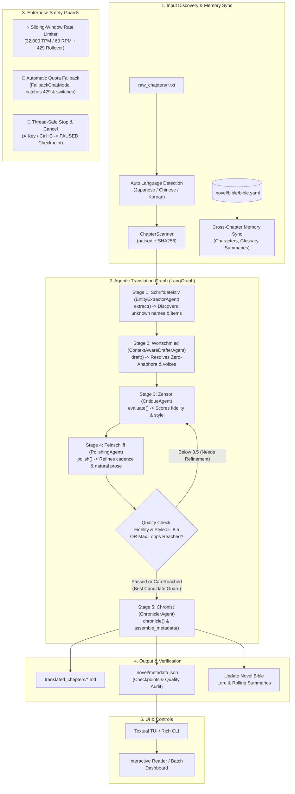

# 📖 NouSetsu - Novel Translation Agent

> **Agentic Document-Level Cross-Chapter Novel Translation System**  
> Powered by **LangGraph**, **LangChain**, **Textual**, and **Rich**.

[](https://www.python.org/)
[](https://github.com/astral-sh/uv)
[](https://github.com/langchain-ai/langgraph)
[](https://textual.textualize.io/)

---

## 🌟 Key Highlights

* **3-Tier Hierarchical Narrative Memory**: Maintains a persistent 3-tier narrative memory in the **Novel Bible**: Macro (**Whole Story Progression**) > Meso (**Story Arcs** via `ArcSummary` with autonomous boundary/milestone detection) > Micro (**Immediate Situation** via volume-partitioned `ChapterSummary`), eliminating long-term narrative drift and forgotten character goals.
* **Cross-Folder & Multi-Volume Continuous Memory**: Automatically detects volume sequences (`Villainess_04`, `Villainess_05`), partitioning chapter summaries into subfolders while automatically backfilling preceding summaries when entering a new volume. Injects volume badges (`[Villainess_04] Chapter 122`) to eliminate multi-volume numbering confusion.
* **Zero-Anaphora Resolution & Nickname Discipline**: Context-augmented drafting specifically designed for East Asian languages (Japanese, Chinese, Korean) where subjects, agents, and pronouns are omitted. Enforces strict name vs. nickname register discipline across Drafter, Critic, and Polisher agents to preserve author intent without arbitrary normalization.
* **Procedural Graph Steering & Offline Self-Evolution (arXiv:2609.09153v1)**: Encodes procedural execution rules into explicit attributed graphs $G = (V, R, E, \Phi)$ carrying `(condition, guidance, pitfalls)`. Uses deterministic code-level localization (< 100 prompt tokens) rather than expensive runtime guidance LLMs, while pruning conversational junk terms in extraction (-300 to -800 output tokens) and switching chunk states (Scene Init vs Boundary Continuity vs Name Discipline) in drafting. Self-evolves offline from critic audit reports with zero inference token cost. Inspectable via `nousetsu graph-info`.
* **Multi-Stage Agentic Pipeline & Functions**:
  | Stage | Agent (German Codename) | Primary Function | Plain-English Role & Purpose |
  |:---:|:---|:---|:---|
  | **1** | **EntityExtractorAgent**<br>*(Schriftdetektiv)* | `extract(source_text, bible, ...)` | **The Detective**: Scans raw text *before* translation to discover unknown character names, spells, and items with Procedural Graph steering and anti-bloat term pruning. |
  | **2** | **ContextAwareDrafterAgent**<br>*(Wortschmied)* | `draft(source_text, bible, ...)` | **The Wordsmith**: Writes the initial full translation, restoring omitted pronouns (*Zero-Anaphora*), enforcing nickname fidelity, and building 3-tier narrative context. |
  | **3** | **CritiqueAgent**<br>*(Zensor)* | `evaluate(source_text, draft_text, ...)` | **The Inspector**: Audits full-length chapters (up to 50k chars) against raw source text for fidelity (0-10), style (0-10), glossary compliance, and nickname disparity. |
  | **4** | **PolishingAgent**<br>*(Feinschliff)* | `polish(draft_text, critique_notes, ..., source_text)` | **The Stylist**: Rewrites draft prose into natural literary target-language fiction using critique notes and source text reference, preserving affectionate address forms and cadence. |
  | **5** | **Chronist**<br>*(ChroniclerAgent)* | `chronicle(...)`<br>`assemble_metadata(...)` | **The Memory Keeper**: Autonomously identifies story arc progression, summarizes chapter events, archives completed arcs, and compiles metadata audit records into `.novel/metadata.json`. |
* **Narrative Inspection & Summary Migration CLI**:
  - `nousetsu narrative`: Renders an interactive 3-tier Rich tree displaying Whole Story progression, active and completed story arcs with milestones, and chapter summaries.
  - `nousetsu migrate-summaries`: Seamlessly upgrades legacy flat summary novel projects to the 3-tier hierarchical system.
* **Decoupled Central `.env` Model Precedence**: LLM model configurations reside in `.env` (`NOVEL_MODEL`, `NOVEL_FALLBACK_MODEL`, `NOVEL_EXTRACTOR_MODEL`, etc.) with a clean 4-tier cascade: CLI flag -> Project Config override -> Central `.env` -> Built-in Safe Fallback (`gemini-3.1-flash-lite`, `gemma-4-26b-a4b-it`).
* **Gemini Interactions API & REST Fallback**: Seamless native support for the new `/v1beta/interactions` endpoint via Google GenAI SDK and HTTP REST fallback, enabling structured interaction steps and thought streaming.
* **Granular Per-Task & Per-Step Token Tracking & TUI Dashboard**: Complete token metrics (`input_tokens`, `output_tokens`, `thought_tokens`, `cached_tokens`, `total_tokens`) tracked for every chapter task and pipeline step. Press `M` in the TUI to access the dedicated **Token Analysis Dashboard** with real-time KPI cards and interactive DataTables.
* **Multi-Agent Per-Role Model Routing & Quota Fallback**: Route each pipeline agent to an optimal model (`extractor_model`, `drafter_model`, `critic_model`, `polisher_model`, `chronicler_model`) with automatic fallback on 429 quota exhaustion (`FallbackChatModel`).
* **Line-Based Semantic Chunking (Rate-Limit & TPM Guard)**: Intelligently partitions long chapters (>85 lines) into ~70-line chunks along scene breaks (`***`, `---`) and paragraph boundaries, passing 3-line sliding translation context to maintain character voice and eliminate 32k TPM sliding-window freezes.
* **Active Chapter Glossary Optimization**: Filters glossary terms to only those appearing in the active chapter, eliminating input prompt bloat and false-positive compliance warnings.
* **Domain Skills System (20 Built-in Skills + Markdown Catalogs)**: Automatically activates targeted literary guidelines (e.g. cultivation hierarchies, adventurer guild ranks, 4-character idiom localization, villainess court etiquette, nickname preservation) based on novel genre and source language.
* **Programmatic Language Anti-Regression Guards**: Enforces target-language integrity with offline Unicode script detection, immediately rejecting any model reversion back into source language.
* **Automated Critic-Polish Reflection Loop**: Automatically loops between `Feinschliff` and `Zensor` to refine prose until both fidelity and style meet strict quality thresholds (`>= 8.5/10`) or hit a configurable loop cap (default 3 loops). Includes an automatic **Best-Candidate Regression Guard** that always saves the highest-scoring version.
* **Proactive Sliding-Window Rate Limiter (32K TPM / 60 RPM)**: Dual quota management across a rolling 60-second window, backed by offline mixed CJK/Latin token estimation and 25s–65s window rollover cooldowns for Google API 429 quota exhaustion.
* **Automatic Source Language Detection**: Automatically recognizes Japanese Kanji/Kana, Korean Hangul, and Chinese Hanzi during chapter scanning, removing manual setup barriers.
* **Thread-Safe Graceful Stop & Resumption**: Cleanly pause or cancel batch processing via `X` shortcut / button in TUI or `SIGINT` (Ctrl+C) in CLI, saving mid-chapter checkpoints (`StageStatus.PAUSED`) without losing progress.
* **Single Project Metadata Checkpoints (`.novel/metadata.json`)**: All chapter checkpoints, error diagnostics, and quality audit metrics are centralized in a single project file, keeping translated folders clean while enabling instant 1-read directory scanning.
* **Transient Error Resilience & Backoff**: Exponential backoff retry absorbs Google `500 INTERNAL`, `503`, and `429` rate limits automatically with full stack trace diagnostics.
* **Folder-to-Folder Batch Automation**: Automatically discovers and naturally sorts chapters (`001.txt`, `ch2.txt`, `ch10.txt`), sequentially translates them while passing state, and skips unaltered completed chapters.
* **Minimalist Reactive Terminal UI (TUI)**: Distraction-free dashboard built with Textual and Rich, featuring an 85%+ height chapter list with minimal status glyphs (`✓`, `●`, `⏸`, `✕`, `·`), a compact 2-row bottom toolbar (`[▶ Trans] [⚡ Batch] [⏹ Stop]`, `[📖 Bible] [📁 Proj] [✨ New] [⚙ Set]`), an 80% reading viewport, a 4-line progress strip with live active chapter progress (`📖 {chapter} [████░░░░] 50%`), a 5-line checkpoint inspector with human-friendly duration formatting, and an in-terminal Novel Bible editor.
* **Official Pip Package (`nousetsu`)**: Packaged with PyPA standards with console scripts `nousetsu` and `novel` that automatically open the interactive TUI when launched with no arguments.

---

## 🏛️ Architecture & Workflow



---

## 🚀 Quick Start

> [!TIP]
> 📖 **Looking for the complete manual?** Check out the comprehensive [**NouSetsu User Guide**](./doc/user_guide.md) for step-by-step TUI navigation, headless batch translation, Novel Bible customization, and troubleshooting!

### 1. Prerequisites
* Python `>= 3.13`
* Optional: [uv](https://github.com/astral-sh/uv) fast package manager

### 2. Installation
You can install NouSetsu globally into your Python environment:

```bash
# Clone the repository
git clone https://github.com/Checkmartyr/NouSetsu.git
cd NouSetsu

# Install via pip
pip install .

# Or install via uv
uv pip install .
```

Once installed, simply run `nousetsu` or `novel` directly in your terminal!

### 3. Configure API Key
Set your Gemini API key (or OpenAI / Anthropic key):
```powershell
# Windows PowerShell
$env:GEMINI_API_KEY = "your-google-gemini-api-key"

# Linux / macOS
export GEMINI_API_KEY="your-google-gemini-api-key"
```
*(Note: If no API key is set, the system automatically runs with a deterministic mock model for testing and offline development).*

---

## 💻 Usage & CLI Reference

NouSetsu can be run via the installed console commands (`nousetsu` or `novel`) or through `uv run`:

### 🖥️ Automatic Interactive TUI (Default)
Simply run `nousetsu` (or `novel`) in your terminal with no arguments:
```bash
nousetsu
```
> [!TIP]
> Executing `nousetsu` without subcommands automatically launches the interactive **Textual TUI dashboard**! If a registered or current project exists, it is loaded immediately; otherwise, the project selector modal opens ready for you to create or pick a novel project.

### 1. Initialize a Project
Create project directories and generate the default **Novel Bible**:
```bash
nousetsu init --title "Ascendance of a Bookworm" --source-lang "English" --target-lang "Thai"
```

### 2. Run Automated Folder-to-Folder Batch
Place raw chapter files (`.txt` or `.md`) inside `raw_chapters/` and run:
```bash
nousetsu batch --input-dir raw_chapters --output-dir translated_chapters
```

**CLI Flags**:
* `--input-dir`, `-i`: Folder containing raw source chapters (default: `raw_chapters`).
* `--output-dir`, `-o`: Folder for translated output and metadata (default: `translated_chapters`).
* `--source-lang`: Source language (default: `English`, or auto-detected).
* `--target-lang`: Target language (default: `Thai`).
* `--model`, `-m`: Default LLM model name (default: `gemini-3.1-flash-lite`).
* `--fallback-model`: Global fallback LLM model name (default: `gemini-3.5-flash-lite`).
* `--extractor-model`: Model override for Entity Extractor Agent (default: `gemini-3.1-flash-lite`).
* `--drafter-model`: Model override for Context-Aware Drafter Agent (default: `gemini-3.5-flash-lite`).
* `--critic-model`: Model override for Critique Agent (default: `gemma-4-26b-a4b-it`).
* `--polisher-model`: Model override for Prose Polisher Agent (default: `gemini-3.5-flash-lite`).
* `--chronicler-model`: Model override for Chronicler Agent (default: `gemma-4-26b-a4b-it`).
* `--limit`, `-l`: Maximum number of chapters to process.
* `--force`, `-f`: Force re-translation even if chapter is already marked completed.
* `--max-loops`: Maximum review reflection loops per chapter (default: 3, bounds: 1–5).
* `--quality-threshold`: Target quality score (fidelity & style) to exit review loop early (default: 8.5).
* `--max-tpm`: Max tokens per minute rate limit quota (default: 32000).
* `--max-rpm`: Max requests per minute rate limit quota (default: 60).
* `--interactions / --no-interactions`: Enable or disable Gemini Interactions API (`/v1beta/interactions`) with REST fallback (default: True).
* `--chunking / --no-chunking`: Enable or disable line-based semantic chunking for long chapters (default: True).
* `--chunk-threshold-lines`: Line threshold to trigger chunking (default: 85).
* `--target-chunk-lines`: Target line count per chunk (default: 70).
* `--auto-update-bible / --no-auto-update-bible`: Automatically merge new characters and terms into Novel Bible.

### 3. List & Filter Agent Skills
```bash
nousetsu skills
nousetsu skills --agent drafter --genre isekai
```

### 4. Explicit TUI Launch
```bash
nousetsu tui --input-dir raw_chapters --output-dir translated_chapters
```

#### TUI Minimal Dashboard Toolbar & Keyboard Shortcuts
The minimal dashboard docks action buttons into a compact 2-row toolbar below the chapter list:
* **Row 1 (Translation Controls)**: `[▶ Trans (T)]`, `[⚡ Batch (B)]`, `[⏹ Stop (X)]`
* **Row 2 (Project Management)**: `[📖 Bible (E)]`, `[📁 Proj (P)]`, `[✨ New (N)]`, `[⚙ Set (S)]`

| Key | Action | Description |
|:---:|:---|:---|
| `T` | **Translate Selected** | Run agentic translation on currently selected chapter |
| `B` | **Run All Batch** | Trigger background batch translation across all chapters |
| `X` | **Stop Translation** | Gracefully halt active translation and save pause checkpoint |
| `P` | **Projects** | Open Project Selector modal to switch active project |
| `N` | **New Project** | Open Initialize Project modal with title, languages & folder names |
| `E` | **Novel Bible** | Open in-terminal editor to inspect/add characters & terms |
| `S` | **Settings** | Configure model routing, fallback models, rate limits, and chunking |
| `R` | **Refresh** | Re-scan chapters and reload status badges |
| `Q` | **Quit** | Exit the TUI application |

---

## 📑 Single Project Metadata & Error Checkpoints (`.novel/metadata.json`)

All chapter translation checkpoints, stage artifacts, fine-grained token usage, and quality audit records are consolidated into a single project metadata file (`.novel/metadata.json`), ensuring translated output directories stay clean and uncluttered:

```json
{
  "project_id": "default_project",
  "version": 1,
  "updated_at": "2026-09-11T05:30:00Z",
  "chapters": {
    "001 - Awakening": {
      "chapter_id": "chapter_0001",
      "chapter_num": 1,
      "source_file": "raw_chapters/001 - Awakening.txt",
      "source_sha256": "eedc16a0eb6762e6e6dd859709f82586f15905907363ed5506fcfdc068a85d30",
      "output_file": "translated_chapters/001 - Awakening.md",
      "model": "gemini-2.5-pro",
      "checkpoint": {
        "status": "completed",
        "last_completed_stage": "chronicling",
        "retry_count": 0,
        "last_error": null,
        "failed_stage": null,
        "error_logs": []
      },
      "stats": {
        "source_char_count": 166,
        "target_word_count": 22,
        "duration_seconds": 0.01,
        "total_tokens": 1284,
        "input_tokens": 820,
        "output_tokens": 364,
        "thought_tokens": 100,
        "cached_tokens": 0,
        "step_usage": [
          {"stage": "extraction", "step_name": "Extraction", "iteration": 1, "duration_seconds": 0.45, "usage": {"input_tokens": 150, "output_tokens": 50, "thought_tokens": 0, "cached_tokens": 0, "total_tokens": 200}},
          {"stage": "drafting", "step_name": "Drafting", "iteration": 1, "duration_seconds": 1.20, "usage": {"input_tokens": 220, "output_tokens": 120, "thought_tokens": 0, "cached_tokens": 0, "total_tokens": 340}},
          {"stage": "critique", "step_name": "Critique (Pass 1)", "iteration": 1, "duration_seconds": 0.85, "usage": {"input_tokens": 200, "output_tokens": 74, "thought_tokens": 50, "cached_tokens": 0, "total_tokens": 324}},
          {"stage": "polishing", "step_name": "Polishing (Pass 1)", "iteration": 1, "duration_seconds": 1.10, "usage": {"input_tokens": 180, "output_tokens": 80, "thought_tokens": 50, "cached_tokens": 0, "total_tokens": 310}},
          {"stage": "chronicling", "step_name": "Chronicling", "iteration": 1, "duration_seconds": 0.35, "usage": {"input_tokens": 70, "output_tokens": 40, "thought_tokens": 0, "cached_tokens": 0, "total_tokens": 110}}
        ]
      },
      "quality_audit": {
        "fidelity_score": 9.5,
        "style_score": 9.2,
        "glossary_compliance_pct": 100.0,
        "warnings": [],
        "passed": true
      }
    }
  }
}
```

---

## 🧪 Verification & Walkthrough Summary

The system is continuously verified through comprehensive unit, integration, UI, and domain skill tests:

### 1. Test Suite Execution
```bash
uv run pytest
```
Output:
```
============================= test session starts =============================
platform win32 -- Python 3.13.12, pytest-9.1.1, pluggy-1.6.0
rootdir: D:\Code\novel_translation_Agent
configfile: pyproject.toml
plugins: anyio-4.15.1, langsmith-0.12.4, asyncio-1.4.0
collected 145 items

tests\test_checkpoint.py ....                                            [  2%]
tests\test_chunker.py ......                                             [  6%]
tests\test_cross_folder_summaries.py ........                            [ 12%]
tests\test_drafter_chunking.py .                                         [ 13%]
tests\test_formatting.py .....                                           [ 16%]
tests\test_glossary_filter.py ..                                         [ 17%]
tests\test_hierarchy_summary.py .....                                    [ 21%]
tests\test_interactions.py ......                                        [ 25%]
tests\test_language.py ...........                                       [ 33%]
tests\test_migration.py ...                                              [ 35%]
tests\test_model_env.py .....                                            [ 38%]
tests\test_model_fallback.py ........                                    [ 44%]
tests\test_models.py ...                                                 [ 46%]
tests\test_multi_folder.py ....                                          [ 48%]
tests\test_polisher_language.py .......                                  [ 53%]
tests\test_procedural_graph.py .....                                     [ 57%]
tests\test_projects.py ....                                              [ 60%]
tests\test_rate_limiter.py ........                                      [ 65%]
tests\test_retry.py ....                                                 [ 68%]
tests\test_review_loop.py ......                                         [ 72%]
tests\test_runner.py ...                                                 [ 74%]
tests\test_scanner.py ..                                                 [ 75%]
tests\test_skills.py ............                                        [ 84%]
tests\test_step_duration.py ...                                          [ 86%]
tests\test_stop.py ..                                                    [ 87%]
tests\test_token_metrics.py ...                                          [ 89%]
tests\test_token_tracking.py ....                                        [ 92%]
tests\test_tui.py ...........                                            [100%]
============================ 145 passed in 17.75s =============================
```

### 2. End-to-End Batch Validation
Sample raw chapters processed through `nousetsu batch`:
* Translation Markdown created (`.md`) without polluting output directories.
* Checkpoints saved centrally to `.novel/metadata.json`.
* Memory committed to `.novel/bible/bible.yaml` with updated narrative summaries.
* Subsequent runs demonstrated instant skip-logic when source files were unchanged:
  ```
  Skipped (Done): Ch.2 (002 - Magic Beast.txt) ------------------- 100% 0:00:00
  ```
* Textual TUI headless pilot tests confirmed widget mounting, reactive status badges, modal escape dismissal, and dual-pane synchronization.

---

## 📚 Technical Documentation & Deep Dives

In-depth technical architecture, developer references, and end-user guides are located in the [**`doc/`**](./doc/README.md) directory:

| Guide | Link | Focus Area |
| :--- | :--- | :--- |
| **End-User Guide** | [**`doc/user_guide.md`**](./doc/user_guide.md) | Complete manual: installation, auto-launch TUI, headless batch, Novel Bible, skills, and safety guards. |
| **Workflow Pipeline** | [**`doc/workflow.md`**](./doc/workflow.md) | LangGraph stages, state machine, sequence diagrams, and retry backoff. |
| **Agents Deep Dive** | [**`doc/agents_deep_dive.md`**](./doc/agents_deep_dive.md) | In-depth breakdown of all 5 specialized agents: cognitive roles, prompts, chunking, and safety guards. |
| **System Architecture** | [**`doc/architecture.md`**](./doc/architecture.md) | Layer design, component boundaries, and clean architecture data flow. |
| **Novel Bible & Memory** | [**`doc/novel_bible.md`**](./doc/novel_bible.md) | Zero-anaphora pronoun resolution, character voice preservation, and style guides. |
| **Storage & Checkpoints** | [**`doc/storage_and_checkpoints.md`**](./doc/storage_and_checkpoints.md) | Single metadata document (`.novel/metadata.json`), error logs, and mid-run resumption. |
| **Terminal UI Guide** | [**`doc/tui_guide.md`**](./doc/tui_guide.md) | Dual Reader, live visualizer, Novel Bible editor, project manager, and keybindings. |
| **Developer API Reference** | [**`doc/api_reference.md`**](./doc/api_reference.md) | Class signatures, methods, and Pydantic schemas. |

---

## 📂 Project Structure

```
NouSetsu/
├── doc/                            # Comprehensive technical documentation & user guide
│   ├── README.md                   # Documentation index
│   ├── user_guide.md               # End-user manual (TUI, CLI, Novel Bible, Skills)
│   ├── workflow.md                 # LangGraph pipeline and agent stages
│   ├── agents_deep_dive.md         # In-depth architectural guide for all 5 pipeline agents
│   ├── architecture.md             # System architecture and layer design
│   ├── novel_bible.md              # Zero-anaphora, 3-tier memory, and Novel Bible guide
│   ├── storage_and_checkpoints.md  # Single metadata, arc storage, and checkpoints
│   ├── tui_guide.md                # Textual TUI user guide, token analytics, and shortcuts
│   └── api_reference.md            # Developer API reference
├── .novel/                         # Project metadata and persistent memory
│   ├── config.yaml                 # Project configuration (languages, raw/out folders)
│   ├── metadata.json               # Consolidated chapter checkpoints & audit stats
│   ├── bible/
│   │   └── bible.yaml              # Characters, glossary, style guide, whole story summary
│   └── summaries/
│       ├── arcs/                   # Story arc JSON archives (arc_0001.json, arc_0002.json)
│       └── <volume>/               # Folder-scoped episodic chapter summaries (chapter_0001.json)
├── raw_chapters/                   # Input folder for source chapters
│   ├── 001 - Awakening.txt
│   └── 002 - Magic Beast.txt
├── translated_chapters/            # Clean output folder for translations
│   ├── 001 - Awakening.md
│   └── 002 - Magic Beast.md
├── src/nousetsu/                   # Standard PyPA package layout
│   ├── agents/                     # LLM agent stages (extractor, drafter, critic, polisher, chronicler)
│   ├── batch/                      # Folder scanner, natural sorter, batch runner
│   ├── cli/                        # CLI command dispatch (nousetsu, novel)
│   ├── graph/                      # LangGraph state graph workflow
│   ├── models/                     # Pydantic schemas (bible, metadata, state, config)
│   ├── prompts/                    # Translation and critique prompt templates
│   ├── skills/                     # Domain skills registry, loader, and models
│   │   ├── builtin/                # 20 built-in agent domain skills
│   │   └── catalog/                # Custom markdown skill catalogs (*.md)
│   ├── storage/                    # File repository, registry, migration, and persistence handlers
│   ├── tui/                        # Textual TUI app and inspection widgets
│   │   ├── widgets/                # Reader, Inspector, ProgressPanel, Modals, Token Analytics
│   │   └── app.py                  # Main Textual App
│   └── utils/                      # Utilities (language detector, sliding window rate limiter)
├── tests/                          # Automated pytest suite (145 tests across 25 modules)
├── main.py                         # Root entry point
├── pyproject.toml                  # Dependencies, hatchling build config, console scripts
└── README.md                       # Repository overview and quickstart
```

---

## 📄 License
MIT License. Built for fiction lovers and novel translation communities.
