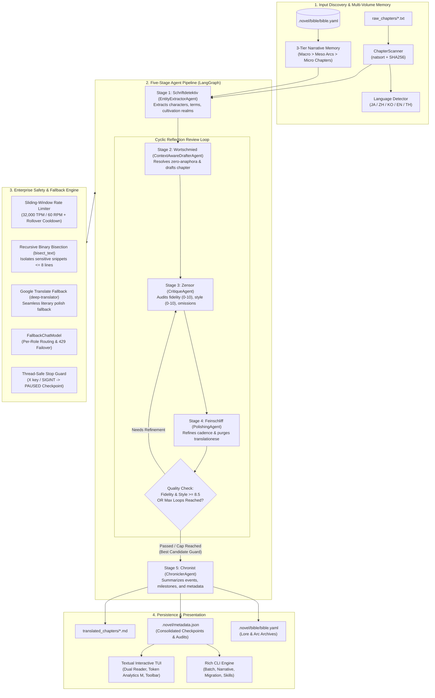

# 📖 NouSetsu (濃説 / 脳説)

> **Enterprise-Grade Document-Level Multi-Agent Literary Translation Framework for East Asian Webnovels**  
> *Powered by LangGraph, LangChain, Textual, and Rich.*

[](https://www.python.org/)
[](https://github.com/Checkmartyr/NouSetsu)
[](https://github.com/astral-sh/uv)
[](https://github.com/langchain-ai/langgraph)
[](https://textual.textualize.io/)
[](https://github.com/Checkmartyr/NouSetsu)
[](LICENSE)

---

## ⚔️ The Challenge: Why Traditional MT & Raw LLMs Fail

Translating Japanese, Chinese, and Korean webnovels and light novels into publication-quality English is notoriously difficult. Sentence-by-sentence machine translation tools (DeepL, Google Translate) and naive single-prompt LLM pipelines suffer from fatal literary flaws:

| Challenge | Traditional MT (Google / DeepL) | Raw Single-Prompt LLM | 📖 NouSetsu Multi-Agent Framework |
| :--- | :--- | :--- | :--- |
| **Zero-Anaphora** *(Omitted Pronouns)* | ❌ Guesses blindly; randomly swaps character genders ("he" vs "she"). | ⚠️ Frequently hallucinates subjects or flips narrative point of view. | ✅ **Wortschmied (Drafter)** resolves omitted subjects via dynamic scene context and character profiles. |
| **Series Memory & Continuity** | ❌ Zero memory across sentences or chapters. | ⚠️ Context window overflow; forgets plot progression after 2 chapters. | ✅ **3-Tier Narrative Memory** (Macro Whole-Story > Meso Arcs > Micro Chapters) persists throughout the series. |
| **AI Safety Blocks** *(Sensory / Action)* | ❌ Hard failures or redacted snippets. | ❌ Monolithic HTTP 400 rejection halts the entire translation batch. | ✅ **Recursive Binary Bisection Engine** isolates sensitive lines ($\le 8$ lines) with Google Translate fallback. |
| **Prose Quality & Cadence** | ❌ Rigid word-for-word translationese ("couldn't help but", "as expected of"). | ⚠️ Inconsistent register; characters sound identical. | ✅ **Feinschliff (Polisher)** refines sentence cadence, emotional resonance, and aristocratic court registers. |
| **Terminology Consistency** | ❌ Spells martial arts ranks and items differently every 3 paragraphs. | ⚠️ Drifts across long batches; forgets canonical spellings. | ✅ **Novel Bible** and **Active Chapter Glossary Filter** strictly enforce terminology without prompt bloat. |
| **Quality Verification** | ❌ No quality feedback or verification. | ❌ What the model outputs on pass 1 is all you get. | ✅ **Zensor (Critic)** reflection review loop scores fidelity/style ($\ge 8.5/10$) with **Best-Candidate Guard**. |
| **API Quota & Cost Protection** | ❌ None; user must manage quotas manually. | ❌ Constant HTTP 429 quota exhaustion on long chapters. | ✅ **32K TPM / 60 RPM Sliding Window Limiter** + Automatic Failover + Line-Based Semantic Chunking. |

---

## 🏛️ The 5-Stage Agent Assembly Line

NouSetsu models the translation workflow as a collaborative literary publishing house. Each stage is assigned a specialized AI agent with a distinct cognitive role:

| Stage | Codename | Agent Class | Production Model | Core Responsibility |
| :---: | :--- | :--- | :--- | :--- |
| **1** | **Schriftdetektiv** | [`EntityExtractorAgent`](file:///D:/Code/novel_translation_Agent/src/nousetsu/agents/extractor.py) | `gemini-3.1-flash-lite` | **The Detective**: Scans raw source text *before* drafting to identify unknown character names, cultivate power realms, and discover terms not yet registered in the Novel Bible. Steered by Procedural Graphs to prune conversational junk vocabulary. |
| **2** | **Wortschmied** | [`ContextAwareDrafterAgent`](file:///D:/Code/novel_translation_Agent/src/nousetsu/agents/drafter.py) | `gemini-3.5-flash-lite` | **The Wordsmith**: Produces the initial full translation draft, resolving zero-anaphora (omitted pronouns/subjects), applying distinct dialogue registers, and injecting 3-tier narrative context across chapter and volume boundaries. |
| **3** | **Zensor** | [`CritiqueAgent`](file:///D:/Code/novel_translation_Agent/src/nousetsu/agents/critic.py) | `gemma-4-26b-a4b-it` | **The Inspector**: Line-by-line auditor scoring fidelity and style (0–10), detecting skipped sentences (omissions), verifying glossary compliance, auditing nickname disparities, and providing actionable critique notes. |
| **4** | **Feinschliff** | [`PolishingAgent`](file:///D:/Code/novel_translation_Agent/src/nousetsu/agents/polisher.py) | `gemini-3.5-flash-lite` | **The Stylist**: Rewrites drafted prose into publication-grade target fiction, purging machine-translation tropes ("couldn't help but", "as expected of"), optimizing prose cadence, and enhancing emotional depth while preserving address forms. |
| **5** | **Chronist** | [`ChroniclerAgent`](file:///D:/Code/novel_translation_Agent/src/nousetsu/agents/chronicler.py) | `gemma-4-26b-a4b-it` | **The Memory Keeper**: Autonomously tracks story arc progression, summarizes chapter events, detects character state shifts (injuries, deaths, breakthroughs), and compiles metadata audit records into `.novel/metadata.json`. |

> 📘 *For the exhaustive technical breakdown of every agent file and method signature, see the [Agent Architecture Deep Dive](docs/architecture/agents_deep_dive.md).*

---

## 🌟 Key Architectural Innovations

### 1. 🧠 3-Tier Hierarchical Narrative Memory (Macro > Meso > Micro)
To eliminate context drift over multi-hundred chapter epics, NouSetsu structures narrative memory into three distinct tiers inside the **Novel Bible**:
* **Macro Context (`whole_story_summary`)**: Global narrative synthesis capturing long-term character motivations, overarching conflicts, and major world state changes.
* **Meso Context (`ArcSummary`)**: Autonomous AI detection of story arc boundaries by `Chronist`. Tracks arc titles, core conflicts, and milestones. Serialized to `.novel/summaries/arcs/arc_XXXX.json`. Completed arcs are archived into the Novel Bible and synthesized into the Macro context.
* **Micro Context (`ChapterSummary`)**: Immediate preceding chapter outcomes, cliffhangers, and character state changes partitioned by volume folder (`.novel/summaries/<volume>/chapter_XXXX.json`). Seamlessly backfills context across volume transitions (`Villainess_04` $\to$ `Villainess_05`) with volume badges.

### 2. 🛡️ Dual-Resilience AI Safety Engine (Recursive Bisection & Fallback)
Novel translations frequently trigger commercial AI safety classifiers (e.g. Google AI `prohibited_content` HTTP 400) on intense action scenes or romantic intimacy. NouSetsu features a dual-resilience defense:
* **Analytical Task Framing**: Automatically envelopes novel excerpts in explicit literary analytical framing across all five pipeline agents, eliminating false-positive safety triggers.
* **Recursive Binary Bisection (`bisect_text`)**: If an LLM safety block occurs, the system bisects the text chunk along natural paragraph, line, or sentence boundaries. Safe halves are translated with full LLM literary prose, while only the isolated minimal sensitive sub-block ($\le 8$ lines) triggers a seamless **Google Translate fallback** (`deep-translator`) with subsequent literary polishing.

### 3. 🎭 Procedural Graph Steering & Self-Evolution (arXiv:2609.09153v1)
NouSetsu encodes procedural execution rules as explicit attributed graphs $G = (V, R, E, \Phi)$ carrying `(condition, guidance, pitfalls)`:
* **Zero Runtime Guidance LLM Tokens**: Uses deterministic code-level localization (< 100 prompt tokens) instead of expensive runtime guidance LLMs.
* **Anti-Bloat Term Pruning**: Prevents the Extractor from generating common conversational vocabulary, saving **300 to 800 output tokens** per chapter.
* **Offline Self-Evolution**: System refines graph edges from critique audit traces offline with zero live inference token overhead. Inspectable anytime via `nousetsu graph-info`.

### 4. 🔄 LangGraph Reflection Review Loop & Best-Candidate Guard
* **Automated Reflection Loop**: `Zensor` and `Feinschliff` enter a multi-pass review loop, refining prose until both fidelity and style meet quality thresholds (`>= 8.5/10`) or reach the configured loop limit.
* **Best-Candidate Regression Guard**: If a subsequent polishing pass scores lower than an earlier candidate, NouSetsu automatically retains the highest-scoring candidate (`best_polished_text` and `best_audit`), preventing quality degradation.

### 5. ⚡ Enterprise Quota Throttling & Per-Role Routing
* **Sliding-Window Rate Limiter**: Proactively enforces a rolling 60-second window across **32,000 TPM** and **60 RPM** with offline CJK/Latin token estimation.
* **Per-Role Model Routing & Failover**: Assign specialized models to each agent role (`extractor_model`, `drafter_model`, `critic_model`, `polisher_model`, `chronicler_model`). Any upstream HTTP 429 quota exhaustion triggers instant failover to `fallback_model` (`gemini-3.5-flash-lite`) via `FallbackChatModel` with 25s–65s window rollover cooldowns.
* **Line-Based Semantic Chunking**: Chapters exceeding 85 lines are intelligently partitioned into ~70-line semantic chunks with 3-line boundary overlap, eliminating 32k TPM window freezes.

### 6. 🖥️ Reactive Terminal User Interface (Textual + Rich)
* **Distraction-Free Dashboard**: Features an 85%+ height chapter list with clean minimal status glyphs (`✓` done, `●` running, `⏸` paused, `✕` failed, `·` waiting), a compact 2-row toolbar, and an 80% reading viewport with dual original/translated panes.
* **Real-Time Token & Duration Analytics**: Press `M` to access the dedicated **Token Analysis Dashboard** with live KPI cards and interactive DataTables broken down by pipeline stage, LLM model, and chapter duration.

### 7. 🔍 Hybrid Search RAG Knowledge Store & Cross-Encoder Reranking
* **Zero-Daemon Local Store**: Powered by SQLite FTS5 (BM25 lexical ranking) and dense 3072-dimensional vectors from **Gemini Embedding 2** (`models/gemini-embedding-2`), managed via **SQLAlchemy 2.0 ORM**.
* **High-Precision Cross-Encoder**: Combines sparse and dense candidates via Reciprocal Rank Fusion (RRF, $k=60$) and reranks them with an LLM Cross-Encoder (`LLMCrossEncoderReranker`).
* **Bi-Directional Pipeline Integration**: Injects episodic lore into `Wortschmied` (Drafter) and canonical TM references into `Zensor` (Critic), while `Chronist` (Chronicler) cross-references prior lore and automatically embeds/indexes completed summaries and scene chunks.

---

## 🏛️ System Architecture



---

## 🚀 Quick Start

### 1. Installation
Install NouSetsu directly via `pip` or `uv`:

```bash
# Clone the repository
git clone https://github.com/Checkmartyr/NouSetsu.git
cd NouSetsu

# Install in editable mode with uv (recommended)
uv pip install -e .

# Or install with standard pip
pip install -e .
```

### 2. Configure Environment & API Keys
Set your Gemini API key (or configure your central `.env` file):

```bash
# Central machine-level .env file (recommended)
cp .env.example .env
# Edit .env and set GEMINI_API_KEY=your-api-key

# Or export in your shell
export GEMINI_API_KEY="your-google-gemini-api-key"        # Linux / macOS
$env:GEMINI_API_KEY = "your-google-gemini-api-key"       # Windows PowerShell
```

> [!NOTE]
> If no API key is supplied, NouSetsu automatically operates with a deterministic offline mock model (`mock-novel-llm`), enabling testing of UI navigation, batch scanning, and checkpoint resumption without consuming API tokens!

### 3. Launch
Launch the interactive Terminal User Interface (TUI) simply by running:

```bash
nousetsu
```
*(Or use the shorthand alias `novel`).*

---

## 💻 Command-Line Interface (CLI) Reference

NouSetsu provides a comprehensive suite of subcommands for headless automation, narrative inspection, and skill management:

### Subcommands Overview

| Command | Description | Example Usage |
| :--- | :--- | :--- |
| `nousetsu` | Automatically launches interactive Textual TUI dashboard | `nousetsu` |
| `nousetsu --version` | Displays current version (`nousetsu 0.2.0`) | `nousetsu -v` |
| `nousetsu init` | Initializes a new novel project, directory structure, and Novel Bible | `nousetsu init -t "My Novel" -s Japanese -T English` |
| `nousetsu batch` | Headless folder-to-folder batch translation with natural sorting | `nousetsu batch -p project/Villainess -F Villainess_05` |
| `nousetsu narrative` | Renders interactive 3-tier narrative memory tree (Macro > Meso > Micro) | `nousetsu narrative -p project/Villainess` |
| `nousetsu migrate-summaries` | Upgrades legacy flat summaries into 3-tier story arc hierarchies | `nousetsu migrate-summaries -p project/Villainess` |
| `nousetsu skills` | Lists and filters active domain skills by agent, language, or genre | `nousetsu skills --agent drafter --genre xianxia` |
| `nousetsu graph-info` | Visualizes procedural execution graphs and name discipline directives | `nousetsu graph-info --agent drafter --verbose` |
| `nousetsu tui` | Explicitly launches the Textual TUI with path overrides | `nousetsu tui -p project/Villainess` |

### Batch Translation Options (`nousetsu batch`)

```bash
nousetsu batch [OPTIONS]
```

| Option | Flag | Default | Description |
| :--- | :---: | :---: | :--- |
| `--project-dir` | `-p` | `.` | Root path to the novel project directory |
| `--volume` | `-F` | `None` | Target specific volume subfolder (e.g. `Villainess_05`) |
| `--chapter` | `-c` | `None` | Filter and translate a specific chapter (e.g. `48`, `"ch 48"`, `"048"`) |
| `--limit` | `-l` | `None` | Maximum number of chapters to process in this run |
| `--force` | `-f` | `False` | Force re-translation even if chapter is already marked completed |
| `--source-lang` | `-s` | `English` | Source language (auto-detected if East Asian script is detected) |
| `--target-lang` | `-T` | `Thai` | Target language for publication-quality output |
| `--model` | `-m` | `.env` | Primary LLM model override (defaults to `NOVEL_MODEL` in `.env`) |
| `--fallback-model` | | `.env` | Fallback LLM model override (defaults to `NOVEL_FALLBACK_MODEL`) |
| `--extractor-model` | | `None` | Dedicated model override for Stage 1 (Schriftdetektiv) |
| `--drafter-model` | | `None` | Dedicated model override for Stage 2 (Wortschmied) |
| `--critic-model` | | `None` | Dedicated model override for Stage 3 (Zensor) |
| `--polisher-model` | | `None` | Dedicated model override for Stage 4 (Feinschliff) |
| `--chronicler-model`| | `None` | Dedicated model override for Stage 5 (Chronist) |
| `--max-loops` | | `3` | Maximum review reflection loops (bounds: 1–5) |
| `--quality-threshold`| | `8.5` | Target quality score (fidelity & style) to trigger early exit |
| `--max-tpm` | | `32000` | Rate limiter tokens-per-minute quota |
| `--max-rpm` | | `60` | Rate limiter requests-per-minute quota |
| `--chunking / --no-chunking` | | `True` | Enable/disable line-based semantic chunking for long chapters |
| `--chunk-threshold-lines` | | `85` | Line threshold to trigger semantic chunking |

---

## ⌨️ Textual TUI Controls & Shortcuts

The interactive Textual TUI provides complete operational control from inside your terminal:

```text
┌─ NouSetsu v0.2.0 ───────────────────────────────────────────────┐
│ 📁 Project: Villainess (Villainess_05)   🌐 English ➔ Thai       │
├───────────────────────────────┬─────────────────────────────────┤
│ Chapter List                  │ Dual Reader View                │
│ ✓ 046_Chapter 46.txt          │ Original Source (Left)          │
│ ✓ 047_Chapter 47.txt          │ Translated Literary Prose (Right│
│ ● 048_Chapter 48.txt          │                                 │
│ · 049_Chapter 49.txt          │                                 │
├───────────────────────────────┴─────────────────────────────────┤
│ 📖 Ch.48 [██████████░░░░░░░░░░] 50% Stage: Polishing (Pass 1)   │
├─────────────────────────────────────────────────────────────────┤
│ [▶ Trans (T)] [⚡ Batch (B)] [⏹ Stop (X)] [📊 Tokens (M)] [📁 Vol (F)] │
│ [📖 Bible (E)] [🗂 Proj (P)]  [✨ New (N)] [⚙ Settings (S)] [🚪 Quit (Q)]│
└─────────────────────────────────────────────────────────────────┘
```

| Key | Action | Description |
| :---: | :--- | :--- |
| `T` | **Translate Selected** | Run agentic pipeline on the currently highlighted chapter |
| `B` | **Run All Batch** | Start asynchronous batch translation across all pending chapters |
| `X` | **Stop Translation** | Safely halt active batch and save clean `PAUSED` checkpoint |
| `M` | **Token Analytics** | Open dedicated Token & Latency dashboard with KPIs and tables |
| `F` | **Volume Switcher** | Switch active volume subfolder within multi-folder projects |
| `P` | **Projects** | Open Project Selector modal to switch active novel projects |
| `N` | **New Project** | Initialize a new novel project with custom title and languages |
| `E` | **Novel Bible** | Open in-terminal editor to inspect/add characters and terms |
| `S` | **Settings** | Configure LLM models, rate limits, and chunking parameters |
| `R` | **Refresh** | Re-scan chapter files and reload status badges |
| `Q` | **Quit** | Exit the TUI application |

---

## 📂 Project Structure & Layout

```text
NouSetsu/
├── .env                            # Central machine-level model routing & API keys
├── pyproject.toml                  # Hatchling package build & console scripts
├── CHANGELOG.md                    # Release history following Keep a Changelog
├── README.md                       # Repository overview and quickstart
├── doc/                            # Comprehensive technical documentation hub
│   ├── README.md                   # Documentation index & quick navigation
│   ├── user_guide.md               # Complete end-user manual (CLI, TUI, Bible, Skills)
│   ├── workflow.md                 # LangGraph pipeline and agent stages
│   ├── agents_deep_dive.md         # In-depth architectural guide for all 5 pipeline agents
│   ├── architecture.md             # System architecture, layer design, and utilities
│   ├── novel_bible.md              # 3-tier narrative memory and Novel Bible guide
│   ├── storage_and_checkpoints.md  # Single metadata, arc storage, and checkpoints
│   ├── tui_guide.md                # Textual TUI user guide, token analytics, and shortcuts
│   └── api_reference.md            # Developer API reference
├── .novel/                         # Project metadata and persistent memory
│   ├── config.yaml                 # Project configuration (languages, paths, loop caps)
│   ├── metadata.json               # Consolidated chapter checkpoints & audit stats
│   ├── bible/
│   │   └── bible.yaml              # Novel Bible (Characters, glossary, whole story summary)
│   └── summaries/
│       ├── arcs/                   # Meso-tier story arc JSON archives (arc_0001.json)
│       └── <volume>/               # Micro-tier folder-scoped chapter summaries
├── raw_chapters/                   # Input folder for raw source chapters (*.txt, *.md)
├── translated_chapters/            # Clean output folder for translated markdown (*.md)
├── src/nousetsu/                   # Core Python package
│   ├── agents/                     # Five pipeline agents (extractor, drafter, critic, polisher, chronicler)
│   ├── batch/                      # Chapter scanner, natural sorter, and batch runner
│   ├── cli/                        # CLI command dispatch (nousetsu, novel)
│   ├── graph/                      # LangGraph state machine & procedural graph engine
│   ├── models/                     # Pydantic schemas (bible, metadata, state, config)
│   ├── prompts/                    # Translation and critique prompt templates
│   ├── skills/                     # Domain skills registry, loader, and 20 built-in skills
│   ├── storage/                    # Repository, project registry, and summary migrator
│   ├── tui/                        # Textual TUI dashboard, reader, and token analytics
│   └── utils/                      # Utilities (rate limiter, chunker, language detector, fallback)
└── tests/                          # Comprehensive pytest test suite (199 tests across 31 modules)
```

---

## 🧪 Verification & Automated Testing

NouSetsu is verified continuously through a hermetic, deterministic test suite:

```bash
# Run entire test suite using uv
uv run --no-sync pytest
```

```text
============================= test session starts =============================
platform win32 -- Python 3.13.12, pytest-9.1.1, pluggy-1.6.0
rootdir: D:\Code\novel_translation_Agent
configfile: pyproject.toml
collected 199 items

tests\test_checkpoint.py ....                                            [  2%]
tests\test_chunker.py ......                                             [  5%]
tests\test_cross_folder_summaries.py ........                            [  9%]
tests\test_drafter_chunking.py .                                         [  9%]
tests\test_formatting.py .....                                           [ 12%]
tests\test_glossary_filter.py ..                                         [ 13%]
tests\test_hierarchy_summary.py .....                                    [ 15%]
tests\test_interactions.py ......                                        [ 18%]
tests\test_language.py ...........                                       [ 24%]
tests\test_migration.py ...                                              [ 25%]
tests\test_model_env.py .....                                            [ 28%]
tests\test_model_fallback.py ........                                    [ 32%]
tests\test_models.py ...                                                 [ 33%]
tests\test_multi_folder.py ....                                          [ 35%]
tests\test_polisher_language.py .......                                  [ 39%]
tests\test_procedural_graph.py .....                                     [ 41%]
tests\test_projects.py ....                                              [ 43%]
tests\test_rate_limiter.py ........                                      [ 47%]
tests\test_recursive_subdivision.py ......................               [ 58%]
tests\test_retry.py ....                                                 [ 60%]
tests\test_review_loop.py ......                                         [ 63%]
tests\test_runner.py .....                                               [ 66%]
tests\test_safety_blocks.py ............                                 [ 72%]
tests\test_scanner.py ..                                                 [ 73%]
tests\test_skills.py ............                                        [ 79%]
tests\test_step_duration.py ...                                          [ 80%]
tests\test_stop.py ..                                                    [ 81%]
tests\test_token_metrics.py ...                                          [ 83%]
tests\test_token_tracking.py ....                                        [ 85%]
tests\test_translation_fallback.py ..................                    [ 94%]
tests\test_tui.py ...........                                            [100%]

============================ 199 passed in 17.40s =============================
```

* **Hermetic Isolation**: Tests run in isolated temporary directories (`tmp_path`), protecting your real novel projects.
* **Deterministic Execution**: Zero live LLM calls during tests via `MockNovelLLM`, achieving ultra-fast execution (~17s for 199 tests).

---

## 📚 Technical Documentation Hub

For deep architectural analyses, developer guides, and end-user documentation, visit the [`doc/`](file:///D:/Code/novel_translation_Agent/doc/) directory:

| Document | Focus Area |
| :--- | :--- |
| [**User Guide**](file:///D:/Code/novel_translation_Agent/doc/user_guide.md) | Complete end-user manual: TUI navigation, CLI batch, Novel Bible, and custom skills. |
| [**Workflow Pipeline**](file:///D:/Code/novel_translation_Agent/doc/workflow.md) | LangGraph stages, sequence diagrams, reflection review loop, and state machine. |
| [**Agents Deep Dive**](file:///D:/Code/novel_translation_Agent/doc/agents_deep_dive.md) | In-depth breakdown of all 5 specialized agents, prompt templates, and cognitive roles. |
| [**System Architecture**](file:///D:/Code/novel_translation_Agent/doc/architecture.md) | Layer design, component boundaries, and clean architecture data flow. |
| [**Novel Bible & Memory**](file:///D:/Code/novel_translation_Agent/doc/novel_bible.md) | 3-tier narrative memory, zero-anaphora subject inference, and style guides. |
| [**Storage & Checkpoints**](file:///D:/Code/novel_translation_Agent/doc/storage_and_checkpoints.md) | Consolidated `.novel/metadata.json`, story arc storage, and paused state resumption. |
| [**Terminal UI Guide**](file:///D:/Code/novel_translation_Agent/doc/tui_guide.md) | Dual reader, live progress visualizer, Token Analytics dashboard, and keyboard shortcuts. |
| [**Developer API Reference**](file:///D:/Code/novel_translation_Agent/doc/api_reference.md) | Class signatures, methods, Pydantic schemas, and extension points. |

---

## 📄 License
Distributed under the **MIT License**. Built with passion for fiction lovers, translation communities, and autonomous AI agents.
