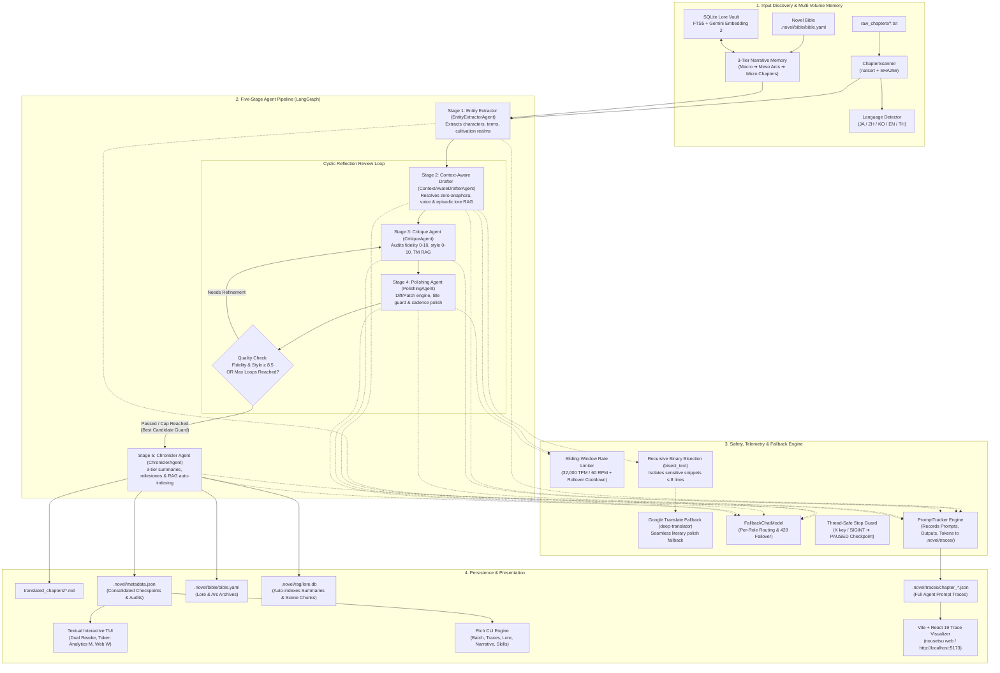

# 📖 NouSetsu (濃説 / 脳説)

> **Document-Level Multi-Agent Novel Translation Framework for East Asian Webnovels**  
> *Powered by LangGraph, LangChain, SQLite Hybrid RAG, Textual, and React 19.*

[](https://www.python.org/)
[](https://github.com/astral-sh/uv)
[](https://github.com/langchain-ai/langgraph)
[](https://textual.textualize.io/)
[](web/)
[](tests/)
[](LICENSE)

<p align="center">
  
</p>

<p align="center">
  <strong>NouSetsu Modern Web Studio (React 19 + Vite)</strong>: High-performance browser environment featuring automated batch translation, volume folder switching, live streaming SSE execution logs, forensic prompt &amp; thought trace auditing, side-by-side diff comparison, and distraction-free literary reading.
  <br>
  <code>nousetsu web</code> &bull; <em>Default: http://localhost:5173</em> &bull; 
  <a href="#modern-web-studio--trace-visualizer-react-19--vite">Explore Full Web Studio Capabilities &rarr;</a>
</p>

---

## 📑 Table of Contents
- [Executive Overview](#-executive-overview)
- [The Problem: Why Naive Machine Translation Fails](#-the-problem-why-naive-machine-translation-fails)
- [The 5-Stage Agent Assembly Line](#-the-5-stage-agent-assembly-line)
- [Key Architectural Innovations](#-key-architectural-innovations)
- [System Architecture](#-system-architecture)
- [Quick Start](#-quick-start)
- [Command-Line Interface (CLI) Reference](#-command-line-interface-cli-reference)
- [Interactive Interfaces: TUI & Web Studio](#-interactive-interfaces-tui--web-studio)
- [Project Layout](#-project-layout)
- [Automated Testing & Quality Verification](#-automated-testing--quality-verification)
- [Technical Documentation Hub](#-technical-documentation-hub)
- [License](#-license)

---

## 🎯 Executive Overview

**NouSetsu** is an autonomous, cross-chapter literary translation and adaptation engine designed specifically for Japanese, Chinese, and Korean webnovels and light novels.

Translating literary long-form prose is substantially more complex than converting isolated sentences. Traditional machine translation (Google Translate, DeepL) and naive single-prompt LLM wrappers degrade quickly over multi-hundred chapter novels—swapping character genders, losing running plot context, hallucinating dropped pronouns, dropping chapter headers, and getting halted by commercial AI safety blocks.

NouSetsu orchestrates five specialized agents within a cyclic **LangGraph** reflection review workflow. It maintains persistent cross-chapter narrative memory via a 3-tier **Novel Bible**, enforces strict terminology and distinct character voice registers, adapts to genre tropes with pluggable domain skills, and features built-in API quota protection and thread-safe cancellation.

---

## ⚔️ The Problem: Why Naive Machine Translation Fails

| Dimension | Traditional MT (Google / DeepL) | Naive Single-Prompt LLM | 📖 NouSetsu Multi-Agent Framework |
| :--- | :--- | :--- | :--- |
| **Zero-Anaphora** *(Omitted Pronouns)* | ❌ Guesses blindly; randomly swaps genders ("he" vs "she"). | ⚠️ Frequently hallucinates subjects or flips narrative point of view. | ✅ **Context-Aware Drafter** resolves omitted subjects via dynamic scene context and character profiles. |
| **Series Memory & Continuity** | ❌ Zero memory across sentences or chapters. | ⚠️ Context overflow; forgets prior plot and relationships after 2 chapters. | ✅ **3-Tier Narrative Memory** (Macro Whole-Story > Meso Arcs > Micro Chapters) persists across volumes. |
| **AI Safety Blocks** *(Action / Romance)* | ❌ Hard failures or redacted snippets. | ❌ Monolithic HTTP 400 rejection halts the entire translation batch. | ✅ **Recursive Binary Bisection Engine** isolates sensitive lines ($\le 8$ lines) with graceful fallback. |
| **Prose Quality & Cadence** | ❌ Rigid translationese ("couldn't help but", "as expected of"). | ⚠️ Inconsistent register; all characters sound identical. | ✅ **Polishing Agent** refines cadence, emotional resonance, and distinct dialogue registers with search/replace diff patches. |
| **Terminology Consistency** | ❌ Spells martial ranks, names, and items differently each chapter. | ⚠️ Drifts across long batches; forgets canonical spellings. | ✅ **Novel Bible** and **Scene Glossary Filter** strictly enforce canonical terminology without prompt bloat. |
| **Compound Name Resolution** | ❌ Fails to match given names when characters have full/compound names. | ⚠️ Re-extracts duplicates (`サフィナ` vs `サフィナ・カルシャナ`). | ✅ **Sub-Component Regex Matching** & programmatic extractor deduplication prevent identity drift. |
| **Quality Verification** | ❌ No quality verification or scoring. | ❌ Single-pass generation with uncorrected omissions. | ✅ **Critique Agent** reflection review loop scores fidelity and style ($\ge 8.5/10$) with **Best-Candidate Guard**. |
| **Quota & Rate Limiting** | ❌ None; user must handle quota exhaustion manually. | ❌ Constant HTTP 429 quota failure on long chapters. | ✅ **32K TPM / 60 RPM Sliding Window Limiter** + automatic failover + line-based semantic chunking. |

---

## 🏛️ The 5-Stage Agent Assembly Line

NouSetsu structures translation as a collaborative literary publishing house. Each stage is executed by a specialized AI agent with a strictly defined cognitive responsibility:

| Stage | Agent Role | Agent Class | Production Model | Core Responsibility |
| :---: | :--- | :--- | :--- | :--- |
| **1** | **Entity Extractor** | [`EntityExtractorAgent`](file:///D:/Code/novel_translation_Agent/src/nousetsu/agents/extractor.py) | `gemini-3.1-flash-lite` | **The Detective**: Analyzes raw source text *before* drafting to discover unknown characters, cultivate power realms, and identify terms not yet registered in the Novel Bible. Steered by Procedural Graphs to prune conversational noise. |
| **2** | **Context-Aware Drafter** | [`ContextAwareDrafterAgent`](file:///D:/Code/novel_translation_Agent/src/nousetsu/agents/drafter.py) | `gemini-3.5-flash-lite` | **The Wordsmith**: Produces the initial full translation draft, resolving zero-anaphora (omitted pronouns/subjects), applying distinct dialogue registers, and injecting 3-tier narrative context across chapter and volume boundaries. |
| **3** | **Critique Agent** | [`CritiqueAgent`](file:///D:/Code/novel_translation_Agent/src/nousetsu/agents/critic.py) | `gemma-4-26b-a4b-it` | **The Inspector**: Line-by-line auditor scoring fidelity and style (0–10), detecting skipped sentences (omissions), verifying glossary compliance, auditing nickname disparities, and generating actionable critique notes. |
| **4** | **Polishing Agent** | [`PolishingAgent`](file:///D:/Code/novel_translation_Agent/src/nousetsu/agents/polisher.py) | `gemini-3.5-flash-lite` | **The Stylist**: Rewrites drafted prose into publication-grade target fiction, purging machine-translation tropes, optimizing cadence, preserving address forms, and utilizing Diff/Patch block replacement for minimal token consumption. |
| **5** | **Chronicler Agent** | [`ChroniclerAgent`](file:///D:/Code/novel_translation_Agent/src/nousetsu/agents/chronicler.py) | `gemma-4-26b-a4b-it` | **The Memory Keeper**: Autonomously tracks story arc boundaries, summarizes chapter events, detects character state shifts (injuries, deaths, breakthroughs), reconciles provisional terms, and compiles metadata audit records into `.novel/metadata.json`. |

> [!NOTE]
> Global fallback across all pipeline stages is anchored by `gemini-3.5-flash-lite`, activated automatically via `FallbackChatModel` when encountering HTTP 429 quota exhaustion or API exceptions.

---

## 🌟 Key Architectural Innovations

### 1. 🧠 3-Tier Hierarchical Narrative Memory (Macro > Meso > Micro)
To eliminate context drift over multi-hundred chapter epics, NouSetsu structures narrative memory into three distinct tiers inside the **Novel Bible**:
* **Macro Context (`whole_story_summary`)**: Global narrative synthesis capturing overarching conflicts, long-term character motivations, and major world state changes.
* **Meso Context (`ArcSummary`)**: Autonomous AI detection of story arc boundaries by the Chronicler Agent. Tracks arc titles, core conflicts, and milestones. Serialized to `.novel/summaries/arcs/arc_XXXX.json`. Completed arcs are archived into the Novel Bible and synthesized into the Macro context.
* **Micro Context (`ChapterSummary`)**: Immediate preceding chapter outcomes, cliffhangers, and character state changes partitioned by volume folder (`.novel/summaries/<volume>/chapter_XXXX.json`). Seamlessly backfills context across volume transitions (`Vol_04` $\to$ `Vol_05`) with volume badges.

### 2. 🛡️ Dual-Resilience AI Safety Engine (Recursive Bisection & Fallback)
Novel translations frequently trigger commercial AI safety classifiers (e.g. Google AI `prohibited_content` HTTP 400) on intense action scenes or romantic intimacy. NouSetsu features a dual-resilience defense:
* **Analytical Task Framing**: Automatically envelopes novel excerpts in explicit literary analytical framing across all five pipeline agents, eliminating false-positive safety triggers.
* **Recursive Binary Bisection (`bisect_text`)**: If an LLM safety block occurs, the system bisects the text chunk along natural paragraph, line, or sentence boundaries. Safe halves are translated with full LLM literary prose, while only the isolated minimal sensitive sub-block ($\le 8$ lines) triggers a seamless **Google Translate fallback** (`deep-translator`) with subsequent literary polishing.
* **Stateful Subdivision Pattern Memory**: Caches verified safe partition boundaries so downstream `CritiqueAgent` and `PolishingAgent` reuse the cached subdivision pattern without repeating bisection.

### 3. 🎭 Procedural Graph Steering & Self-Evolution (arXiv:2609.09153v1)
NouSetsu encodes procedural execution rules as explicit attributed graphs $G = (V, R, E, \Phi)$ carrying `(condition, guidance, pitfalls)`:
* **Zero Runtime Guidance LLM Tokens**: Uses deterministic code-level localization (< 100 prompt tokens) instead of expensive runtime guidance LLMs.
* **Anti-Bloat Term Pruning**: Prevents the Extractor from generating common conversational vocabulary, saving **300 to 800 output tokens** per chapter.
* **Offline Self-Evolution**: System refines graph edges from critique audit traces offline with zero live inference token overhead via `nousetsu learn-graph`.

### 4. 🔄 LangGraph Reflection Review Loop & Best-Candidate Guard
* **Automated Reflection Loop**: The Critique Agent and Polishing Agent enter a multi-pass review loop, refining prose until both fidelity and style meet quality thresholds (`>= 8.5/10`) or reach the configured loop limit.
* **Best-Candidate Regression Guard**: If a subsequent polishing pass scores lower than an earlier candidate, NouSetsu automatically retains the highest-scoring candidate (`best_polished_text` and `best_audit`), preventing quality degradation.

### 5. 🔍 Hybrid Search RAG Knowledge Store & Cross-Encoder Reranking
* **Zero-Daemon Local Store**: Powered by SQLite FTS5 (BM25 lexical ranking) and dense 3072-dimensional vectors from **Gemini Embedding 2** (`models/gemini-embedding-2`), managed via **SQLAlchemy 2.0 ORM**.
* **High-Precision Cross-Encoder**: Combines sparse and dense candidates via Reciprocal Rank Fusion (RRF, $k=60$) and reranks them with an LLM Cross-Encoder (`LLMCrossEncoderReranker`).
* **Bi-Directional Pipeline Integration**: Injects episodic lore into the Context-Aware Drafter and canonical TM references into the Critique Agent, while the Chronicler Agent cross-references prior lore and automatically embeds/indexes completed summaries and scene chunks.

### 6. ⚡ Enterprise Quota Throttling & Per-Role Routing
* **Sliding-Window Rate Limiter**: Proactively enforces a rolling 60-second window across **32,000 TPM** and **60 RPM** with offline CJK/Latin token estimation.
* **Per-Role Model Routing & Failover**: Assign specialized models to each agent role (`extractor_model`, `drafter_model`, `critic_model`, `polisher_model`, `chronicler_model`). Any upstream HTTP 429 quota exhaustion triggers instant failover to `fallback_model` (`gemini-3.5-flash-lite`) via `FallbackChatModel` with 25s–65s window rollover cooldowns.
* **Line-Based Semantic Chunking**: Chapters exceeding 800 lines are intelligently partitioned into ~400-line semantic chunks with 3-line boundary overlap, eliminating 32k TPM window freezes.

### 7. 📊 Diff / Patch Polishing Engine & Title Preservation
* **Diff / Patch Polishing**: Generates targeted search/replace block patches (`PATCH_POLISHING_SYSTEM_PROMPT`) via [`apply_search_replace_patches`](file:///D:/Code/novel_translation_Agent/src/nousetsu/utils/diff_patcher.py) rather than re-generating whole chapters from scratch, dramatically reducing polisher token consumption.
* **Automatic Title Preservation**: Skill directives and programmatic regex guards prevent the polisher from dropping chapter headings.

### 8. 🛡️ Bible Language Integrity & Sanitization Engine
* **Comprehensive Multi-Pass Sanitization**: [`sanitize_bible`](file:///D:/Code/novel_translation_Agent/src/nousetsu/storage/bible_sanitizer.py) strictly enforces language purity in `.novel/bible/bible.yaml`, eliminating mixed-language pollution, duplicate character profiles, and corrupted glossary terms.
* **Consonant-Skeleton & Thai Accent Normalization**: Uses Katakana-to-Romaji conversion and Thai tone-mark stripping (`strip_thai_accents`) to canonicalize relationship and pronoun keys, matching variants like `แมรี เลกาเลีย` to `แมรี่ เลกาเลีย` and `Klaus` to `เคลาส์`.
* **Automated Persistence Guard**: Integrated directly into [`NovelRepository.save_bible`](file:///D:/Code/novel_translation_Agent/src/nousetsu/storage/repository.py), ensuring every bible write automatically merges variants, purges non-CJK source glossary terms, and translates relationship values and voices into literary target prose.

### 9. 🔍 Script-Aware Compound Name Filtering & Extractor Deduplication
* **Sub-Component Regex Matching**: Splits full character names by East Asian delimiters (`[・·\s/_\-]+`) so characters referenced only by given names (e.g. `サフィナ` from `サフィナ・カルシャナ`) remain in the active scene roster.
* **Programmatic Candidate Deduplication**: Prevents `EntityExtractorAgent` from re-extracting characters already present in the Novel Bible or matching compound sub-names.
* **Auto-Alias Population**: Registers compound name parts into character aliases, preserving canonical names without overwriting them.

### 10. 📁 Centralized Projects Root (`NOVEL_PROJECTS_DIR`) & High-Speed Scanner
* **Storage Decoupling**: Central machine-level `NOVEL_PROJECTS_DIR` in `.env` decouples novel projects from application code, automatically discovering projects across subdirectories.
* **Parallel Chapter Scanner**: `ChapterScanner.scan_parallel` leverages `ThreadPoolExecutor` and composite cache keys `(path, size, mtime)` for **320x faster project re-scanning**.
* **Dedicated Scan CLI**: `nousetsu scan` enables fast terminal inspection of chapter queues, completion status, and volume breakdowns across single or multiple projects (`--all-projects`).

### 11. 🎨 Interactive Web Studio, Chapter Upload & Character Visualizer
* **Multi-Folder Chapter Upload**: Web Studio API endpoint (`/api/projects/{name}/chapters/upload`) enables dragging and dropping raw chapters into target volume folders with live indexing.
* **Interactive Character Visualizer**: Visual dossiers, relationship maps, and personality/voice analysis cards for Novel Bible characters.
* **Diff Viewer**: Compares initial draft text directly against polished prose, omitting intermediate extraction traces for clear revision tracking.

### 12. 🌐 Automated Web Novel Chapter Scraper Integration (`modules/novel_scraper`)
* **Headless Online Fiction Ingestion**: Interfaces with the `Novel-Scraper` engine via [`NovelScraperBridge`](file:///D:/Code/novel_translation_Agent/src/nousetsu/scraper/bridge.py) to inspect landing page URLs and discover Table of Contents across Syosetu (`ncode.syosetu.com`), Kakuyomu, and other platforms.
* **Romanized Directory Slugs**: Automatically converts East Asian novel titles (Kanji/Kana, Chinese, Korean) into filesystem-safe romanized directory slugs (e.g. `douyara-tensei...`).
* **Web Studio Direct Setup**: Seamless "Import from Web URL" flow in `NewProjectModal.tsx` supporting chapter range selection (e.g. `1` to `50`), one-click project creation, and zero-padded chapter generation (`0001_Title.txt`). See [**Novel Scraper Guide**](file:///D:/Code/novel_translation_Agent/docs/novel_scraper.md).

### 13. 📚 Dual-Format eBook Engine (EPUB3 & Native PyMuPDF PDF Compilation)
* **eBook & PDF Ingestion (`nousetsu import`)**: Automatically extracts chapters, volume metadata, and embedded illustrations from EPUB and PDF files via [`EbookReader`](file:///D:/Code/novel_translation_Agent/src/nousetsu/ebook/reader.py).
* **Native PyMuPDF PDF Compilation (`nousetsu export`)**: Generates publication-ready PDFs in memory via [`PdfWriter`](file:///D:/Code/novel_translation_Agent/src/nousetsu/ebook/writer.py) (`pymupdf.DocumentWriter` + `pymupdf.Story`) with custom fonts, margins, page breaks, and centered bottom page numbering (`- {page} -`).
* **Thai Typography & Word Wrapping**: Solves Southeast Asian text clipping in PDF/EPUB renderers using PyThaiNLP zero-width space (`\u200b`) boundary insertion ([`src/nousetsu/ebook/typography.py`](file:///D:/Code/novel_translation_Agent/src/nousetsu/ebook/typography.py)) and embeds Thai Google Fonts (`Sarabun`, `Prompt`, `Kanit`, `Noto Serif Thai`, `Chakra Petch`).
* **Live Publication Studio**: Interactive modal in Web Studio with real-time typography adjustments (font family, font size, line spacing), Table of Contents, click-to-preview chapter reader, and automatic resolution to the active volume's translated folder (`<folder>_th`).

---

## 🏛️ System Architecture


```mermaid
flowchart TD
    subgraph Input_Layer ["1. Input Discovery & Multi-Volume Memory"]
        Raw["raw_chapters/*.txt"] --> Scanner["ChapterScanner<br/>(natsort + SHA256)"]
        Scanner --> Lang["Language Detector<br/>(JA / ZH / KO / EN / TH)"]
        Bible["Novel Bible<br/>.novel/bible/bible.yaml"] --> Memory["3-Tier Narrative Memory<br/>(Macro ➔ Meso Arcs ➔ Micro Chapters)"]
        RAGStore["SQLite Lore Vault<br/>FTS5 + Gemini Embedding 2"] <--> Memory
    end

    subgraph Agent_Pipeline ["2. Five-Stage Agent Pipeline (LangGraph)"]
        Scanner & Memory --> Extractor["Stage 1: Entity Extractor (EntityExtractorAgent)<br/>Extracts characters, terms, cultivation realms"]
        Extractor --> Drafter["Stage 2: Context-Aware Drafter (ContextAwareDrafterAgent)<br/>Resolves zero-anaphora, voice &amp; episodic lore RAG"]
        
        subgraph Review_Loop ["Cyclic Reflection Review Loop"]
            Drafter --> Critic["Stage 3: Critique Agent (CritiqueAgent)<br/>Audits fidelity 0-10, style 0-10, TM RAG"]
            Critic --> Polisher["Stage 4: Polishing Agent (PolishingAgent)<br/>Diff/Patch engine, title guard &amp; cadence polish"]
            Polisher --> QualityCheck{"Quality Check:<br/>Fidelity &amp; Style &ge; 8.5<br/>OR Max Loops Reached?"}
            QualityCheck -- "Needs Refinement" --> Critic
        end
        
        QualityCheck -- "Passed / Cap Reached<br/>(Best Candidate Guard)" --> Chronicler["Stage 5: Chronicler Agent (ChroniclerAgent)<br/>3-tier summaries, milestones &amp; RAG auto-indexing"]
    end

    subgraph Safety_Resilience ["3. Safety, Telemetry & Fallback Engine"]
        Limiter["Sliding-Window Rate Limiter<br/>(32,000 TPM / 60 RPM + Rollover Cooldown)"]
        BisectionEngine["Recursive Binary Bisection (bisect_text)<br/>Isolates sensitive snippets &le; 8 lines"]
        GTFallback["Google Translate Fallback (deep-translator)<br/>Seamless literary polish fallback"]
        FallbackRouter["FallbackChatModel<br/>(Per-Role Routing &amp; 429 Failover)"]
        StopSignal["Thread-Safe Stop Guard<br/>(X key / SIGINT ➔ PAUSED Checkpoint)"]
        Tracker["PromptTracker Engine<br/>(Records Prompts, Outputs, Tokens to .novel/traces/)"]
    end

    subgraph Persistence_Output ["4. Persistence & Presentation"]
        Chronicler --> OutMarkdown["translated_chapters/*.md"]
        Chronicler --> MetaJSON[".novel/metadata.json<br/>(Consolidated Checkpoints &amp; Audits)"]
        Chronicler --> BibleUpdate[".novel/bible/bible.yaml<br/>(Lore &amp; Arc Archives)"]
        Chronicler --> RAGUpdate[".novel/rag/lore.db<br/>(Auto-indexes Summaries &amp; Scene Chunks)"]
        Tracker --> TraceJSON[".novel/traces/chapter_*.json<br/>(Full Agent Prompt Traces)"]
        MetaJSON --> TUI["Textual Interactive TUI<br/>(Dual Reader, Token Analytics M, Web W)"]
        MetaJSON --> CLI["Rich CLI Engine<br/>(Batch, Traces, Lore, Narrative, Skills)"]
        TraceJSON --> WebUI["Vite + React 19 Trace Visualizer<br/>(nousetsu web / http://localhost:5173)"]
    end

    Extractor & Drafter & Critic & Polisher & Chronicler -.-> FallbackRouter
    Drafter & Polisher -.-> Limiter
    Drafter -.-> BisectionEngine
    BisectionEngine -.-> GTFallback
    Extractor & Drafter & Critic & Polisher & Chronicler -.-> Tracker
```

---

## 🚀 Quick Start

### 1. Install `uv` and NouSetsu

`uv` installs Python versions, manages the project virtual environment, and installs dependencies from `uv.lock`. NouSetsu requires Python 3.13 or newer.

#### Install `uv`

On Windows, run this in PowerShell:
```powershell
powershell -ExecutionPolicy ByPass -c "irm https://astral.sh/uv/install.ps1 | iex"
```

On macOS or Linux, run this in a shell:
```bash
curl -LsSf https://astral.sh/uv/install.sh | sh
```

Restart your terminal if needed, then verify that `uv` is on your `PATH`:
```bash
uv --version
```

#### Clone and install NouSetsu

```bash
# Clone the repository, including the scraper submodule
git clone --recurse-submodules https://github.com/Checkmartyr/NouSetsu.git
cd NouSetsu

# Install Python 3.13 using uv (skip if a compatible Python is already available)
uv python install 3.13

# Create the project environment and install locked dependencies
uv sync

# Verify the CLI installation
uv run nousetsu --version
```

If you already cloned the repository without its submodules, initialize them with `git submodule update --init --recursive` before using the scraper.

### 2. Alternative: Run with Docker Compose
If you prefer running in a containerized environment without installing Python 3.13 or Node.js on the host:

```bash
# Copy and configure environment variables
cp .env.example .env

# Launch the Web Studio container (binds to http://localhost:5173)
docker compose up -d

# Execute CLI commands inside the container
docker compose run --rm nousetsu scan --all-projects
docker compose run --rm nousetsu batch --project-dir Douyara -c 48
```

### 3. Configure Environment & API Keys

NouSetsu uses a decoupled configuration system: project metadata resides in `.novel/config.yaml`, while machine-level API credentials and model routing reside in your central `.env` file.

#### Step 1: Copy Configuration Template
Copy the documented template into your project root:
```bash
cp .env.example .env
```

#### Step 2: API Keys & Authentication
Configure the key(s) for the provider(s) you want to use in `.env`:
```ini
GEMINI_API_KEY=your_gemini_api_key_here
OPENAI_API_KEY=your_openai_api_key_here
OPENROUTER_API_KEY=your_openrouter_api_key_here
```
> [!TIP]
> Obtain a free or pay-as-you-go key from [Google AI Studio](https://aistudio.google.com/). You can also export keys directly in your terminal environment:
> ```bash
> # Windows PowerShell
> $env:GEMINI_API_KEY = "AIzaSy..."
> 
> # Linux / macOS Bash
> export GEMINI_API_KEY="AIzaSy..."
> ```
> OpenAI and OpenRouter are supported directly. OpenRouter uses the OpenAI-compatible API; an `ANTHROPIC_API_KEY` alone does not enable Anthropic routing.

#### Step 3: Multi-Agent Model Routing & Precedence Cascade
NouSetsu resolves LLM models via a strict **4-tier precedence hierarchy**:
1. **CLI Flag / Constructor Argument**: Explicit runtime override (e.g. `--model`, `--critic-model`).
2. **Project Config**: Project-specific override in `.novel/config.yaml` (`cfg.model_name` or `cfg.<agent>_model`).
3. **Central `.env` Variable**: Machine-level routing (`NOVEL_MODEL`, `NOVEL_CRITIC_MODEL`, etc.).
4. **Built-in Safe Fallback**: Default production model (`gemini-3.1-flash-lite`, `gemma-4-26b-a4b-it`).

Each pipeline agent can be routed to an independent model tailored to its cognitive responsibility. Provider selection is based on the model ID and matching API key, not on whichever key happens to be present:

- **Gemini**: use a `gemini-*` or `gemma-*` model with `GEMINI_API_KEY` (or `GOOGLE_API_KEY`).
- **OpenAI**: use a model such as `gpt-4o` with `OPENAI_API_KEY`; `openai:gpt-4o` explicitly selects OpenAI.
- **OpenRouter**: use an OpenRouter model ID such as `anthropic/claude-3.7-sonnet` with `OPENROUTER_API_KEY`, or prefix it as `openrouter:anthropic/claude-3.7-sonnet`. A bare OpenAI model name can also use OpenRouter when only `OPENROUTER_API_KEY` is configured.

For example, set `NOVEL_MODEL` or an agent-specific `NOVEL_*_MODEL` to the desired model ID. When OpenAI and OpenRouter keys are both present, bare `gpt-*`/`o1`/`o3`/`o4` model names use OpenAI, while slash-form model IDs use OpenRouter.

| Agent Stage | Environment Variable | Default Model | Cognitive Responsibility |
| :--- | :--- | :--- | :--- |
| **Stage 1: Entity Extractor** | `NOVEL_EXTRACTOR_MODEL` | `gemini-3.1-flash-lite` | Entity discovery, character profiles, cultivation ranks |
| **Stage 2: Context-Aware Drafter** | `NOVEL_DRAFTER_MODEL` | `gemini-3.5-flash-lite` | Zero-anaphora pronoun resolution, dialogue registers |
| **Stage 3: Critique Agent** | `NOVEL_CRITIC_MODEL` | `gemini-3.5-flash-lite` | Fidelity and style evaluation (0–10 scoring), omission audit |
| **Stage 4: Polishing Agent** | `NOVEL_POLISHER_MODEL` | `gemini-3.1-flash-lite` | Diff/patch cadence refinement, translationese purging |
| **Stage 5: Chronicler Agent** | `NOVEL_CHRONICLER_MODEL` | `gemini-3.5-flash-lite` | 3-tier story arc memory, state shifts, term reconciliation |
| **Global Primary Fallback** | `NOVEL_MODEL` / `DEFAULT_MODEL` | `gemini-3.1-flash-lite` | Default model when stage is not specialized |
| **Automated 429 Failover** | `NOVEL_FALLBACK_MODEL` | `gemini-3.5-flash-lite` | Activated automatically upon HTTP 429 quota exhaustion |

#### Step 4: Execution, Rate Limiting & Reasoning Tuning
Tune performance, rate quotas, and model reasoning parameters in `.env`:

| Variable | Default | Description |
| :--- | :---: | :--- |
| `NOVEL_MAX_TPM` | `32000` | Tokens-per-minute rate limit window guard |
| `NOVEL_MAX_RPM` | `60` | Requests-per-minute rate limit window guard |
| `NOVEL_USE_INTERACTIONS` | `1` | Use Gemini Interactions API (`/v1beta/interactions`) for streaming thoughts |
| `NOVEL_TEMPERATURE` | `1.0` | Sampling temperature for creative and fluent prose drafting/polishing |
| `NOVEL_MAX_REVIEW_LOOPS` | `3` | Maximum reflection review passes between Critic and Polisher (bounds: 1–5) |
| `NOVEL_QUALITY_THRESHOLD` | `8.5` | Quality score threshold (both fidelity & style $\ge 8.5$) triggering early exit |
| `NOVEL_FILTER_EXTRACTOR_ENTITIES` | `true` | Filter known characters and terms per chunk in Entity Extractor |
| `NOVEL_THINKING_LEVEL` | `medium` | Gemini reasoning level (`minimal`, `low`, `medium`, `high`, `off`) |
| `NOVEL_THINKING_BUDGET` | `2048` | Optional maximum thinking token budget for reasoning models |
| `NOVEL_PROJECTS_DIR` | `project` | Default directory where novel projects are stored |
| `NOVEL_SCRAPER_PATH` | *(Auto)* | Optional path override for `modules/novel_scraper` submodule |
| `NOVEL_SCRAPER_PYTHON` | *(Auto)* | Optional Python interpreter override for web novel scraping |

#### Step 5: Zero-Token Offline Mock Testing
If no matching provider API key is configured (or when using models prefixed with `"mock"` / `"test"`), NouSetsu operates with a deterministic offline mock model (`mock-novel-llm`). This enables full testing of TUI navigation, project creation, batch scanning, and checkpoint resumption without consuming API tokens or requiring an internet connection.

### 4. Launching NouSetsu
Launch the interactive Terminal User Interface (TUI):

```bash
nousetsu
```
*(Or use the shorthand alias `novel`).*

To launch the Web Studio & Trace Visualizer:
```bash
nousetsu web
```

---

## 💻 Command-Line Interface (CLI) Reference

NouSetsu provides a full suite of CLI subcommands for headless automation, narrative inspection, and skill management:

### Subcommands Overview

| Command | Description | Example Usage |
| :--- | :--- | :--- |
| `nousetsu` | Automatically launches interactive Textual TUI dashboard | `nousetsu` |
| `nousetsu --version` | Displays current version (`nousetsu 0.3.0`) | `nousetsu -v` |
| `nousetsu init` | Initializes a new novel project, directory structure, and Novel Bible | `nousetsu init -t "My Novel" -s Japanese -T English` |
| `nousetsu batch` | Headless folder-to-folder batch translation with natural sorting | `nousetsu batch -p project/Douyara -F Douyara_01 -c 48` |
| `nousetsu scan` | Fast scan chapter queue and project status in `NOVEL_PROJECTS_DIR` | `nousetsu scan --all-projects` |
| `nousetsu web` | Launches the interactive Vite + React 19 Trace Visualizer web app | `nousetsu web --host 0.0.0.0 --port 5173` |
| `nousetsu narrative` | Renders interactive 3-tier narrative memory tree (Macro > Meso > Micro) | `nousetsu narrative -p project/Douyara` |
| `nousetsu migrate-summaries` | Upgrades legacy flat summaries into 3-tier story arc hierarchies | `nousetsu migrate-summaries -p project/Douyara` |
| `nousetsu skills` | Lists and filters active domain skills by agent, language, or genre | `nousetsu skills --agent drafter --genre xianxia` |
| `nousetsu graph-info` | Visualizes procedural execution graphs and name discipline directives | `nousetsu graph-info -a all` |
| `nousetsu learn-graph` | Executes offline self-evolution loop on diagnostic traces to mutate graphs | `nousetsu learn-graph -p project/Douyara -a all` |
| `nousetsu realign-chapters` | Detects and resolves chapter numbering collisions across volume folders | `nousetsu realign-chapters -p project/Douyara -F Douyara_02` |
| `nousetsu traces` | Inspects, analyzes, and exports agent prompt and output traces | `nousetsu traces -c 48 --show-prompts` |
| `nousetsu lore` | Searches project Lore Vault using Hybrid RAG + Cross-Encoder | `nousetsu lore "magic sword"` |
| `nousetsu migrate-rag` | Backfills novel summaries, arcs, and chunks into RAG store | `nousetsu migrate-rag --embed` |
| `nousetsu import` | Imports and extracts chapters & illustrations from an EPUB or PDF novel file | `nousetsu import -i novel.epub -p project/Douyara` |
| `nousetsu export` | Compiles translated chapters into EPUB3 or publication-ready PDF | `nousetsu export -p project/Douyara -F Douyara_01 -f pdf` |
| `nousetsu tui` | Explicitly launches the Textual TUI with path overrides | `nousetsu tui -p project/Douyara` |

### Batch Translation Options (`nousetsu batch`)

```bash
nousetsu batch [OPTIONS]
```

| Option | Flag | Default | Description |
| :--- | :---: | :---: | :--- |
| `--project-dir` | `-p` | `.` | Root path to the novel project directory |
| `--folder` | `-F` | `None` | Target specific volume subfolder (e.g. `Douyara_01`) |
| `--chapter` | `-c` | `None` | Filter and translate a specific chapter or range (e.g. `48`, `"5-58"`, `"5+"`, `"ch 48"`) |
| `--limit` | `-l` | `None` | Maximum number of chapters to process in this run |
| `--force` | `-f` | `False` | Force re-translation even if chapter is already marked completed |
| `--source-lang` | | `None` | Override source language (e.g. `Japanese`, `Chinese`, `Korean`) |
| `--target-lang` | | `None` | Override target language (e.g. `English`, `Thai`) |
| `--genre` | `-g` | `None` | Override novel genre (e.g. `xianxia`, `isekai`, `litrpg`, `romance`) |
| `--model` | `-m` | `.env` | Primary LLM model override (defaults to `NOVEL_MODEL` in `.env`) |
| `--fallback-model` | | `.env` | Fallback LLM model override (defaults to `NOVEL_FALLBACK_MODEL`) |
| `--extractor-model` | | `None` | Dedicated model override for Stage 1 (Entity Extractor) |
| `--drafter-model` | | `None` | Dedicated model override for Stage 2 (Context-Aware Drafter) |
| `--critic-model` | | `None` | Dedicated model override for Stage 3 (Critique Agent) |
| `--polisher-model` | | `None` | Dedicated model override for Stage 4 (Polishing Agent) |
| `--chronicler-model`| | `None` | Dedicated model override for Stage 5 (Chronicler Agent) |
| `--max-loops` | | `3` | Maximum review reflection loops (bounds: 1–5) |
| `--quality-threshold`| | `8.5` | Target quality score (fidelity & style) to trigger early exit |
| `--max-tpm` | | `32000` | Rate limiter tokens-per-minute quota |
| `--max-rpm` | | `60` | Rate limiter requests-per-minute quota |
| `--chunking / --no-chunking` | | `True` | Enable/disable line-based semantic chunking for long chapters |
| `--chunk-threshold-lines` | | `800` | Line threshold to trigger semantic chunking |
| `--rag / --no-rag` | | `True` | Enable/disable hybrid search episodic lore retrieval |
| `--rerank / --no-rerank` | | `True` | Enable/disable Stage 2 Cross-Encoder reranking for RAG |
| `--filter-extractor / --no-filter-extractor` | | `True` | Enable/disable per-chunk character filtering for Extractor |
| `--reconcile-terms / --no-reconcile-terms` | | `True` | Enable/disable post-polish term reconciliation in Chronicler |

### Import Options (`nousetsu import`)

```bash
nousetsu import FILE [OPTIONS]
```

| Option | Flag | Default | Description |
| :--- | :---: | :---: | :--- |
| `file` | | *(Positional)* | Path to source `.epub` or `.pdf` novel file |
| `--project-dir` | `-p` | `None` | Root folder of novel project |
| `--folder` | `-F` | `None` | Destination volume subfolder (e.g. `Volume_01` or `raw_chapters`) |
| `--start` | | `None` | First chapter index to extract |
| `--end` | | `None` | Last chapter index to extract |
| `--overwrite` | | `False` | Overwrite existing chapter files in target folder |
| `--no-images` | | `False` | Skip extracting illustration images to `assets/` |

### Export Options (`nousetsu export`)

```bash
nousetsu export [OPTIONS]
```

| Option | Flag | Default | Description |
| :--- | :---: | :---: | :--- |
| `--format` | `-f` | `epub` | Output format: `epub`, `pdf` (native binary), or `html` |
| `--project-dir` | `-p` | `.` | Root folder of novel project |
| `--folder` | `-F` | `None` | Translated volume folder to compile (auto-resolves active translated folder) |
| `--output` | `-o` | `None` | Output destination file path (`.epub`, `.pdf`, or `.html`) |
| `--title` | | `None` | Book title override |
| `--author` | | `None` | Author name override |
| `--font` | | `Sarabun` | Font family (`Sarabun`, `Prompt`, `Kanit`, `Noto Serif Thai`, `Chakra Petch`) |
| `--font-size` | | `16` | Body text font size in points/pixels |
| `--line-height` | | `1.8` | Line height spacing ratio |
| `--no-appendix` | | `False` | Do not append Novel Bible characters/glossary appendix |
| `--no-wrap` | | `False` | Disable Thai zero-width space line breaking |

---

## 🖥️ Interactive Interfaces: TUI & Web Studio

### Reactive Terminal User Interface (Textual + Rich)

```text
┌─ NouSetsu v0.3.0 ───────────────────────────────────────────────┐
│ 📁 Project: Douyara (Douyara_01)         🌐 Japanese ➔ English  │
├───────────────────────────────┬─────────────────────────────────┤
│ Chapter List                  │ Dual Reader View                │
│ ✓ 046_Chapter 46.txt          │ Original Source (Left)          │
│ ✓ 047_Chapter 47.txt          │ Translated Literary Prose (Right│
│ ● 048_Chapter 48.txt          │                                 │
│ · 049_Chapter 49.txt          │                                 │
├───────────────────────────────┴─────────────────────────────────┤
│ 📖 Ch.48 [██████████░░░░░░░░░░] 50% Stage: Polishing (Pass 1)   │
├─────────────────────────────────────────────────────────────────┤
│ [▶ Trans (T)] [⚡ Batch (B)] [⏹ Stop (X)] [📊 Tokens (M)] [📁 Vol (F)] │
│ [📖 Bible (E)] [🗂 Proj (P)]  [✨ New (N)] [⚙ Settings (S)] [🌐 Web (W)] │
└─────────────────────────────────────────────────────────────────┘
```

| Key | Action | Description |
| :---: | :--- | :--- |
| `T` | **Translate Selected** | Run agentic pipeline on the currently highlighted chapter |
| `B` | **Run All Batch** | Start asynchronous batch translation across all pending chapters |
| `X` | **Stop Translation** | Safely halt active batch and save clean `PAUSED` checkpoint |
| `M` | **Token Analytics** | Open dedicated Token & Latency dashboard with KPIs and tables |
| `W` | **Web Traces** | Launch interactive Trace Visualizer web app in your browser |
| `F` | **Volume Switcher** | Switch active volume subfolder within multi-folder projects |
| `P` | **Projects** | Open Project Selector modal to switch active novel projects |
| `N` | **New Project** | Initialize a new novel project with custom title and languages |
| `E` | **Novel Bible** | Open in-terminal editor to inspect/add characters and terms |
| `S` | **Settings** | Configure LLM models, rate limits, and chunking parameters |
| `R` | **Refresh** | Re-scan chapter files and reload status badges |
| `Q` | **Quit** | Exit the TUI application |

### Modern Web Studio & Trace Visualizer (React 19 + Vite)

NouSetsu includes an embedded, high-performance web studio (`nousetsu web`) for batch queue control, forensic inspection of pipeline executions, real-time agent thought auditing, translation diff analysis, and token telemetry:

<p align="center">
  
</p>

* **Studio & Batch Control**: Volume folder switcher, real-time chapter queue status badges, single/batch translation triggers, and live streaming SSE execution logs.
* **Forensic Trace Inspection**: Audit exact system prompts, dynamic context injections, and raw LLM completions across all 5 stages (`EXTRACTION` ➔ `DRAFTING` ➔ `CRITIQUE` ➔ `POLISHING` ➔ `CHRONICLING`).
* **Side-by-Side Diff Comparison**: Visually inspect line-by-line evolutions from initial draft through multi-pass polishing with unified color-coded diffs.
* **Immersive Reader**: Distraction-free reading interface with typography controls, themes (Dark, Sepia, Light), and side-by-side original source peek.
* **Novel Bible & Roster**: Interactive character sheets with romanized aliases, vocal registers, relationships, and canonical glossary.
* **Settings & Model Routing**: 5-agent LLM cascade selection (`gemini-3.1-flash-lite`, `gemini-3.5-flash-lite`, `gemma-4-26b-a4b-it`), rate limiters (32K TPM / 60 RPM), and chunking thresholds.
* **Live Publication Studio**: Preview and customize typography with real-time EPUB3/PDF compilation before downloading.
* **Zero-Configuration Launch**: Launch directly via CLI (`nousetsu web`) or press `W` from inside the TUI application.

### Native Desktop Installer (Tauri)

The Windows installer bundles the Python runtime, NouSetsu backend dependencies, and the built web studio. Python does not need to be installed on the destination machine.

```powershell
uv sync
cd web
npm ci
cd ..\src-tauri
cargo tauri build
```

The Tauri build hook builds the web frontend, freezes the API backend with PyInstaller, smoke-tests its API, and bundles it into the installer. MSI and NSIS installers are written under `src-tauri/target/release/bundle/`. Keep model API keys out of the installer; the running app reads them from environment variables or a `.env` file in its application data directory.

---

## 📂 Project Layout

```text
NouSetsu/
├── .env                            # Machine-level model routing, rate limits & API keys
├── pyproject.toml                  # Hatchling package build, scripts & dependencies
├── CHANGELOG.md                    # Release history following Keep a Changelog
├── README.md                       # Repository overview and technical guide
├── AGENTS.md                       # Operational guide & architectural handbook for AI agents
├── web/                            # React 19 + TypeScript + Vite trace visualizer
│   ├── src/                        # Visualizer components (timeline, diff viewer, token KPIs)
│   └── dist/                       # Static production bundle served by embedded web server
├── docs/                           # Comprehensive technical documentation hub
│   ├── README.md                   # Documentation index & quick navigation
│   ├── user_guide.md               # End-user manual (CLI, TUI, Bible, Skills)
│   ├── workflow.md                 # LangGraph pipeline and agent reflection cycle
│   ├── agents_deep_dive.md         # In-depth architectural guide for all 5 pipeline agents
│   ├── architecture.md             # System architecture, layer design, and utilities
│   ├── novel_bible.md              # 3-tier narrative memory and Novel Bible guide
│   ├── storage_and_checkpoints.md  # Unified metadata, arc storage, and checkpoints
│   ├── hybrid_rag.md               # Hybrid Search RAG architecture, FTS5 & Cross-Encoder
│   ├── tui_guide.md                # Textual TUI user guide, token analytics, and shortcuts
│   └── api_reference.md            # Developer API reference
├── .novel/                         # Project metadata and persistent memory (gitignored)
│   ├── config.yaml                 # Project configuration (languages, paths, loop caps)
│   ├── metadata.json               # Consolidated chapter checkpoints & audit stats
│   ├── traces/                     # Chapter and stage LLM prompt & output traces
│   ├── rag/                        # SQLite lore database (lore.db) with FTS5 virtual table
│   ├── bible/
│   │   └── bible.yaml              # Novel Bible (Characters, glossary, whole story summary)
│   └── summaries/
│       ├── arcs/                   # Meso-tier story arc JSON archives (arc_0001.json)
│       └── <volume>/               # Micro-tier folder-scoped chapter summaries
├── raw_chapters/                   # Input folder for raw source chapters (*.txt, *.md)
├── translated_chapters/            # Clean output folder for translated markdown (*.md)
├── src/nousetsu/                   # Core Python framework
│   ├── agents/                     # Five pipeline agents (extractor, drafter, critic, polisher, chronicler)
│   ├── analysis/                   # PromptTracker and token telemetry collection
│   ├── batch/                      # Chapter scanner, natural sorter, and batch runner
│   ├── cli/                        # CLI command dispatch & web server
│   ├── ebook/                      # Dual-format eBook & PDF ingestion and compilation
│   ├── graph/                      # LangGraph state machine & procedural graph engine
│   ├── models/                     # Pydantic schemas (bible, metadata, state, trace, config)
│   ├── prompts/                    # Translation and critique prompt templates
│   ├── rag/                        # SQLite hybrid search engine, SQLAlchemy ORM, and reranker
│   ├── scraper/                    # Novel-Scraper bridge, detector, and models
│   ├── skills/                     # Domain skills registry, loader, and 23 built-in skills
│   ├── storage/                    # Repository, project registry, and summary migrator
│   ├── tui/                        # Textual TUI dashboard, reader, and token analytics
│   └── utils/                      # Utilities (rate limiter, chunker, diff patcher, language detector)
└── tests/                          # Hermetic test suite (440 tests across 62 modules)
```

---

## 🧪 Automated Testing & Quality Verification

NouSetsu is verified continuously through a hermetic, deterministic test suite:

```bash
# Run entire test suite using uv
uv run --no-sync pytest -q
```

```text
440 passed, 1 warning in ~35s
```

* **Hermetic Isolation**: Tests run in isolated temporary directories (`tmp_path`), protecting real novel projects from mutation.
* **Deterministic Execution**: Zero live LLM calls during tests via `MockNovelLLM`, achieving high-speed execution (<40s for 440 tests across 62 modules).
* **Automated Documentation Auditor**: The built-in [`check_doc_drift.py`](file:///D:/Code/novel_translation_Agent/.agents/skills/doc-updater/scripts/check_doc_drift.py) auditor checks all links, AST symbols, line anchors, and CLI flags with `--strict` verification.

---

## 📚 Technical Documentation Hub

For exhaustive technical analyses, developer guides, and architectural deep dives, visit the [`docs/`](file:///D:/Code/novel_translation_Agent/docs/) directory:

| Document | Focus Area |
| :--- | :--- |
| [**Five Pipeline Agents**](file:///D:/Code/novel_translation_Agent/docs/agents/README.md) | Dedicated operational guides for each pipeline stage: [**`01_entity_extractor`**](file:///D:/Code/novel_translation_Agent/docs/agents/01_entity_extractor.md), [**`02_drafter`**](file:///D:/Code/novel_translation_Agent/docs/agents/02_drafter.md), [**`03_critic`**](file:///D:/Code/novel_translation_Agent/docs/agents/03_critic.md), [**`04_polisher`**](file:///D:/Code/novel_translation_Agent/docs/agents/04_polisher.md), [**`05_chronicler`**](file:///D:/Code/novel_translation_Agent/docs/agents/05_chronicler.md). |
| [**User Guide**](file:///D:/Code/novel_translation_Agent/docs/user_guide.md) | Complete end-user manual: TUI navigation, CLI batch, Novel Bible, and custom skills. |
| [**Workflow Pipeline**](file:///D:/Code/novel_translation_Agent/docs/workflow.md) | LangGraph stages, sequence diagrams, reflection review loop, and state machine. |
| [**Agents Deep Dive**](file:///D:/Code/novel_translation_Agent/docs/agents_deep_dive.md) | In-depth breakdown of all 5 specialized agents, prompt templates, and cognitive roles. |
| [**System Architecture**](file:///D:/Code/novel_translation_Agent/docs/architecture.md) | Layer design, component boundaries, and clean architecture data flow. |
| [**Novel Bible & Memory**](file:///D:/Code/novel_translation_Agent/docs/novel_bible.md) | 3-tier narrative memory, zero-anaphora subject inference, and style guides. |
| [**Storage & Checkpoints**](file:///D:/Code/novel_translation_Agent/docs/storage_and_checkpoints.md) | Consolidated `.novel/metadata.json`, story arc storage, and paused state resumption. |
| [**Terminal UI Guide**](file:///D:/Code/novel_translation_Agent/docs/tui_guide.md) | Dual reader, live progress visualizer, Token Analytics dashboard, and keyboard shortcuts. |
| [**Novel Scraper Guide**](file:///D:/Code/novel_translation_Agent/docs/novel_scraper.md) | Automated webnovel scraping from Syosetu/Kakuyomu, submodule setup, and Web Studio URL import. |
| [**Developer API Reference**](file:///D:/Code/novel_translation_Agent/docs/api_reference.md) | Class signatures, methods, Pydantic schemas, and extension points. |

---

## 📄 License
Distributed under the **MIT License**. Built with passion for fiction lovers, translation communities, and autonomous AI agents.
