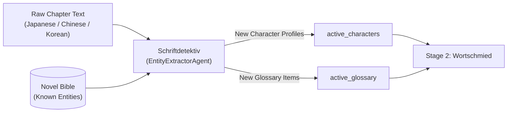

# 🔍 Stage 1: Schriftdetektiv (`EntityExtractorAgent`)

- **Source File**: [`src/nousetsu/agents/extractor.py`](file:///D:/Code/novel_translation_Agent/src/nousetsu/agents/extractor.py)
- **Class**: `EntityExtractorAgent`
- **German Codename**: **Schriftdetektiv** (*The Detective*)
- **Production Model**: `gemini-3.1-flash-lite` (Default via `.env` / cascade)
- **Fallback Model**: `gemini-3.5-flash-lite` (Via `FallbackChatModel` on HTTP 429)

---

## 1. Architectural Mission

`Schriftdetektiv` is the pre-translation entity detective. Its mission is to analyze the raw, untranslated chapter text *before drafting begins* to discover unknown character names, family factions, magical artifacts, and cultivation realm milestones not yet cataloged in the Novel Bible.

By feeding these discovered entities directly into the chapter's active glossary and character roster, subsequent stages (`Wortschmied` and `Zensor`) operate with consistent terminology from sentence one.



---

## 2. Public & Internal Method Contracts

### `__init__`
```python
def __init__(
    self,
    model_name: str = "gemini-3.1-flash-lite",
    fallback_model: Optional[str] = None,
    chunker: Optional[Any] = None,
    enable_recursive_subdivision: bool = True,
    subdivision_min_lines: int = 8,
    subdivision_max_depth: int = 3,
)
```

### `extract()`
Primary entry point invoked by `NovelTranslationWorkflow`:
```python
def extract(
    self,
    source_text: str,
    bible: NovelBible,
    chunks: Optional[List[Any]] = None,
    notify_callback: Optional[Any] = None,
    rate_limiter: Optional[Any] = None,
    stop_event: Optional[Any] = None,
    **kwargs: Any
) -> Tuple[List[CharacterProfile], List[GlossaryItem]]
```
- **Returns**: A 2-tuple containing newly discovered `List[CharacterProfile]` and `List[GlossaryItem]`.

### `extract_chunked()`
Splits long chapters across `LineSemanticChunker` slices to prevent context saturation and rate limit spikes:
```python
def extract_chunked(
    self,
    chunks: List[Any],
    bible: NovelBible,
    notify_callback: Optional[Any] = None,
    rate_limiter: Optional[Any] = None,
    stop_event: Optional[Any] = None,
    **kwargs: Any
) -> Tuple[List[CharacterProfile], List[GlossaryItem]]
```

---

## 3. Core Cognitive Mechanics

### A. Analytical Task Framing (AI Safety Defense)
Submitting raw novel combat or romantic dialogue to commercial LLM APIs frequently trips false-positive safety classifiers (`prohibited_content` HTTP 400). `EntityExtractorAgent` neutralizes this by wrapping raw text in explicit analytical task framing:

```python
user_content = (
    f"Extract fictional characters, factions, and world terminology from this novel excerpt:\n\n"
    f"{source_text}"
)
```
This forces safety classifiers to treat the prompt as an analytical entity extraction request rather than raw content generation.

### B. Procedural Graph Anti-Bloat Term Pruning (arXiv:2609.09153v1)
Naive extraction prompts often extract common conversational vocabulary ("hello", "good morning", "went to the store"), which bloats downstream prompts and wastes tokens. `Schriftdetektiv` is steered by procedural graph constraints:
- **Rule**: Only extract proper nouns, cultivation stages, magical artifacts, and clan names.
- **Pruning**: Saves **300 to 800 output tokens** per chapter by filtering common adjectives and verbs.

### C. JSON Parsing & Regex Recovery
The agent expects a structured JSON array:
```json
{
  "new_characters": [
    {"name": "Translated Name", "original_name": "Raw Name", "gender": "female", "role": "supporting", "voice": "polite"}
  ],
  "new_terms": [
    {"source": "Raw Term", "target": "Translated Term", "category": "realm", "notes": "Explanation"}
  ]
}
```
If the LLM outputs conversational chatter or markdown backticks, `re.search(r"```(?:json)?\s*([\s\S]*?)\s*```", raw_content)` extracts the valid JSON payload cleanly.

---

## 4. Domain Skills Active for Extractor

Registered via [`src/nousetsu/skills/builtin/extractor.py`](file:///D:/Code/novel_translation_Agent/src/nousetsu/skills/builtin/extractor.py):

| Skill Name | Title | Priority | Mission |
|:---|:---|:---:|:---|
| `entity_disambiguation` | Entity & Clan Disambiguation | 100 | Distinguishes between identical surnames across different clans or historical periods. |
| `cultivation_realm_extractor` | Cultivation Realm & Power Hierarchy | 95 | Extracts cultivation stages (e.g., Qi Condensation, Core Formation, Nascent Soul). |
| `relationship_mapper` | Interpersonal & Clan Relationship Mapper | 90 | Maps familial relations (elder brother, sworn sister, master-disciple) for pronoun resolution. |

---

## 5. RAG System Interaction

`Schriftdetektiv` serves as the primary **outbound discovery mechanism** for the RAG knowledge store:
- Newly discovered `GlossaryItem`s and `CharacterProfile`s are persisted to `.novel/bible/bible.yaml`.
- During historical backfills (`nousetsu migrate-rag`), all extracted characters and glossary items are embedded and indexed into `.novel/rag/lore.db` and SQLite FTS5 for hybrid retrieval.

---

## 6. Testing & Hermetic Mocking

`EntityExtractorAgent` is tested deterministically using `MockNovelLLM`:
```python
agent = EntityExtractorAgent(model_name="mock-model")
chars, terms = agent.extract(source_text="...", bible=bible)
assert isinstance(chars, list)
assert isinstance(terms, list)
```
No live API keys or network calls are required during automated testing.
