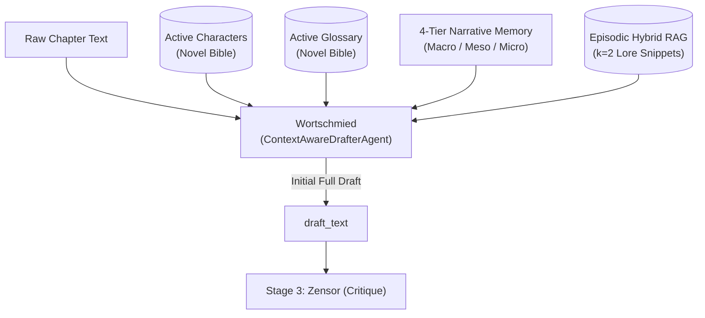

# ✍️ Stage 2: Wortschmied (`ContextAwareDrafterAgent`)

- **Source File**: [`src/nousetsu/agents/drafter.py`](file:///D:/Code/novel_translation_Agent/src/nousetsu/agents/drafter.py)
- **Class**: `ContextAwareDrafterAgent`
- **German Codename**: **Wortschmied** (*The Wordsmith*)
- **Production Model**: `gemini-3.5-flash-lite` (Default via `.env` / cascade)
- **Fallback Model**: `gemini-3.5-flash-lite` (Via `FallbackChatModel` on HTTP 429)

---

## 1. Architectural Mission

`Wortschmied` is the primary literary drafting engine of the NouSetsu pipeline. Its mission is to transform raw, document-level chapter text (Japanese, Chinese, Korean) into a complete, publication-quality literary English prose draft.

Unlike simplistic segment-by-segment machine translation systems, `Wortschmied`:
1. Synthesizes a **4-tier hierarchical narrative memory** (Macro whole story, Meso active arc, Micro immediate situation, and Episodic RAG lore).
2. Resolves **zero-anaphora** (grammatically omitted subjects, pronouns, and viewpoint actors).
3. Enforces strict **character voice differentiation** across distinct dialogue registers.
4. Executes **dual-resilience AI safety bisection** when commercial safety classifiers encounter visceral combat or romantic intimacy.



---

## 2. Public & Internal Method Contracts

### `__init__`
```python
def __init__(
    self,
    model_name: str = "gemini-3.5-flash-lite",
    fallback_model: Optional[str] = None,
    procedural_graph: Optional[ProceduralGraph] = None,
    temperature: Optional[float] = None,
    polisher: Optional[Any] = None,
    enable_recursive_subdivision: bool = True,
    subdivision_min_lines: int = 8,
    subdivision_max_depth: int = 4,
)
```

### `draft()`
Primary entry point invoked by `NovelTranslationWorkflow`:
```python
def draft(
    self,
    source_text: str,
    bible: NovelBible,
    active_characters: List[CharacterProfile],
    active_glossary: List[GlossaryItem],
    rolling_summaries: List[ChapterSummary],
    genre: Optional[str] = None,
    chunks: Optional[List[Any]] = None,
    notify_callback: Optional[Any] = None,
    rate_limiter: Optional[Any] = None,
    stop_event: Optional[Any] = None,
    procedural_graph: Optional[ProceduralGraph] = None,
    polisher: Optional[Any] = None,
    **kwargs: Any
) -> str
```
- **Returns**: Complete drafted chapter text in publication-grade English.
- **Delegation**: If `chunks` has more than 1 chunk, delegates automatically to `draft_chunked()`.

### `draft_chunked()`
Sequential sliding-context chunk translation:
```python
def draft_chunked(
    self,
    chunks: List[Any],
    bible: NovelBible,
    active_characters: List[CharacterProfile],
    active_glossary: List[GlossaryItem],
    rolling_summaries: List[ChapterSummary],
    genre: Optional[str] = None,
    notify_callback: Optional[Any] = None,
    rate_limiter: Optional[Any] = None,
    stop_event: Optional[Any] = None,
    procedural_graph: Optional[ProceduralGraph] = None,
    polisher: Optional[Any] = None,
    **kwargs: Any
) -> str
```

### `format_summaries()`
Assembles 4-tier context hierarchy for prompt injection:
```python
@staticmethod
def format_summaries(
    rolling_summaries: List[ChapterSummary],
    limit: int = 3,
    bible: Optional[NovelBible] = None,
    rag_results: Optional[List[Any]] = None
) -> str
```

---

## 3. Core Cognitive Mechanics

### A. 4-Tier Hierarchical Narrative Context
To prevent context drift and hallucination across multi-hundred chapter sagas, `Wortschmied` formats narrative memory into four distinct tiers:
1. **Tier 1 (Macro)**: `whole_story_summary` from `NovelBible` synthesizing overall saga progression.
2. **Tier 2 (Meso)**: `active_arc` tracking the central conflict, arc synopsis, and completed milestones.
3. **Tier 3 (Micro)**: Immediate preceding chapter outcomes (`rolling_summaries`, up to 3 chapters) with volume folder disambiguation (e.g. `[Villainess_05] Chapter 47`).
4. **Tier 4 (Episodic RAG)**: Top $k=2$ historical lore snippets retrieved via hybrid search (FTS5 BM25 + Gemini Embedding 2 + Cross-Encoder reranking).

### B. Zero-Anaphora Subject & Pronoun Resolution
East Asian languages routinely drop subjects and personal pronouns. `Wortschmied` examines:
- Honorifics and sentence-final particles (`-wa`, `-ze`, `-kashira`, `-ssu`, `-de gozaru`).
- Verb honorific levels (sonkeigo, kenjougo, polite vs. crude speech).
- Physical proximity and spatial blocking in the scene.
- Active viewpoint (POV) character physiological reactions.
This prevents gender-flipping errors and pronoun hallucinations.

### C. Recursive Bisection & Google Translate Safety Fallback
Commercial AI safety filters frequently trigger HTTP 400 `prohibited_content` blocks on battle sequences or intimate drama. `Wortschmied` handles this without aborting the batch:
1. Catches `is_safety_block_exception(e)`.
2. If the text can be subdivided (`can_subdivide_text`, $\ge 8$ lines, depth $< 4$):
   - Bisects the text into balanced halves (`bisect_text`).
   - Recursively drafts the safe half with the LLM in full literary prose.
   - Passes the draft tail as sliding context to draft the second half.
3. If the snippet cannot be subdivided further (depth 4 reached or $\le 8$ lines):
   - Routes the minimal sensitive snippet to **Google Translate** (`translate_via_google`).
   - Passes the raw translation to `PolishingAgent` (`_handle_safety_fallback`) with literary prose framing.
   - If the polisher is also blocked, safely retains raw Google Translate text and increments `safety_fallbacks_used`.

### D. Sliding Context Chunking
For chapters exceeding `chunk_threshold_lines` (default: 85 lines), chunks are drafted sequentially. The last 300 words of chunk $N$'s draft are passed as `preceding_context` into chunk $N+1$, ensuring dialogue flow and sentence continuity across chunk boundaries.

---

## 4. Domain Skills Active for Drafter

Registered via [`src/nousetsu/skills/builtin/drafter.py`](file:///D:/Code/novel_translation_Agent/src/nousetsu/skills/builtin/drafter.py):

| Skill Name | Title | Priority | Mission |
|:---|:---|:---:|:---|
| `zero_anaphora_resolution` | Zero-Anaphora Subject & Pronoun Resolution | 110 | Recovers unstated subjects, omitted actors, and dialogue speakers using speech registers. |
| `name_address_fidelity` | Name & Nickname Address Form Fidelity | 105 | Strictly preserves distinction between formal names and intimate nicknames/diminutives. |
| `character_voice_differentiation` | Distinct Character Voice Differentiation | 100 | Enforces individualized speech registers (aristocrats vs. mercenaries vs. kuudere). |
| `idiom_localization` | Cultural Idiom & Metaphor Localization | 95 | Translates four-character idioms (chengyu/yojijukugo) into vivid English prose rather than literal calques. |
| `litrpg_system_framing` | LitRPG & System Notification Formatting | 90 | Standardizes status windows, skill alerts, and level-up prompts into clean, uniform markdown callouts. |

---

## 5. RAG System Interaction

- **Inbound Retrieval**: Before drafting, `NovelTranslationWorkflow` queries `HybridSearchEngine` with the chapter title and first paragraph.
- **Top $k=2$ Episodic Lore**: Passes relevant historical records (past oaths, character status conditions, magic artifacts) into `draft(..., rag_results=...)`.
- **Prompt Injection**: Injected under `### 4. Relevant Historical Lore & Past Canon (Episodic Hybrid RAG)` inside `format_summaries()`.

---

## 6. Testing & Hermetic Mocking

`ContextAwareDrafterAgent` is tested deterministically with `MockNovelLLM`:
```python
agent = ContextAwareDrafterAgent(model_name="mock-model")
draft = agent.draft(
    source_text="...",
    bible=bible,
    active_characters=[],
    active_glossary=[],
    rolling_summaries=[]
)
assert len(draft) > 0
```
- Recursive bisection and safety fallback mechanics are thoroughly verified in `tests/test_recursive_subdivision.py` and `tests/test_translation_fallback.py`.
- No live network calls occur when model names begin with `"mock"` or `"test"`.
