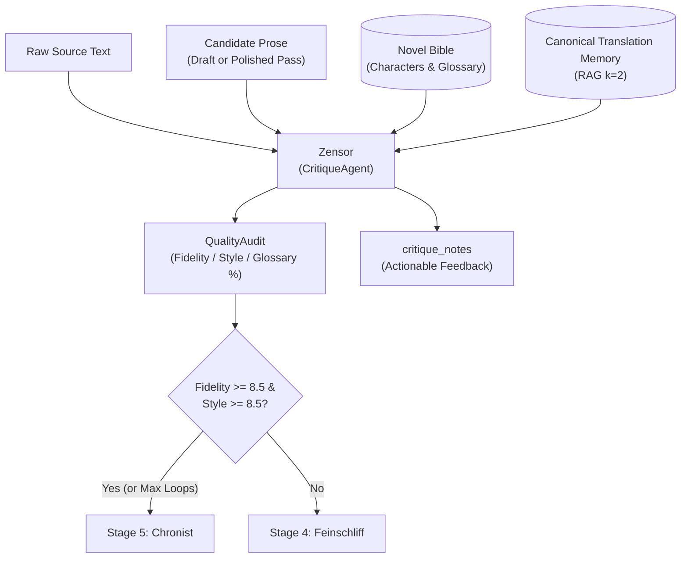

# 🔎 Stage 3: Zensor (`CritiqueAgent`)

- **Source File**: [`src/nousetsu/agents/critic.py`](file:///D:/Code/novel_translation_Agent/src/nousetsu/agents/critic.py)
- **Class**: `CritiqueAgent`
- **German Codename**: **Zensor** (*The Inspector*)
- **Production Model**: `gemma-4-26b-a4b-it` (Default via `.env` / cascade)
- **Fallback Model**: `gemini-3.5-flash-lite` (Via `FallbackChatModel` on HTTP 429)

---

## 1. Architectural Mission

`Zensor` is the rigorous, line-by-line quality auditor of the NouSetsu pipeline. Its mission is to compare candidate prose (initial draft or polished revision) directly against the original raw source text to identify fidelity breaches, omissions, glossary violations, voice flattening, and intimacy discrepancies.

Operating within the LangGraph cyclic reflection loop, `Zensor`:
1. Conducts **paired line-semantic chunk auditing** (`_build_paired_chunks`).
2. Evaluates literary fidelity ($0.0 - 10.0$) and prose style ($0.0 - 10.0$).
3. Verifies canonical consistency against historical translations via **Translation Memory (TM) RAG** ($k=2$).
4. Enforces programmatic glossary and language regression guards.
5. Produces actionable, prioritized critique notes guiding `Feinschliff` (PolishingAgent).



---

## 2. Public & Internal Method Contracts

### `__init__`
```python
def __init__(
    self,
    model_name: str = "gemma-4-26b-a4b-it",
    fallback_model: Optional[str] = None,
    chunker: Optional[Any] = None,
    enable_recursive_subdivision: bool = True,
    subdivision_min_lines: int = 8,
    subdivision_max_depth: int = 3,
)
```

### `evaluate()`
Primary entry point invoked by `NovelTranslationWorkflow`:
```python
def evaluate(
    self,
    source_text: str,
    draft_text: str,
    bible: NovelBible,
    active_characters: List[CharacterProfile],
    active_glossary: List[GlossaryItem],
    genre: Optional[str] = None,
    chunks: Optional[List[Any]] = None,
    notify_callback: Optional[Any] = None,
    rate_limiter: Optional[Any] = None,
    stop_event: Optional[Any] = None,
    rag_context: Optional[List[Any]] = None,
    **kwargs: Any
) -> Tuple[QualityAudit, str]
```
- **Returns**: A 2-tuple containing:
  1. `QualityAudit`: `fidelity_score`, `style_score`, `glossary_compliance_pct`, `warnings`, and `passed`.
  2. `critique_notes`: Concrete, line-level feedback instructing the polisher what to rectify.

### `_build_paired_chunks()`
Partitions source and candidate text into aligned, synchronized line chunks for parallel evaluation:
```python
def _build_paired_chunks(self, source_text: str, draft_text: str) -> List[Any]
```

---

## 3. Core Cognitive Mechanics

### A. Paired Line-Semantic Chunking
When auditing lengthy chapters, naive LLM evaluation suffers from context fatigue, skipping middle paragraphs. `Zensor` overcomes this with paired semantic chunking:
- Source and draft texts are aligned into proportional line segments.
- Each chunk preserves `start_line`, `end_line`, and corresponding `source_content`.
- Audits are conducted per chunk and aggregated deterministically:
  $$\text{fidelity} = \frac{1}{N}\sum_{i=1}^N \text{fidelity}_i, \quad \text{style} = \frac{1}{N}\sum_{i=1}^N \text{style}_i$$

### B. Canonical Translation Memory (TM) RAG Verification
On Pass 1, `Zensor` receives up to $k=2$ historical translation memory snippets retrieved from `.novel/rag/lore.db`:
- **Context Injection**: RAG candidates are provided under `CANONICAL TRANSLATION MEMORY (HISTORICAL BENCHMARKS)`.
- **Consistency Verification**: `Zensor` cross-examines character speech patterns and nomenclature against previous volumes to prevent tone drift across chapters.
- **Cache Efficiency**: Subsequent reflection passes re-use the cached TM context without performing redundant database queries.

### C. Programmatic Glossary Verification
In addition to LLM scoring, `Zensor` performs hard programmatic string checks:
1. Filters active glossary terms to those whose `source` term actually appears in the chapter's raw source text.
2. Checks whether the canonical `target` translation appears in `draft_text`.
3. If missing, adds an explicit warning and deducts from `glossary_compliance_pct`.

### D. Target Language Regression Guard
If the candidate translation inadvertently retains or reverts to the source language (e.g. Japanese kanji/kana or Chinese hanzi left unlocalized):
- `detect_language(draft_text)` flags the collision.
- The audit is automatically failed (`fidelity_score = 1.0`, `style_score = 1.0`, `passed = False`).
- An urgent warning is appended, compelling `Feinschliff` or `NovelTranslationWorkflow` to re-draft.

### E. AI Safety Block Resilience & Recursive Bisection
If a sensitive passage trips content filters during critique:
- If depth $< 3$ and lines $\ge 8$, bisects source and draft chunks to audit non-sensitive portions with full scores.
- Base case: assigns passing default scores (`fidelity = 8.5`, `style = 8.0`, `glossary = 100%`) with an audit warning (`⚠️ Sensitive scene safety block bypassed during critique`), preventing workflow stalls.

---

## 4. Domain Skills Active for Critic

Registered via [`src/nousetsu/skills/builtin/critic.py`](file:///D:/Code/novel_translation_Agent/src/nousetsu/skills/builtin/critic.py):

| Skill Name | Title | Priority | Mission |
|:---|:---|:---:|:---|
| `omission_detector` | Omission & Truncation Auditor | 110 | Rigorous line-by-line verification ensuring no sentences, descriptive beats, or inner monologues are skipped. |
| `glossary_enforcer` | Strict Glossary & Canonical Terminology Auditor | 100 | Validates 100% adherence to active glossary terms, spellings, and title capitalizations. |
| `hallucination_guard` | Hallucination & Fabrication Guard | 95 | Detects fabricated events, invented dialogue, or swapped speaker actions. |
| `nickname_disparity_auditor` | Nickname & Formal Address Disparity Auditor | 92 | Catches unauthorized formal-to-nickname substitutions or intimacy flattening in dialogue. |
| `tone_consistency_auditor` | Tone & Register Consistency Auditor | 90 | Verifies character speech dignity, comedic timing, and emotional resonance match source intent. |

---

## 5. RAG System Interaction

- **Canonical TM Input**: Receives top $k=2$ past chapter translation snippets via `rag_context`.
- **Pass 1 Enforcement**: On the initial evaluation pass, `Zensor` utilizes canonical TM to ensure terminology and honorific choices match published precedent.
- **Pass 2+ Re-Audit**: Evaluates polished candidate prose against the raw source text to verify whether `Feinschliff` successfully resolved all issues noted in Pass 1.

---

## 6. Testing & Hermetic Mocking

`CritiqueAgent` is tested deterministically with `MockNovelLLM`:
```python
agent = CritiqueAgent(model_name="mock-model")
audit, notes = agent.evaluate(
    source_text="...",
    draft_text="...",
    bible=bible,
    active_characters=[],
    active_glossary=[]
)
assert isinstance(audit, QualityAudit)
assert audit.passed is True
```
- Tested extensively across `tests/test_review_loop.py`, `tests/test_skills.py`, and `tests/test_translation_fallback.py`.
