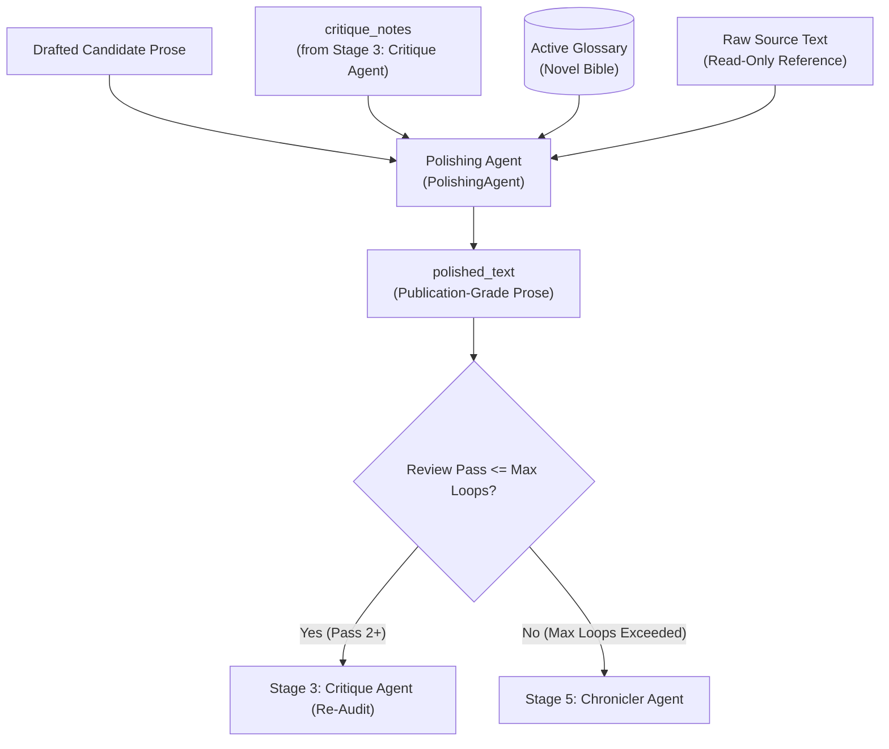

# ✨ Stage 4: Polishing Agent (`PolishingAgent`)

- **Source File**: [`src/nousetsu/agents/polisher.py`](file:///D:/Code/novel_translation_Agent/src/nousetsu/agents/polisher.py)
- **Class**: `PolishingAgent`
- **Role**: **Polishing Agent** (*The Stylist*)
- **Production Model**: `gemini-3.5-flash-lite` (Default via `.env` / cascade)
- **Fallback Model**: `gemini-3.5-flash-lite` (Via `FallbackChatModel` on HTTP 429)

---

## 1. Architectural Mission

The `PolishingAgent` is the stylistic master of the NouSetsu pipeline. Its mission is to transform rough drafted prose into publication-grade, immersive literary target-language fiction by incorporating the specific editorial feedback provided by the Critique Agent (`CritiqueAgent`).

Unlike crude automated paraphrasers, the Polishing Agent:
1. Systematically purges mechanical **translationese cliches** and passive sentence structures.
2. Ingests raw source text as a **read-only nuance reference** to resolve ambiguous draft phrasing without hallucinating new plot beats.
3. Enhances **prose cadence, rhythm, and sensory depth** (alternating terse action beats with lyrical atmospheric exposition).
4. Strictly preserves canonical terminology and character address hierarchies established in the Novel Bible.



---

## 2. Public & Internal Method Contracts

### `__init__`
```python
def __init__(
    self,
    model_name: str = "gemini-3.5-flash-lite",
    fallback_model: Optional[str] = None,
    temperature: Optional[float] = None
)
```

### `polish()`
Primary entry point invoked by `NovelTranslationWorkflow`:
```python
def polish(
    self,
    draft_text: str,
    critique_notes: str,
    active_glossary: List[GlossaryItem],
    bible: NovelBible,
    genre: Optional[str] = None,
    source_text: Optional[str] = None,
    draft_chunks: Optional[List[Any]] = None,
    notify_callback: Optional[Any] = None,
    rate_limiter: Optional[Any] = None,
    stop_event: Optional[Any] = None,
    prompt_tracker: Optional[Any] = None,
    subdivided_blocks: Optional[List[SubdividedBlock]] = None,
    **kwargs: Any
) -> str
```
- **Attributes**: `self.prompt_tracker: Optional[Any] = None` stores the active tracker instance injected by `NovelTranslationWorkflow`.
- **Returns**: High-polish literary English prose text.
- **Delegation**: If `draft_chunks` has more than 1 chunk, delegates automatically to `polish_chunked()`.

### `polish_chunked()`
Chunk-by-chunk polishing with running context for long chapters:
```python
def polish_chunked(
    self,
    draft_chunks: List[Any],
    critique_notes: str,
    active_glossary: List[GlossaryItem],
    bible: NovelBible,
    genre: Optional[str] = None,
    source_text: Optional[str] = None,
    notify_callback: Optional[Any] = None,
    rate_limiter: Optional[Any] = None,
    stop_event: Optional[Any] = None,
    **kwargs: Any
) -> str
```

---

## 3. Core Cognitive Mechanics

### A. Translationese Purging
The Polishing Agent eliminates stiff machine-translation crutches:
- *"could not help but..."* $\to$ Converted into direct physical actions or internal emotional impulses.
- *"as expected of..."* $\to$ Integrated as natural character admiration or contextual acknowledgment.
- *"it was none other than..."* $\to$ Stated directly with dramatic punch.
- Clunky passive verbs (*"his face was slapped by her"*) $\to$ Active, visceral verbs (*"she slapped his face"*).

### B. Read-Only Nuance Disambiguation
To prevent "telephone game" distortions across multiple polishing passes, the Polishing Agent receives the original source text marked explicitly as `(Reference Only)`:
- Allows the polisher to verify the emotional weight or exact metaphor of an ambiguous sentence in the draft.
- In chunked mode, source text is sliced per chunk (`raw_src_lines[src_start:src_end]`), preventing context overload.

### C. Cadence & Sensory Expansion (Show, Don't Tell)
The agent restructures repetitive subject-verb-object cadences:
- **Action & Tension**: Employs short, punchy sentence fragments to accelerate heart rate during combat or revelations.
- **Exposition & Atmosphere**: Weaves sweeping, layered descriptive periods with tactile, auditory, and olfactory textures.
- **Dialogue Pacing**: Tightens verbal sparring to sound like natural spoken dialogue while strictly retaining honorific titles and relationship distance.

### D. Target Language Regression Guard
If the model produces prose that accidentally reverts to the source language (or an unlocalized bilingual mix):
- `detect_language(text)` detects the regression.
- The polisher automatically discards the corrupt generation and retains `draft_text`, guaranteeing that the chapter remains 100% in the target language.

### E. Stateful Subdivision Pattern Memory & Polisher Bisection
If commercial AI safety filters trip on a sensitive scene (combat, romance) during translation or polishing:
- **Pattern Memory Ingestion**: Consumes `subdivided_blocks` produced by `ContextAwareDrafterAgent`. Any block flagged `is_sensitive=True` is preserved as-is using its fallback draft text without re-invoking the LLM, preventing recurring safety crashes.
- **Recursive Polisher Bisection (`_polish_with_recursive_subdivision`)**: For unflagged blocks or new safety blocks encountered during polishing, the agent strips the source text reference and attempts prose refinement. If still blocked, it recursively bisects the draft text into minimal snippets, polishing safe halves while falling back to draft text on sensitive slices.
- **Zero Data Loss**: Guarantees that neither initial translation nor multi-pass reflection loops fail or halt on sensitive scenes.

### F. Chapter Title & Header Preservation Guard
To prevent stylistic polishing from stripping chapter headings (e.g. `บทที่ 11 - อวดดอกไม้` or `70\nChapter 11...`):
- **Domain Skill**: The `chapter_header_preservation` skill (priority 115) directs the model to strictly retain chapter titles.
- **System Prompt**: Rule 6 in `POLISHING_SYSTEM_PROMPT` mandates preserving chapter headings at the top of the output.
- **Programmatic Guard**: `_ensure_chapter_title_preserved()` scans the draft head using multi-lingual regex patterns (`Chapter X`, `บทที่ X`, `第X章`, `제X장`, `# Title`, and leading page numbers). If the LLM omits the header, it automatically prepends the chapter header block from the draft.

### G. Diff / Patch Polishing Engine (`DiffPatcher`)
For minor critique corrections or multi-pass review loops, rewriting the entire chapter word-for-word wastes token quota and risks introducing new translation errors:
- **SEARCH/REPLACE Diff Format**: When polishing in patch mode, the Polishing Agent outputs targeted search/replace blocks (`<<<<<<< SEARCH\n[draft text]\n=======\n[polished text]\n>>>>>>>`) or `NO_CHANGES_NEEDED`.
- **Parsing & Application**: `apply_search_replace_patches()` in [`src/nousetsu/utils/diff_patcher.py`](file:///D:/Code/novel_translation_Agent/src/nousetsu/utils/diff_patcher.py) applies targeted edits directly to `draft_text`.
- **Zero-Loss Fallback**: If patch formatting is absent or fails to apply, the agent gracefully treats the response as full-text prose, ensuring zero corruption.
- **Token Efficiency**: Reduces completion token consumption on Pass 2+ by up to **60–80%**, since untouched prose paragraphs are not re-emitted by the LLM.

---

## 4. Domain Skills Active for Polisher

### Built-in Skills
Registered via [`src/nousetsu/skills/builtin/polisher.py`](file:///D:/Code/novel_translation_Agent/src/nousetsu/skills/builtin/polisher.py):

| Skill Name | Title | Priority | Mission |
|:---|:---|:---:|:---|
| `chapter_header_preservation` | Chapter Header & Title Preservation | 115 | Ensures chapter titles, numbers, and structural headings from the draft are strictly retained at the top of the polished output. |
| `translationese_filter` | Anti-Translationese & Stiff Phrasing Filter | 110 | Eliminates repetitive machine-translation cliches, awkward passives, and unnatural syntax. |
| `prose_cadence_enhancer` | Literary Cadence & Rhythmic Sentence Variation | 100 | Crafts dynamic sentence variety, lyrical pacing, and immersive sensory descriptions. |
| `address_form_preservation` | Address Form & Nickname Preservation | 95 | Preserves exact dialogue address choices (formal names vs. nicknames) during stylistic polishing. |
| `show_dont_tell` | Show-Don't-Tell Emotional Depth Enhancer | 90 | Transforms flat emotional assertions into physical character behaviors and atmospheric cues. |
| `dialogue_flow` | Natural Spoken Dialogue Cadence | 85 | Enhances natural conversational cadence and verbal sparring without diluting regional dialects. |

### Catalog Markdown Skills (`src/nousetsu/skills/catalog/`)

| Skill Name | Title | Scope | Mission |
|:---|:---|:---:|:---|
| `otome_court_etiquette` | Aristocratic Court Banter & Poise | Romance, Otome, Drama | Refines aristocratic court dialogue, sharp subtextual sparring, and villainess poise. |

---

## 5. RAG System Interaction

- **Indirect Ingestion**: The Polishing Agent does not directly query the vector database; instead, it consumes the actionable critique notes from the Critique Agent, which already incorporate canonical Translation Memory (TM) constraints from RAG.
- **Cyclic Feedback**: Polished outputs are immediately re-evaluated by the Critique Agent in subsequent reflection loops, ensuring stylistic embellishments never sacrifice factual fidelity.

---

## 6. Testing & Hermetic Mocking

`PolishingAgent` is tested deterministically with `MockNovelLLM`:
```python
agent = PolishingAgent(model_name="mock-model")
polished = agent.polish(
    draft_text="She could not help but smile.",
    critique_notes="Remove translationese cliches.",
    active_glossary=[],
    bible=bible
)
assert len(polished) > 0
```
- Fully tested across `tests/test_review_loop.py` and `tests/test_translation_fallback.py`.
