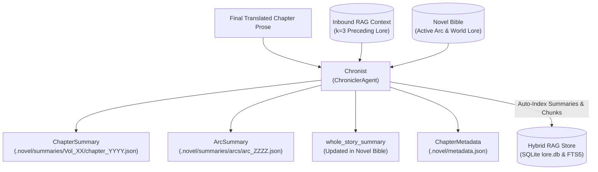

# 📜 Stage 5: Chronist (`ChroniclerAgent`)

- **Source File**: [`src/nousetsu/agents/chronicler.py`](file:///D:/Code/novel_translation_Agent/src/nousetsu/agents/chronicler.py)
- **Class**: `ChroniclerAgent`
- **German Codename**: **Chronist** (*The Memory Keeper*)
- **Production Model**: `gemma-4-26b-a4b-it` (Default via `.env` / cascade)
- **Fallback Model**: `gemini-3.5-flash-lite` (Via `FallbackChatModel` on HTTP 429)

---

## 1. Architectural Mission

`Chronist` is the memory keeper and telemetry compiler of the NouSetsu pipeline. Its mission is to synthesize the translated chapter into rolling narrative memory, detect story arc transitions, maintain character health/status shifts, assemble audit metadata, and automatically index chapter events into the RAG knowledge store.

Unlike simple summary scripts, `Chronist`:
1. Manages a **3-tier narrative memory hierarchy** (Macro whole story, Meso story arc, Micro chapter synopsis).
2. Autonomous **story arc boundary detection** (`ArcSummary`) and climax resolution archiving.
3. Operates **bi-directionally with the RAG knowledge base** (inbound reading $k=3$ and outbound chunk auto-indexing).
4. Assembles granular **token consumption and latency telemetry** into unified `.novel/metadata.json`.



---

## 2. Public & Internal Method Contracts

### `__init__`
```python
def __init__(
    self,
    model_name: str = "gemma-4-26b-a4b-it",
    fallback_model: Optional[str] = None
)
```

### `chronicle()`
Primary cognitive summarization entry point:
```python
def chronicle(
    self,
    chapter_num: int,
    chapter_title: str,
    translated_text: str,
    genre: Optional[str] = None,
    source_lang: Optional[str] = None,
    bible: Optional[NovelBible] = None,
    rag_context: Optional[List[Any]] = None,
    **kwargs: Any
) -> ChapterSummary
```
- **Returns**: Validated `ChapterSummary` model with synopsis, key plot events, character status changes, and optional arc/story updates.

### `assemble_metadata()`
Compiles execution telemetry and stage checkpoints:
```python
def assemble_metadata(
    self,
    chapter_id: str,
    chapter_num: int,
    source_file: str,
    source_sha256: str,
    output_file: str,
    source_text: str,
    final_text: str,
    model_name: str,
    duration_seconds: float,
    quality_audit: QualityAudit,
    active_characters: List[CharacterProfile],
    active_glossary: List[GlossaryItem],
    draft_text: str,
    critique_notes: str,
    polished_text: str,
    status: StageStatus = StageStatus.COMPLETED,
    step_usage: Optional[List[StepTokenUsage]] = None,
    safety_fallbacks_used: int = 0,
    subdivisions_count: int = 0
) -> ChapterMetadata
```
- **Returns**: Unified `ChapterMetadata` object persisted to `.novel/metadata.json`.

---

## 3. Core Cognitive Mechanics

### A. 3-Tier Hierarchical Narrative Memory (Macro > Meso > Micro)
To guarantee consistency across multi-hundred chapter novels, `Chronist` partitions memory into three tiers:
1. **Micro (`ChapterSummary`)**: Folder-scoped snapshot containing:
   - High-density chapter synopsis ($2-3$ paragraphs).
   - Key plot events list.
   - Character condition and status updates (physical injuries, relationship shifts, power breakthroughs).
2. **Meso (`ArcSummary`)**: Detects story arc milestones and climax resolution (`arc_completed = true`). When an arc completes, it is archived into `.novel/summaries/arcs/arc_XXXX.json` and its lessons synthesized into the novel bible.
3. **Macro (`whole_story_summary`)**: An overarching synthesis of the entire novel so far, ensuring that early saga promises and overarching themes remain active in prompt context.

### B. Bi-Directional RAG Knowledge Store Integration
`Chronist` is the only pipeline agent with full bi-directional RAG capabilities:
- **Inbound Retrieval ($k=3$)**: Queries `HybridSearchEngine` for preceding character conditions, lingering injuries, or active arc commitments before generating the summary.
- **Outbound Auto-Indexing**: Upon chapter completion, `NovelTranslationWorkflow` segments the translated chapter into $\sim 20$-line semantic scene chunks, embeds them with **Gemini Embedding 2** (`models/gemini-embedding-2`, 3072 dimensions), and writes them alongside the `ChapterSummary` directly into SQLite `lore.db` and SQLite FTS5 (`lore_fts`).

### C. Granular Token & Latency Telemetry Assembly
`assemble_metadata()` aggregates token telemetry across all five pipeline stages:
- `prompt_tokens`, `completion_tokens`, `thought_tokens` (Gemini reasoning), and `cached_tokens`.
- Duration in seconds tracked per step.
- Safety metrics: counts of `safety_fallbacks_used` and `subdivisions_count`.
- Serializes complete `StageArtifacts` into `CheckpointData`, allowing paused or failed jobs to resume without re-translating completed stages.

---

## 4. Domain Skills Active for Chronicler

Registered via [`src/nousetsu/skills/builtin/chronicler.py`](file:///D:/Code/novel_translation_Agent/src/nousetsu/skills/builtin/chronicler.py):

| Skill Name | Title | Priority | Mission |
|:---|:---|:---:|:---|
| `lore_world_state_tracker` | World State, Artifact & Lore Progression Tracker | 100 | Tracks realm breakthroughs, inventory acquisitions, sect territory changes, and power systems. |
| `character_status_tracker` | Character Condition, Injury & Revelation Tracker | 95 | Records physical injuries, psychological trauma, secrets revealed, and relationship milestones. |
| `continuity_auditor` | Narrative Lore & Timeline Continuity Auditor | 85 | Verifies timeline consistency and cross-checks chapter outcomes against previous summaries. |

---

## 5. RAG System Interaction

| Mode | Target Store | Dimensions / Index | Purpose |
|:---|:---|:---:|:---|
| **Inbound Read** | `.novel/rag/lore.db` | $k=3$ candidates | Retrieves preceding character injuries and lore before writing chapter summary. |
| **Outbound Write** | `.novel/rag/lore.db` (Vector) | 3072 dims (Cosine) | Dense semantic vector search for historical chapter scenes and summaries. |
| **Outbound Write** | SQLite `lore_fts` (FTS5) | BM25 index | Sparse lexical keyword lookup for terms, names, and exact quotes. |

---

## 6. Testing & Hermetic Mocking

`ChroniclerAgent` is tested deterministically with `MockNovelLLM`:
```python
agent = ChroniclerAgent(model_name="mock-model")
summary = agent.chronicle(
    chapter_num=1,
    chapter_title="Awakening",
    translated_text="...",
    bible=bible
)
assert isinstance(summary, ChapterSummary)
assert summary.chapter_num == 1
```
- Multi-tier memory and arc detection are verified in `tests/test_hierarchy_summary.py` and `tests/test_cross_folder_summaries.py`.
- RAG interactions are verified in `tests/test_chronicler_rag.py`.
