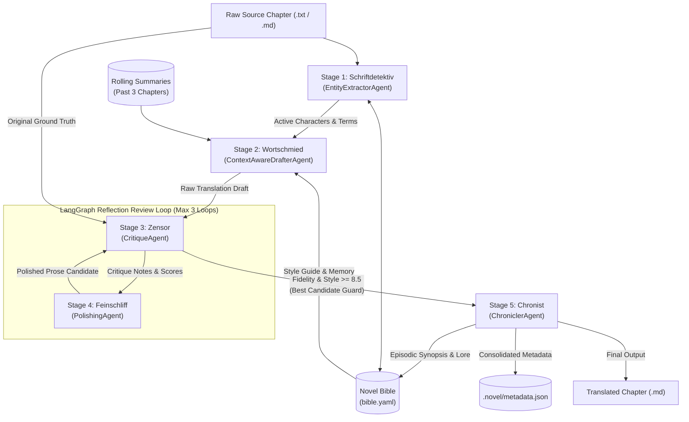
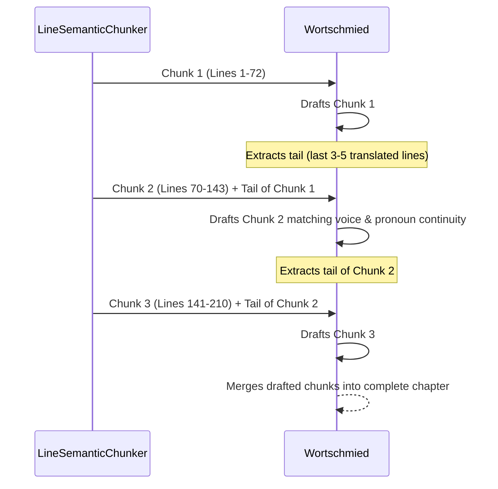
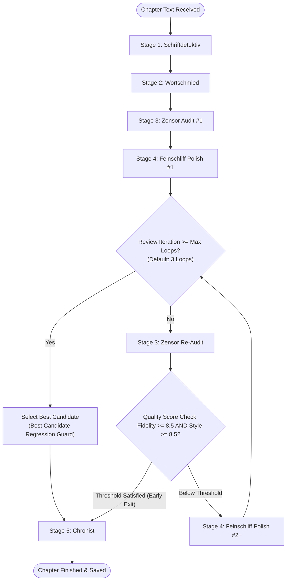

# 🧠 Deep-Dive Architectural Guide: The Five Specialized Pipeline Agents

> **An In-Depth Technical Manual on Agent Cognitive Roles, Prompt Engineering, Context Ingestion, Chunking Algorithms, and Safety Guards**  
> Part of the **NouSetsu** (濃説 / 脳説) Autonomous Novel Translation Framework.

---

## 📑 Table of Contents

1. [Executive Summary & Pipeline Architecture](#1-executive-summary--pipeline-architecture)
2. [Stage 1: Schriftdetektiv (EntityExtractorAgent)](#2-stage-1-schriftdetektiv-entityextractoragent)
   - [2.5 Procedural Graph Steering & Anti-Bloat Pitfalls (arXiv:2609.09153v1)](#25-procedural-graph-steering--anti-bloat-pitfalls-arxiv260909153v1)
3. [Stage 2: Wortschmied (ContextAwareDrafterAgent)](#3-stage-2-wortschmied-contextawaredrafteragent)
   - [3.5 Procedural Graph Directives & Offline Evolution (arXiv:2609.09153v1)](#35-procedural-graph-directives--offline-evolution-arxiv260909153v1)
4. [Stage 3: Zensor (CritiqueAgent)](#4-stage-3-zensor-critiqueagent)
5. [Stage 4: Feinschliff (PolishingAgent)](#5-stage-4-feinschliff-polishingagent)
6. [Stage 5: Chronist (ChroniclerAgent)](#6-stage-5-chronist-chronicleragent)
7. [The Reflection Review Loop & Quality Gating](#7-the-reflection-review-loop--quality-gating)
8. [Cross-Cutting Infrastructure: Routing, Rate Limiting & Fallback](#8-cross-cutting-infrastructure-routing-rate-limiting--fallback)
9. [End-to-End Real-World Scenario Walkthrough](#9-end-to-end-real-world-scenario-walkthrough)

---

## 1. Executive Summary & Pipeline Architecture

Traditional machine translation (MT) models attempt to perform translation in a single pass. For literary fiction—specifically East Asian webnovels (Japanese, Chinese, Korean)—this monolithic approach produces severe literary degradation:
* **Context Amnesia**: Inability to recall events from earlier chapters.
* **Zero-Anaphora Collapse**: East Asian languages drop sentence subjects and pronouns; single-pass engines guess blindly, causing random character gender and actor flips.
* **Terminology Drift**: Faction names, martial arts ranks, and character titles change spelling every few paragraphs.
* **Translationese & Robotic Cadence**: Machine-translation tropes ("couldn't help but", "as expected of", awkward passive phrasing) ruin narrative immersion.

**NouSetsu** solves this by decomposing the translation process into five specialized, single-responsibility AI agents coordinated by **LangGraph**:



---

## 2. Stage 1: Schriftdetektiv (`EntityExtractorAgent`)

* **German Designation**: *Schriftdetektiv* (The Detective / Script Investigator)
* **Source Module**: [`src/nousetsu/agents/extractor.py`](file:///D:/Code/novel_translation_Agent/src/nousetsu/agents/extractor.py)
* **Default Model**: `gemini-3.1-flash-lite` (Configurable via `extractor_model`)
* **Default Temperature**: `0.1` (Deterministic, low hallucination)

### 2.1 Core Cognitive Purpose
In webnovels, authors introduce new side characters, magical spells, sects, and artifacts without formal introduction. If drafting begins immediately, the translator engine will guess pronunciations or transliterations arbitrarily, corrupting series continuity.

`Schriftdetektiv` operates **ahead of translation**. It inspects raw source chapter text, cross-references all known entities in the **Novel Bible**, isolates newly introduced proper nouns, and creates canonical target-language proposals.

### 2.2 Context Ingestion & Assembly
Before prompting the LLM, the extractor constructs an active context payload:
1. **Known Characters String**: Formats existing character cards:
   ```text
   - クララ・フォン・アンバー -> Clara von Amber (Protagonist, Calm aristocratic tone)
   - レイモンド -> Raymond (Prince, Authoritative blunt tone)
   ```
2. **Known Glossary String**: Formats canonical glossary terms:
   ```text
   - 魔導具 -> magic tool (item)
   - 蒼雷剣 -> Azure Thunder Blade (item)
   ```
3. **Domain Skills Injection**: Queries [`SkillRegistry`](file:///D:/Code/novel_translation_Agent/src/skills/registry.py) for active extraction skills matching the novel's source language and genre:
   - `entity_disambiguation`: Directives for separating family names from given names and parsing honorific suffixes (`-sama`, `-san`, `-dono`, `xiong`, `shidi`).
   - `cultivation_hierarchies`: Directives for detecting martial realms (Qi Condensation, Foundation Establishment, Golden Core) and spiritual treasures.
   - `relationship_mapping`: Directives for identifying master-disciple, sibling, and clan dynamics.

### 2.3 System Prompt & Execution
The agent invokes the model with [`EXTRACTION_SYSTEM_PROMPT`](file:///D:/Code/novel_translation_Agent/src/nousetsu/prompts/templates.py#L3-L39):
```json
{
  "new_characters": [
    {
      "name": "Translated Canonical Name",
      "original_name": "Original Script Name",
      "aliases": ["alias1", "nickname"],
      "gender": "male/female/neutral/unknown",
      "role": "protagonist/antagonist/supporting/minor",
      "voice": "speech quirks, politeness level, tone",
      "relationships": {"Known Character": "rival"}
    }
  ],
  "new_terms": [
    {
      "source": "Original Term",
      "target": "Translated Term",
      "category": "term/faction/location/skill/item/rank",
      "notes": "contextual usage notes"
    }
  ],
  "active_terms_in_chapter": ["term1", "term2"]
}
```

### 2.4 Parsing Resilience & Error Recovery
LLMs occasionally wrap JSON in markdown formatting (````json ... ````) or include leading/trailing remarks. `Schriftdetektiv` executes a multi-layer parser:
1. Strips internal reasoning thought tokens (`extract_text_from_message`).
2. Applies regex fence extraction: `re.search(r"```(?:json)?\s*([\s\S]*?)\s*```", raw_content)`.
3. Validates each object using Pydantic V2 (`CharacterProfile.model_validate` and `GlossaryItem.model_validate`).
4. If JSON parsing completely fails, falls back gracefully to empty lists without crashing the workflow.

### 2.5 Procedural Graph Steering & Anti-Bloat Pitfalls (arXiv:2609.09153v1)
`Schriftdetektiv` uses a lightweight, deterministic [`ProceduralGraph`](file:///D:/Code/novel_translation_Agent/src/nousetsu/graph/procedural.py) to guide entity extraction without runtime guidance LLM overhead:
- **Active Node**: `Scan_Candidates` -> `Filter_Known` -> `Deduce_Profiles` -> `Prune_Trivial_Terms`.
- **Injected Directives (< 80 tokens)**: Directs the model to check honorific suffixes (`-san`, `-sama`) before guessing character gender, and strictly bans extracting conversational verbs, everyday adjectives, greetings, or generic titles as new terms.
- **Token Efficiency**: Prevents dumping dozens of trivial words into JSON output, saving 300–800 output tokens per chapter.

---

## 3. Stage 2: Wortschmied (`ContextAwareDrafterAgent`)

* **German Designation**: *Wortschmied* (The Wordsmith)
* **Source Module**: [`src/nousetsu/agents/drafter.py`](file:///D:/Code/novel_translation_Agent/src/nousetsu/agents/drafter.py)
* **Default Model**: `gemini-3.5-flash-lite` (Configurable via `drafter_model`)
* **Default Temperature**: `0.3` (Creative narrative flexibility while retaining prompt adherence)

### 3.1 Core Cognitive Purpose
`Wortschmied` produces the complete initial translation draft. Its primary mission is solving the **Zero-Anaphora Dilemma** and establishing distinct character voices while strictly following the Novel Bible's style guide.

### 3.2 Zero-Anaphora Resolution Algorithm
In Japanese and Chinese, sentences routinely omit subjects:
$$\text{Original: } \text{部屋に入った。剣を抜いた。微笑んだ。}$$
Literal MT engines guess actors randomly ("*I entered... He drew... She smiled.*"). `Wortschmied` resolves omitted pronouns through three-point triangulation:
1. **Scene Presence Matrix**: Ingests active characters registered in the Novel Bible to know exactly who is inside the current room or combat encounter.
2. **Honorific & Verb Register Hierarchy**: Japanese speech markers (e.g. `仰った` vs `申した`, or sentence-ending particles `わ`, `ぜ`, `のだ`) definitively identify speaker social status and gender.
3. **Rolling Context Window**: Queries synopses of the past 3 chapters (`rolling_summaries[-3:]`) to maintain awareness of ongoing quests, alliances, and injuries.

### 3.3 Dynamic Glossary Relevance Filtering
If a novel has a 500-term glossary, injecting all 500 terms into the drafting prompt causes prompt bloat, increases latency, and exceeds token budgets.
`Wortschmied` performs an **in-memory relevance filter**:
```python
relevant_glossary = [
    item for item in active_glossary
    if item.source.lower() in source_text.lower()
]
eval_glossary = relevant_glossary if relevant_glossary else active_glossary[:20]
```
Only terms physically present in the chapter are injected into the prompt, reducing token consumption by up to 80%.

### 3.4 Line-Based Semantic Chunking Architecture (`draft_chunked`)
When a chapter exceeds `chunk_threshold_lines` (default: 85 lines), translating it in a single prompt risks context truncation or 32,000 TPM rate-limit delays.
[`LineSemanticChunker`](file:///D:/Code/novel_translation_Agent/src/utils/chunker.py) divides the text into ~70-line chunks snapping to paragraph breaks and scene transitions (`***`, `---`, `◆◆◆`) without cutting inside dialogue quotes (`「...」`, `"..."`).

`draft_chunked` processes chunks sequentially using a **Sliding Context Window**:

The tail of the preceding translation is injected into the subsequent chunk prompt under `PRECEDING CONTEXT`, ensuring zero pronoun discontinuity across chunk boundaries.

### 3.5 Procedural Graph Directives & Offline Evolution (arXiv:2609.09153v1)
To preserve boundary continuity and eliminate pronoun hallucination with minimal token overhead:
- **Chunk 1 Localization**: Active node `Scene_Init` -> `Zero_Anaphora_Resolution` steers scene anchoring, tense consistency, and initial POV attribution.
- **Chunk N Localization**: Active node `Boundary_Continuity` -> `Zero_Anaphora_Resolution` injects explicit guidance to resume narrative flow from the preceding tail, with strict pitfalls forbidding repetition or restating introductory exposition.
- **Offline Self-Evolution (`pg_refiner.py`)**: An offline diagnostic loop inspects Critic audit warnings, mutates edge pitfalls/guidance, and gates updates via structural verification, incurring zero tokens during translation runs.

---

## 4. Stage 3: Zensor (`CritiqueAgent`)

* **German Designation**: *Zensor* (The Inspector / Censor)
* **Source Module**: [`src/nousetsu/agents/critic.py`](file:///D:/Code/novel_translation_Agent/src/nousetsu/agents/critic.py)
* **Default Model**: `gemma-4-26b-a4b-it` (Configurable via `critic_model`)
* **Default Temperature**: `0.1` (Strict, dispassionate evaluation)

### 4.1 Core Cognitive Purpose
`Zensor` acts as an adversarial, independent quality auditor. It never trusts the drafter or polisher blindly. It compares the candidate translation line-by-line against the original source text to detect semantic omissions, hallucinated plot points, character voice drift, and terminology errors.

### 4.2 Dual-Pass Auditing Topology
`Zensor` is invoked multiple times during chapter processing:
* **Pass 1 Audit**: Audits the raw draft produced by `Wortschmied` against the raw source text. Produces initial baseline scores and actionable notes for the polisher.
* **Pass 2+ Re-Audit**: Audits the refined prose produced by `Feinschliff` directly against the raw source text. Verifies whether previous critique notes were resolved and checks for any newly introduced drift.

### 4.3 Evaluation Metrics & Scoring Rubric
The agent produces a structured [`QualityAudit`](file:///D:/Code/novel_translation_Agent/src/models/metadata.py) record:
* **Fidelity Score (`0.0 - 10.0`)**: Semantic equivalence, missing descriptions, dropped sentence clauses, or hallucinated details.
* **Style Score (`0.0 - 10.0`)**: Sentence rhythm, natural English dialogue registers, absence of machine-translation tropes.
* **Glossary Compliance Percentage (`0.0% - 100.0%`)**: Programmatic verification of canonical glossary terms.
* **Actionable Critique Notes**: Concrete bullet points directing the polisher on which lines to rewrite.

### 4.4 Automated Programmatic Safety Guards

#### A. Programmatic Glossary Verification
In addition to LLM self-reporting, `Zensor` executes deterministic programmatic verification:
```python
missing_terms = []
for item in source_present_terms:
    if item.target.lower() not in draft_text.lower():
        missing_terms.append(f"Glossary term '{item.target}' (source: '{item.source}') missing in draft")
if missing_terms:
    audit.warnings.extend(missing_terms)
    audit.glossary_compliance_pct = max(0.0, 100.0 - (len(missing_terms) / len(source_present_terms) * 100.0))
```

#### B. Critical Language Regression Guard
If an LLM hallucinates or loops back into translating target English into source Japanese, `Zensor` executes zero-dependency script analysis via [`detect_language`](file:///D:/Code/novel_translation_Agent/src/utils/language.py):
```python
if bible.target_language.lower() != bible.source_language.lower():
    detected_lang = detect_language(draft_text)
    if detected_lang and detected_lang.lower() == bible.source_language.lower():
        audit.fidelity_score = 1.0
        audit.style_score = 1.0
        audit.passed = False
        audit.warnings.insert(0, "CRITICAL LANGUAGE REGRESSION: Draft generated in source language!")
```
This forces an immediate quality audit failure, preventing corrupted text from exiting the review loop.

---

## 5. Stage 4: Feinschliff (`PolishingAgent`)

* **German Designation**: *Feinschliff* (The Fine Polish / Lapidary)
* **Source Module**: [`src/nousetsu/agents/polisher.py`](file:///D:/Code/novel_translation_Agent/src/nousetsu/agents/polisher.py)
* **Default Model**: `gemini-3.5-flash-lite` (Configurable via `polisher_model`)
* **Default Temperature**: `0.3` (Literary flair, cadence variety, rich vocabulary)

### 5.1 Core Cognitive Purpose
Raw translation drafts—even when accurate—frequently sound like translated text. They suffer from syntactic rigidity, repetitive sentence structures, and passive voice.

`Feinschliff` transforms the raw draft into **publication-grade literary prose**. It refines sentence cadence, eliminates translationese, implements "Show, Don't Tell" principles, and addresses every critique note generated by `Zensor`.

### 5.2 Translationese Elimination
`Feinschliff` actively purges common webnovel translationese tropes:
| Clunky Machine Translation | Publication-Quality Polish |
| :--- | :--- |
| *"He couldn't help but sigh."* | *"He sighed, rubbing his temple."* |
| *"As expected of the guild master..."* | *"True to his reputation, the guild master..."* |
| *"She showed a smile that was not quite a smile."* | *"Her smile wavered, sharp and humorless."* |
| *"The sword released an immense amount of bloodlust."* | *"A murderous chill radiated from the bare blade."* |

### 5.3 Bilingual Grounding Reference
`Feinschliff` does not polish in a vacuum. It receives both:
1. **The Draft Translation**: The primary text to refine into native English.
2. **The Original Source Text (Reference Only)**: Provided as a reference check so the polisher can clarify ambiguous metaphors, verify character emotions, and confirm environmental details without guessing.
3. **The Critique Notes**: Actionable directives from `Zensor` specifying exactly what needs improvement.

### 5.4 Chunked Polishing (`polish_chunked`)
For chapters exceeding 85 lines, `Feinschliff` polishes each chunk sequentially (`_polish_single_chunk`). It passes forward the trailing sentences of the previously polished chunk to prevent tone mismatches, abrupt stylistic shifts, or duplicate opening phrases across chunk borders.

---

## 6. Stage 5: Chronist (`ChroniclerAgent`)

* **German Designation**: *Chronist* (The Chronicler / Memory Keeper)
* **Source Module**: [`src/nousetsu/agents/chronicler.py`](file:///D:/Code/novel_translation_Agent/src/nousetsu/agents/chronicler.py)
* **Default Model**: `gemma-4-26b-a4b-it` (Configurable via `chronicler_model`)
* **Default Temperature**: `0.2` (Analytical, structured data extraction)

### 6.1 Core Cognitive Purpose
When translating long series (often hundreds of chapters), early chapters are lost to memory unless systematically archived. `Chronist` ensures persistent series continuity. After a chapter achieves passing quality, `Chronist` reads the final polished text and updates the series' narrative lore.

### 6.2 Narrative Lore Extraction
`Chronist` extracts three critical narrative structures:
1. **Chapter Synopsis**: A 2-to-3 paragraph episodic summary stored in `.novel/summaries/chapter_XXXX.json`. This summary is injected into subsequent chapter drafts as rolling context.
2. **Key Events**: Major plot turning points (e.g. *"Discovered the hidden passage under the ruined chapel"*).
3. **Character State Changes**:
   - **Injuries & Afflictions**: Poisoned, blinded, severed arm, mana depletion.
   - **Power Breakthroughs**: Promoted to B-rank adventurer, broke through to Core Formation realm.
   - **Relationship Shifts**: Formed pact with shadow wolf, betrayed by second prince.

### 6.3 Metadata Consolidation (`assemble_metadata`)
`Chronist` compiles all forensic audit metrics, checkpoint data, duration tracking, and token usage into a consolidated [`ChapterMetadata`](file:///D:/Code/novel_translation_Agent/src/models/metadata.py) record:
* **Token Dimensions**: Tracks `prompt_tokens`, `completion_tokens`, `thought_tokens`, `cached_tokens`, and `total_tokens`.
* **Execution Duration**: Computes total wall-clock time (`duration_seconds`) and granular per-step durations (`step_usage`).
* **Stage Artifacts**: Saves final polished text, raw draft, critique notes, and active characters.
* **Checkpoint Status**: Sets `status = StageStatus.COMPLETED` and atomically writes the record into `.novel/metadata.json`.

---

## 7. The Reflection Review Loop & Quality Gating

Inside [`src/nousetsu/graph/workflow.py`](file:///D:/Code/novel_translation_Agent/src/graph/workflow.py), LangGraph manages the cyclic reflection exchange between `Zensor` and `Feinschliff`:



### 7.1 Early Exit Criteria
If both `fidelity_score >= 8.5` and `style_score >= 8.5` on any review pass, the chapter exits the loop early, saving API tokens and execution time.

### 7.2 Best-Candidate Regression Guard
Language models occasionally over-correct: a second polish pass might improve sentence rhythm but accidentally hallucinate a minor character action or omit an adjective.
`NovelTranslationWorkflow` calculates average quality for each pass:
$$\text{Score} = \frac{\text{fidelity\_score} + \text{style\_score}}{2.0}$$
The workflow continuously preserves `best_polished_text` and `best_audit`. If Pass 3 scores lower than Pass 2, the system automatically discards the Pass 3 regression and commits the higher-scoring Pass 2 candidate.

---

## 8. Cross-Cutting Infrastructure: Routing, Rate Limiting & Fallback

All five agents interact through shared enterprise resilience layers:

### 8.1 Per-Role Model Routing
Rather than using a single model for all tasks, each agent can be assigned an optimal LLM based on task nature:
* **Extraction & Drafting**: Fast reasoning with high context windows (`gemini-3.1-flash-lite`, `gemini-3.5-flash-lite`).
* **Critique & Chronicling**: High-parameter analytical reasoning (`gemma-4-26b-a4b-it`).

### 8.2 Automatic Failover via `FallbackChatModel`
When a model encounters an HTTP 429 quota exhaustion or `RESOURCE_EXHAUSTED` error, [`FallbackChatModel`](file:///D:/Code/novel_translation_Agent/src/agents/llm.py) automatically catches the error and retries execution using the configured `fallback_model` (e.g. `gemini-3.5-flash-lite`), ensuring zero batch interruption.

### 8.3 Sliding-Window Rate Limiter
[`SlidingWindowRateLimiter`](file:///D:/Code/novel_translation_Agent/src/utils/rate_limiter.py) enforces a rolling 60-second window across **32,000 TPM** and **60 RPM**. It blocks calls proactively before API requests occur, sleeping in 200–250ms interruptible increments to allow instant response to user cancellation (`X` key or `Ctrl+C`).

---

## 9. End-to-End Real-World Scenario Walkthrough

To see how the five agents collaborate in practice, observe a raw scene from a Japanese fantasy webnovel:

### 1. Raw Input Text (Japanese)
```text
森の奥深く、少女は足を止めた。「もう逃げられないわ」
背後から重い足音が響く。大男が巨大な戦斧を担いで立っていた。
「観念するんだな、アリス」
彼女は腰の蒼雷剣に手をかけた。魔力を注ぎ込むと、青い稲妻が刀身を走った。
```

### 2. Stage 1: Schriftdetektiv Output
```json
{
  "new_characters": [
    {
      "name": "Alice",
      "original_name": "アリス",
      "gender": "female",
      "role": "protagonist",
      "voice": "Determined, aristocratic, sharp in danger"
    },
    {
      "name": "Large Man",
      "original_name": "大男",
      "gender": "male",
      "role": "antagonist",
      "voice": "Gruff, threatening, low register"
    }
  ],
  "new_terms": [
    {
      "source": "蒼雷剣",
      "target": "Azure Thunder Blade",
      "category": "item",
      "notes": "Lightning-infused magical sword"
    }
  ],
  "active_terms_in_chapter": ["蒼雷剣"]
}
```

### 3. Stage 2: Wortschmied Initial Draft
```markdown
Deep in the forest, the girl stopped in her tracks. "I can't run anymore," she said.
Heavy footsteps echoed from behind her. A large man stood there, carrying a giant battleaxe on his shoulder.
"Give it up, Alice."
She put her hand on the Azure Thunder Blade at her waist. As she poured mana into it, blue lightning ran across the blade.
```

### 4. Stage 3: Zensor Audit Notes
```json
{
  "fidelity_score": 9.2,
  "style_score": 7.8,
  "glossary_compliance_pct": 100.0,
  "warnings": [],
  "critique_notes": "1. Dialogue attribution 'she said' is flat; original Japanese implies exhausted defiance ('もう逃げられないわ'). 2. 'Poured mana into it, blue lightning ran across the blade' is stiff translationese. Enhance visual impact and sensory tension."
}
```

### 5. Stage 4: Feinschliff Polished Prose
```markdown
Deep within the forest shadows, Alice slowed to a halt. "No more running," she breathed, her voice steadying.

Behind her, heavy boots crunched into the forest loam. A massive warrior loomed through the mist, a two-handed battleaxe resting easily against his shoulder.

"Nowhere left to go, Alice. Give it up."

Her fingers tightened around the hilt of the Azure Thunder Blade at her hip. She channeled her mana—and brilliant blue arcs of lightning hissed across the steel, illuminating the dark trees in cold azure light.
```

### 6. Stage 5: Chronist Episode Summary & Metadata
```json
{
  "chapter_num": 1,
  "title": "Encounter in the Forest",
  "synopsis": "Fleeing into the deep forest, Alice is cornered by a heavily armed warrior wielding a battleaxe. Refusing surrender, she activates her Azure Thunder Blade, preparing for combat.",
  "key_events": [
    "Alice cornered by a large warrior in the forest.",
    "Alice draws and charges the Azure Thunder Blade with mana."
  ],
  "character_state_changes": [
    "Alice: cornered, armed and combat-ready."
  ]
}
```

---

*NouSetsu is designed and maintained by Checkmartyr. Comprehensive technical guides are available in the [`doc/`](file:///D:/Code/novel_translation_Agent/doc/README.md) directory.*
