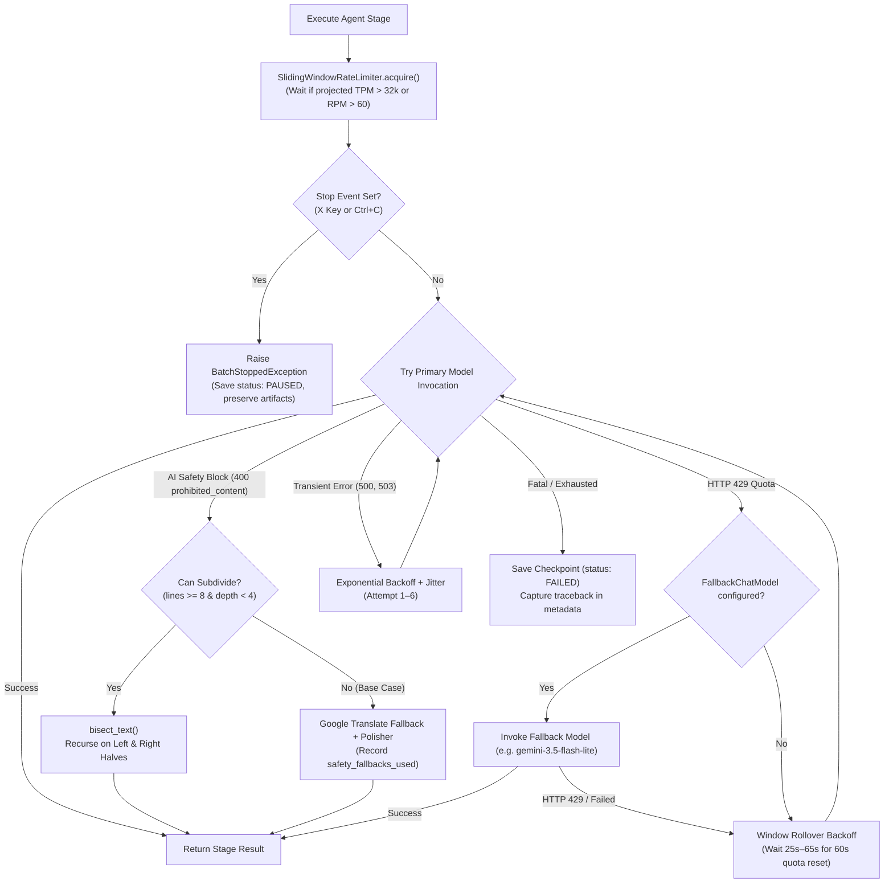

# 🏛️ System Architecture & Component Design

This document details the software architecture, design patterns, and layer separation of **NouSetsu**. The system is built with clean architecture principles to ensure decoupling between LLM providers, multi-agent orchestration, local persistence, and user interfaces.

---

## 🏗️ Layered Architecture Diagram

```mermaid
graph TD
    subgraph Presentation_Layer ["Presentation Layer (UI / Web / CLI)"]
        TUI["Textual TUI Application<br/>(DualReader, ProgressPanel, Token Analytics M, Web Traces W, Volume F, Stop X)"]
        WEB["Vite + React 19 Web Visualizer<br/>(nousetsu web, port 5173, Prompt Inspector, Timeline)"]
        CLI["Rich CLI Commands<br/>(init, batch, tui, narrative, migrate-summaries, graph-info, skills, traces, web, lore, migrate-rag)"]
    end

    subgraph Batch_Orchestration ["Batch & Task Orchestration"]
        Scanner["ChapterScanner<br/>(natsort, SHA256, load_all_metadata)"]
        Runner["BatchRunner<br/>(sequential loop, stop_event, checkpoints, Rich progress, RAG sync)"]
    end

    subgraph Workflow_Layer ["Agentic Workflow Layer (LangGraph & Procedural Graphs)"]
        Workflow["NovelTranslationWorkflow<br/>(StateGraph, Review Reflection Loop, stage callbacks)"]
        State["TranslationState<br/>(source, draft, critique, polish, 3-tier Bible memory, best candidate)"]
        PG["ProceduralGraph & Refiner<br/>(G=(V,R,E,Phi), deterministic localization, Name_Discipline, offline self-evolution)"]
        DiffPatcher["DiffPatcher Engine<br/>(SEARCH/REPLACE diff blocks, fuzzy line matching, fallback to full text)"]
        Tracker["PromptTracker<br/>(AgentPromptTrace, ChapterTraceDocument, forensic prompt & response logging)"]
    end

    subgraph Agent_Layer ["Specialized Agent Layer"]
        Extractor["Stage 1: Entity Extractor<br/>(EntityExtractorAgent + Scan_Candidates PG)"]
        Drafter["Stage 2: Context-Aware Drafter<br/>(ContextAwareDrafterAgent + Chunk-Aware PG + RAG k=2)"]
        Critic["Stage 3: Critique Agent<br/>(CritiqueAgent + Nickname Auditor + TM RAG k=2)"]
        Polisher["Stage 4: Polishing Agent<br/>(PolishingAgent + Cadence Engine + Diff/Patch + Title Guard)"]
        Chronicler["Stage 5: Chronicler Agent<br/>(ChroniclerAgent + 3-Tier Hierarchy + RAG Indexer k=3)"]
        LLM["LLM Client & FallbackChatModel<br/>(Per-Role Model Routing, 429 Automatic Failover)"]
    end

    subgraph RAG_Engine ["Hybrid Search RAG Knowledge Store"]
        RAG["HybridSearchEngine<br/>(Reciprocal Rank Fusion k=60)"]
        FTS["SQLite FTS5 BM25<br/>(Lexical sparse search)"]
        Embed["Gemini Embedding 2<br/>(3072-dim dense cosine similarity)"]
        Rerank["LLMCrossEncoderReranker<br/>(Joint LLM relevance scoring)"]
    end

    subgraph Utility_Layer ["Foundational Utilities (src/nousetsu/utils/ & analysis/)"]
        RateLimiter["SlidingWindowRateLimiter<br/>(32K TPM / 60 RPM, rolling window, 429 backoff)"]
        Chunker["LineSemanticChunker<br/>(85-line threshold, 70 target, 3 overlap)"]
        TokenEstimator["estimate_tokens<br/>(offline CJK 1.7 / Latin 1.3 weights)"]
        LangDetector["detect_language<br/>(Unicode script & lexical analysis)"]
        Formatter["format_duration<br/>(human-friendly step duration display)"]
        TokenMetrics["Token Analytics<br/>(compute_token_summary, StageMetric, ModelMetric)"]
        Filtering["Boundary & Scene Filtering<br/>(filter_glossary_for_text, filter_characters_for_scene)"]
    end

    subgraph Storage_Layer ["Persistence & Storage Layer"]
        Repo["NovelRepository<br/>(bible.yaml, .novel/metadata.json, summaries, arcs)"]
        LoreDB["LoreStore (lore.db)<br/>(SQLAlchemy 2.0 ORM, lore_fts FTS5 table)"]
        TracesDir["Trace Archive<br/>(.novel/traces/chapter_XXXX.json)"]
        Registry["ProjectRegistry<br/>(multi-project paths, last active project)"]
        Migrator["SummaryMigrationEngine<br/>(migrate_novel_summaries, 3-tier synthesis)"]
    end

    subgraph Domain_Models ["Domain & Schema Layer (Pydantic)"]
        M_Bible["NovelBible, CharacterProfile, GlossaryItem"]
        M_Meta["ChapterMetadata, CheckpointData, ErrorLogEntry, ArcSummary"]
        M_Config["ProjectConfig, StyleGuideConfig"]
        M_PG["ProceduralNode, ProceduralEdge, DiagnosticTrace"]
        M_Trace["AgentPromptTrace, ChapterTraceDocument"]
        M_RAG["LoreDocumentORM, LoreDocument, SearchResult, RAGConfig"]
    end

    %% Dependencies
    TUI --> Runner
    WEB --> TracesDir
    CLI --> Runner
    Runner --> Scanner
    Runner --> Workflow
    Scanner --> LangDetector
    Runner --> RateLimiter
    Workflow --> State
    Workflow --> PG
    Workflow --> Tracker
    Tracker --> TracesDir
    Workflow --> Extractor
    Workflow --> Drafter
    Workflow --> Critic
    Workflow --> Polisher
    Workflow --> Chronicler
    Workflow --> RateLimiter
    Workflow --> TokenMetrics
    Polisher --> DiffPatcher
    PG --> Extractor
    PG --> Drafter
    Critic -.->|"Audit Traces"| PG
    Drafter --> Chunker
    Polisher --> Chunker
    Drafter --> RAG
    Critic --> RAG
    Chronicler --> RAG
    RAG --> FTS
    RAG --> Embed
    RAG --> Rerank
    RAG --> LoreDB
    RateLimiter --> TokenEstimator
    Extractor --> LLM
    Drafter --> LLM
    Critic --> LLM
    Polisher --> LLM
    Chronicler --> LLM
    LLM --> RateLimiter
    Runner --> Repo
    Scanner --> Repo
    Migrator --> Repo
    TUI --> Registry
    TUI --> Repo
    Repo --> Domain_Models
    Workflow --> Domain_Models
```

---

## 🧩 Architectural Layers & Responsibilities

### 1. Presentation Layer (`src/nousetsu/tui/`, `src/nousetsu/cli/`, `web/`)
* **Textual TUI (`src/nousetsu/tui/app.py`)**: An asynchronous terminal application powered by `textual`. Renders side-by-side original and translated chapter views, reactive status badges (`[DONE]`, `[FAILED]`, `[RESUME]`, `[PAUSED]`, `[WAIT]`), a live 5-stage progress visualizer with chapter name display, dedicated **Stop Translation (`X`)** controls, volume folder switcher modal (`F`), Token Analysis modal (`M`), **Web Traces hotkey (`W`)**, and tabs for editing the Novel Bible, inspecting 3-tier summaries, and switching projects.
* **React 19 + Vite Web Visualizer (`web/`, `src/nousetsu/cli/web_server.py`)**: A modern, standalone web application served locally on port 5173 (`nousetsu web`). Displays interactive chapter prompt timelines, diff views between draft and polished text, per-stage token breakdowns (including thought tokens), and full audit trace inspection.
* **Rich CLI (`src/nousetsu/cli/app.py`)**: Command-line entry points for headless execution:
  * `nousetsu batch`: Batch chapter translation with limit, genre, volume routing, `--rag`, and `--rerank` flags.
  * `nousetsu web`: Launches the local Vite/React trace visualizer server and opens it in the browser.
  * `nousetsu traces`: Inspects forensic prompt traces and token logs in the terminal.
  * `nousetsu lore`: Queries and manages the SQLite Hybrid RAG knowledge store.
  * `nousetsu migrate-rag` (alias `index-rag`): Builds or refreshes the RAG SQLite database from existing summaries.
  * `nousetsu narrative`: Inspects 3-tier macro, meso, and micro narrative memory tree.
  * `nousetsu migrate-summaries`: Upgrades legacy flat summaries into 3-tier arc hierarchies.
  * `nousetsu graph-info`: Visualizes procedural execution graphs and name discipline directives.
  * `nousetsu skills`: Inspects, filters, and validates the 22-skill catalog.

### 2. Batch & Scanning Layer (`src/nousetsu/batch/`)
* **`ChapterScanner`**: Discovers raw chapter files (`.txt`, `.md`), applies natural numerical sorting (`1, 2, 10`), computes SHA-256 checksums to detect file changes, triggers auto source language detection, supports multi-folder novel structures, and performs a single I/O read of `.novel/metadata.json` for instantaneous project discovery.
* **`BatchRunner`**: Sequentially translates chapters, passes updated Novel Bible state forward, manages resumption checkpoints, manages thread-safe `stop()` and `reset_stop()` signals, coordinates rate limits, and synchronizes chapter completions with the RAG knowledge store.

### 3. Agentic Workflow & Procedural Graph Layer (`src/nousetsu/graph/`)
* **`NovelTranslationWorkflow`**: Compiles a LangGraph `StateGraph` featuring an automated **Reflection Review Loop** between `PolishingAgent` and `CritiqueAgent`:
  * Evaluates fidelity and style quality thresholds (`>= 8.5/10`).
  * Employs an automated **Best-Candidate Regression Guard** to retain the highest-scoring candidate if subsequent passes degrade.
  * Emits fine-grained progress notifications (`stage_callback`) to update the TUI and CLI in real time.
  * Wraps all agent invocations with `invoke_with_retry` and rate-limit acquisitions.
  * Coordinates `PromptTracker` for recording stage prompts, raw responses, and token usages into `.novel/traces/`.
* **Procedural Graph Engine (`src/nousetsu/graph/procedural.py`)**: Attributed directed graph $G = (V, R, E, \Phi)$ formalizing procedural execution knowledge (Lu et al., arXiv:2609.09153v1). Provides deterministic code-level localization without online guidance LLM token bloat. Features `Name_Discipline` for enforcing formal-vs-diminutive address rules.
* **Offline Refiner (`src/nousetsu/graph/pg_refiner.py`)**: Analyzes chapter critique audit traces offline to propose mutations (add/update/delete edge pitfalls and guidance), gated by structural verification and rejection memory with zero live inference token cost.

### 4. Specialized Agent Layer (`src/nousetsu/agents/`)
Each agent possesses a single cognitive responsibility:
* **Stage 1: `EntityExtractorAgent`**: Discovers unknown character names, spells, items, and titles before drafting. Steered by `Scan_Candidates` procedural graph directives with anti-bloat term pruning. Records forensic traces via `PromptTracker`.
* **Stage 2: `ContextAwareDrafterAgent`**: First-pass translation with zero-anaphora subject inference, character voice registers, nickname discipline, and 3-tier hierarchical narrative injection (Macro whole-story + Meso arc + Micro rolling chapters with volume badges). Inbound episodic RAG retrieves relevant past events ($k=2$). Uses script-aware word boundary filtering for active glossary and per-scene character roster filtering. Localizes procedural state to `Scene_Init` for chunk 1 and `Boundary_Continuity` for subsequent chunks. Integrates `LineSemanticChunker` for long chapters.
* **Stage 3: `CritiqueAgent`**: Line-by-line fidelity and stylistic auditing, generating scores and remediation notes. Inbound Translation Memory (TM) RAG retrieves canonical phrasing ($k=2$). Audits nickname disparity and skipped lines.
* **Stage 4: `PolishingAgent`**: High-cadence prose refinement, address form preservation, and translationese elimination across semantic chunks. Features optional **Diff / Patch Polishing Engine** (`DiffPatcher`) for token-efficient search/replace diff editing and an explicit **Chapter Title Preservation Guard** preventing heading loss or hallucination.
* **Stage 5: `ChroniclerAgent`**: Generates episodic chapter summaries, reads inbound lore ($k=3$), evaluates arc progression and milestone climaxes, updates macro `whole_story_summary`, archives completed story arcs into `.novel/summaries/arcs/`, and automatically indexes chapter summaries and 20-line scene chunks into the Hybrid RAG database.
* **Per-Role Model Routing & `FallbackChatModel` (`src/nousetsu/agents/llm.py`)**: Resolves specialized models per stage (`extractor_model`, `drafter_model`, `critic_model`, `polisher_model`, `chronicler_model`), stripping thought tokens and automatically failing over to `fallback_model` when encountering HTTP 429 quota exhaustion.

### 5. Hybrid Search RAG Knowledge Store (`src/nousetsu/rag/`)
* **`HybridSearchEngine` (`src/nousetsu/rag/engine.py`)**: Unified hybrid search orchestration combining lexical BM25 and dense semantic search.
* **SQLite FTS5 Full-Text Search**: Native SQLite virtual table (`lore_fts`) providing zero-daemon, lightning-fast BM25 keyword matching across entity names, titles, and dialogue.
* **Gemini Embedding 2**: Computes 3072-dimensional vector representations (`models/gemini-embedding-2`) with cosine similarity.
* **Reciprocal Rank Fusion (RRF, $k=60$)**: Merges lexical and semantic candidate rankings without requiring ad-hoc manual score scaling.
* **`LLMCrossEncoderReranker` (`src/nousetsu/rag/reranker.py`)**: Evaluates fused candidates with a joint LLM cross-encoder for precise context relevance.

### 6. Foundational Utility & Analytics Layer (`src/nousetsu/utils/` & `src/nousetsu/analysis/`)
* **`SlidingWindowRateLimiter` (`src/nousetsu/utils/rate_limiter.py`)**: Tracks requests and tokens across a rolling 60-second window, enforcing 32,000 TPM and 60 RPM limits with interruptible sleeps.
* **`LineSemanticChunker` (`src/nousetsu/utils/chunker.py`)**: Partitions chapters over 85 lines into ~70-line semantic chunks with 3-line boundary overlap, maintaining scene breaks and quote continuity.
* **`DiffPatcher` Engine (`src/nousetsu/utils/diff_patcher.py`)**: Parses LLM `<<<<<<< SEARCH ... ======= ... >>>>>>>` blocks and `NO_CHANGES_NEEDED` signals, performs fuzzy line matching against draft text, and safely falls back to full-text replacement upon parse failure.
* **`PromptTracker` (`src/nousetsu/analysis/tracker.py`)**: Captures exact input prompts, raw responses, model names, and token breakdowns per agent stage, streaming JSONL records and serializing consolidated `ChapterTraceDocument` files to `.novel/traces/`.
* **Script-Aware Boundary & Scene Filtering (`src/nousetsu/utils/glossary_filter.py`, `src/nousetsu/utils/character_filter.py`)**:
  * `filter_glossary_for_text` / `filter_glossary_for_scene`: Distinguishes CJK vs non-CJK terms, enforcing regex word boundaries (`\b`) on Latin text to prevent substring false positives.
  * `filter_characters_for_scene`: Dynamically narrows active character roster in Drafter/Critic to characters mentioned in the current scene chunk.
* **`Translation Fallback & Bisection Engine` (`src/nousetsu/utils/translation_fallback.py`)**:
  * `bisect_text`: Splits text chunks along prioritized boundary hierarchies (paragraph `\n\n`, line `\n`, sentence punctuation, whitespace word boundaries, or character midpoint).
  * `can_subdivide_text`: Determines if a blocked chunk meets minimum division thresholds (`min_lines >= 8` or `min_chars >= 200`).
  * `translate_via_google`: Deep-translator integration with ISO language mapping (`ja`, `en`, `th`, `zh-CN`, `ko`) for graceful fallback on commercial safety rejections.
* **`format_duration` (`src/nousetsu/utils/formatting.py`)**: Human-friendly duration display formatting (`3.9s`, `2m 15s`, `1h 4m`).
* **`estimate_tokens` (`src/nousetsu/utils/rate_limiter.py`)**: Offline token estimation assigning ~1.7 tokens per CJK character and ~1.3 tokens per Latin word.
* **`detect_language` (`src/nousetsu/utils/language.py`)**: Zero-dependency Unicode script and stop-word frequency analyzer recognizing Japanese, Chinese, Korean, Thai, Russian, and Latin languages.
* **`compute_token_summary` & Analytics (`src/nousetsu/analysis/token_metrics.py`)**: Computes project-wide and folder-scoped token analytics (`StageMetric`, `ModelMetric`, `ChapterMetric`, `ProjectTokenSummary`) across prompt, completion, thought, and cached tokens.

### 7. Persistence & Storage Layer (`src/nousetsu/storage/`)
* **`NovelRepository`**: Manages all file system persistence for a project:
  * `.novel/config.yaml`: Language pair, raw/output folders, rate limits, review loop caps, and per-agent model preferences.
  * `.novel/bible/bible.yaml`: Characters, glossary, and style guide.
  * `.novel/metadata.json`: Consolidated single metadata document storing all chapter checkpoints, quality audit scores, step durations, token breakdowns, and paused stage artifacts.
  * `.novel/summaries/<volume>/`: Historical episodic chapter summaries partitioned by volume folder.
  * `.novel/summaries/arcs/`: Archived Meso-tier story arc summaries (`arc_XXXX.json`).
  * `.novel/traces/`: Forensic chapter prompt trace logs (`chapter_XXXX.json`).
  * `.novel/rag/lore.db`: Zero-daemon local SQLite database managed by SQLAlchemy 2.0 ORM (`LoreDocumentORM`, `lore_fts`).
* **`ProjectRegistry`**: Stores user-registered project directories across arbitrary filesystem locations and persists the `last_active_project` for instant reopening.
* **`SummaryMigrationEngine` (`src/nousetsu/storage/migration.py`)**: Automatically detects and migrates legacy flat summaries into the 3-tier hierarchy (`whole_story_summary` -> `ArcSummary` -> partitioned volume summaries).

### 8. Domain Model Layer (`src/nousetsu/models/`)
* Strongly typed Pydantic V2 models defining contracts across the entire system (`TranslationState`, `NovelBible`, `ChapterMetadata`, `ArcSummary`, `ProjectConfig`, `AgentPromptTrace`, `ChapterTraceDocument`, `LoreDocument`, `SearchResult`).

---

## 🔒 Error Handling, Quota Management & Cancellation

NouSetsu is engineered for enterprise reliability over massive web novel series:

* **Zero Data Loss**: Checkpoints preserve intermediate progress at the chapter level.
* **Atomic Writes**: YAML and JSON files are written safely to prevent corruption during interruptions.
* **Dual Resilience Engine**: Combines binary bisection to isolate sensitive scenes with automatic Google Translate fallback so commercial safety blocks never halt batch translation.
