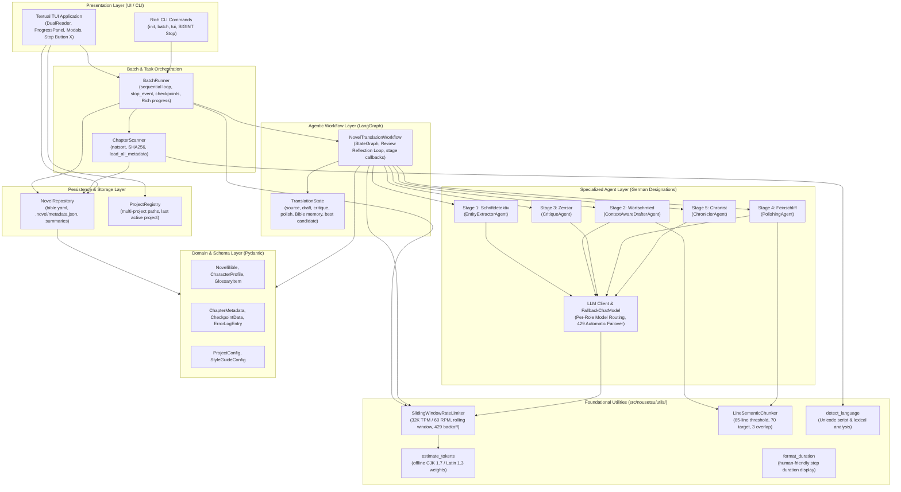
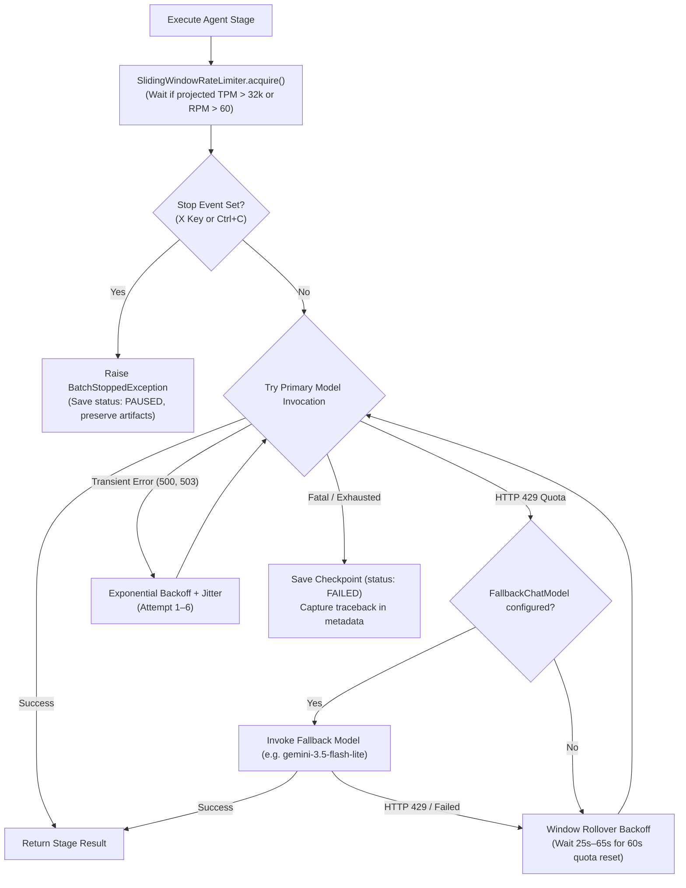

# 🏛️ System Architecture & Component Design

This document details the software architecture, design patterns, and layer separation of **NouSetsu**. The system is built with clean architecture principles to ensure decoupling between LLM providers, multi-agent orchestration, local persistence, and user interfaces.

---

## 🏗️ Layered Architecture Diagram

---

## 🧩 Architectural Layers & Responsibilities

### 1. Presentation Layer (`src/nousetsu/tui/`, `src/nousetsu/cli/`)
* **Textual TUI (`src/nousetsu/tui/app.py`)**: An asynchronous terminal application powered by `textual`. Renders side-by-side original and translated chapter views, reactive status badges (`[DONE]`, `[FAILED]`, `[RESUME]`, `[PAUSED]`, `[WAIT]`), a live 5-stage progress visualizer, dedicated **Stop Translation (`X`)** controls, and modals for editing the Novel Bible, adjusting rate limits & review loops, and switching projects.
* **Rich CLI (`src/nousetsu/cli/app.py`)**: Command-line entry points for headless servers, scripts, and terminal batch translation with native `SIGINT` (Ctrl+C) signal interception.

### 2. Batch & Scanning Layer (`src/nousetsu/batch/`)
* **`ChapterScanner`**: Discovers raw chapter files (`.txt`, `.md`), applies natural numerical sorting (`1, 2, 10`), computes SHA-256 checksums to detect file changes, triggers auto source language detection, and performs a single I/O read of `.novel/metadata.json` for instantaneous project discovery.
* **`BatchRunner`**: Sequentially translates chapters, passes updated Novel Bible state forward, manages resumption checkpoints, manages thread-safe `stop()` and `reset_stop()` signals, and coordinates rate limits.

### 3. Agentic Workflow Layer (`src/nousetsu/graph/`)
* **`NovelTranslationWorkflow`**: Compiles a LangGraph `StateGraph` featuring an automated **Reflection Review Loop** between `Feinschliff` and `Zensor`:
  * Evaluates fidelity and style quality thresholds (`>= 8.5/10`).
  * Employs an automated **Best-Candidate Regression Guard** to retain the highest-scoring candidate if subsequent passes degrade.
  * Emits fine-grained progress notifications (`stage_callback`) to update the TUI and CLI in real time.
  * Wraps all agent invocations with `invoke_with_retry` and rate-limit acquisitions.

### 4. Specialized Agent Layer (`src/nousetsu/agents/`)
Each agent possesses a single cognitive responsibility:
* **Stage 1: `EntityExtractorAgent` (*Schriftdetektiv*)**: Discovers unknown character names, spells, items, and titles before drafting.
* **Stage 2: `ContextAwareDrafterAgent` (*Wortschmied*)**: First-pass translation with zero-anaphora subject inference, character voice registers, and rolling episodic summaries. Integrates `LineSemanticChunker` for long chapters.
* **Stage 3: `CritiqueAgent` (*Zensor*)**: Line-by-line fidelity and stylistic auditing, generating scores and remediation notes.
* **Stage 4: `PolishingAgent` (*Feinschliff*)**: High-cadence prose refinement and translationese elimination across semantic chunks.
* **Stage 5: `ChroniclerAgent` (*Chronist*)**: Episodic synopses, world lore updates, and metadata compilation.
* **Per-Role Model Routing & `FallbackChatModel` (`src/nousetsu/agents/llm.py`)**: Resolves specialized models per stage (`extractor_model`, `drafter_model`, `critic_model`, `polisher_model`, `chronicler_model`), stripping thought tokens and automatically failing over to `fallback_model` when encountering HTTP 429 quota exhaustion.

### 5. Foundational Utility Layer (`src/nousetsu/utils/`)
* **`SlidingWindowRateLimiter` (`src/nousetsu/utils/rate_limiter.py`)**: Tracks requests and tokens across a rolling 60-second window, enforcing 32,000 TPM and 60 RPM limits with interruptible sleeps.
* **`LineSemanticChunker` (`src/nousetsu/utils/chunker.py`)**: Partitions chapters over 85 lines into ~70-line semantic chunks with 3-line boundary overlap, maintaining scene breaks and quote continuity.
* **`format_duration` (`src/nousetsu/utils/formatting.py`)**: Human-friendly duration display formatting (`3.9s`, `2m 15s`, `1h 4m`).
* **`estimate_tokens` (`src/nousetsu/utils/rate_limiter.py`)**: Offline token estimation assigning ~1.7 tokens per CJK character and ~1.3 tokens per Latin word.
* **`detect_language` (`src/nousetsu/utils/language.py`)**: Zero-dependency Unicode script and stop-word frequency analyzer recognizing Japanese, Chinese, Korean, Thai, Russian, and Latin languages.

### 6. Persistence & Storage Layer (`src/nousetsu/storage/`)
* **`NovelRepository`**: Manages all file system persistence for a project:
  * `.novel/config.yaml`: Language pair, raw/output folders, rate limits, review loop caps, and per-agent model preferences.
  * `.novel/bible/bible.yaml`: Characters, glossary, and style guide.
  * `.novel/metadata.json`: Consolidated single metadata document storing all chapter checkpoints, quality audit scores, step durations, and paused stage artifacts.
  * `.novel/summaries/`: Historical episodic chapter summaries.
* **`ProjectRegistry`**: Stores user-registered project directories across arbitrary filesystem locations and persists the `last_active_project` for instant reopening.

### 7. Domain Model Layer (`src/nousetsu/models/`)
* Strongly typed Pydantic V2 models defining contracts across the entire system (`TranslationState`, `NovelBible`, `ChapterMetadata`, `ProjectConfig`).

---

## 🔒 Error Handling, Quota Management & Cancellation

NouSetsu is engineered for enterprise reliability over massive web novel series:

* **Zero Data Loss**: Checkpoints preserve intermediate progress at the chapter level.
* **Atomic Writes**: YAML and JSON files are written safely to prevent corruption during interruptions.
