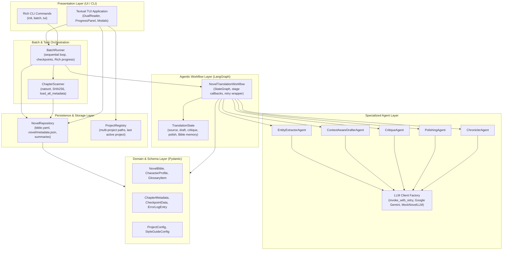

# 🏛️ System Architecture & Component Design

This document details the software architecture, design patterns, and layer separation of **NouSetsu**. The system is built with clean architecture principles to ensure decoupling between LLM providers, multi-agent orchestration, local persistence, and user interfaces.

---

## 🏗️ Layered Architecture Diagram



---

## 🧩 Architectural Layers & Responsibilities

### 1. Presentation Layer (`src/tui/`, `src/cli/`)
* **Textual TUI (`src/tui/app.py`)**: An asynchronous terminal application powered by `textual`. Renders side-by-side original and translated chapter views, reactive status badges (`[DONE]`, `[FAILED]`, `[RESUME]`, `[WAIT]`), a live 5-stage progress visualizer, and in-terminal modals for editing the Novel Bible and switching projects.
* **Rich CLI (`src/cli/app.py`)**: Command-line entry points for headless servers, scripts, and terminal batch translation.

### 2. Batch & Scanning Layer (`src/batch/`)
* **`ChapterScanner`**: Discovers raw chapter files (`.txt`, `.md`), applies natural human numerical sorting (`1, 2, 10` instead of `1, 10, 2`), computes SHA-256 checksums to detect file modifications, and performs a single I/O read of `.novel/metadata.json` for instantaneous project discovery.
* **`BatchRunner`**: Sequentially translates chapters, passes updated Novel Bible state forward to successive chapters, manages resumption checkpoints, handles error logging, and displays Rich progress bars.

### 3. Agentic Workflow Layer (`src/graph/`)
* **`NovelTranslationWorkflow`**: Compiles a LangGraph `StateGraph` linking the five translation nodes (`extract` $\to$ `draft` $\to$ `critique` $\to$ `polish` $\to$ `chronicle`).
* Emits fine-grained progress notifications (`stage_callback`) to update the TUI and CLI in real time.
* Wraps all agent invocations with `invoke_with_retry` to absorb transient network or provider errors.

### 4. Specialized Agent Layer (`src/agents/`)
Each agent has a single, well-defined cognitive responsibility:
* **`EntityExtractorAgent`**: Named entity recognition and glossary candidate discovery.
* **`ContextAwareDrafterAgent`**: First-pass translation with zero-anaphora subject inference, character voice registers, and rolling chapter summaries.
* **`CritiqueAgent`**: Independent fidelity and stylistic auditing, generating scores and remediation notes.
* **`PolishingAgent`**: High-cadence prose refinement and translationese elimination.
* **`ChroniclerAgent`**: Episodic synopses, world lore updates, and metadata compilation.
* **`LLM Client Factory (`src/agents/llm.py`)`**: Decouples LLM implementations. Integrates Google Gemini (`gemini-2.5-pro`, `gemini-2.5-flash`), with automatic fallback to a deterministic `MockNovelLLM` when running tests without API keys. Discards thinking/reasoning tokens from new reasoning models to preserve clean output.

### 5. Persistence & Storage Layer (`src/storage/`)
* **`NovelRepository`**: Manages all file system persistence for a project:
  * `.novel/config.yaml`: Language pair, raw folder, output folder, and model preferences.
  * `.novel/bible/bible.yaml`: Characters, glossary, and style guide.
  * `.novel/metadata.json`: Consolidated single metadata document storing all chapter checkpoints and quality audit scores.
  * `.novel/summaries/`: Historical episodic chapter summaries.
* **`ProjectRegistry`**: Stores user-registered project directories across arbitrary filesystem locations and persists the `last_active_project` for instant reopening.

### 6. Domain Model Layer (`src/models/`)
* Strongly typed Pydantic V2 models defining data contracts across the entire codebase. Guarantees schema validation, automated JSON/YAML serialization, and immutability where needed.

---

## 🔒 Error Handling & Resilience Architecture

NouSetsu is designed for high reliability over long-running batch jobs:

```
[Agent Execution]
       │
       ├── Transient Error (500, 503, 429, Timeout)?
       │        ├── YES: invoke_with_retry (backoff + jitter) ──► Re-attempt
       │        └── NO / Retries Exhausted:
       │                 │
       │                 ▼
       │         [Capture Stack Trace via traceback.format_exc()]
       │                 │
       │                 ▼
       │         [CheckpointData.record_error(stage, err, traceback)]
       │                 │
       │                 ▼
       │         [Save to .novel/metadata.json (status: failed)]
       │                 │
       │                 ▼
       │         [Render [FAILED] badge in TUI for 1-click retry]
```

* **Zero Data Loss**: Checkpoints save intermediate progress at the chapter level.
* **Atomic Writes**: YAML and JSON files are written with atomic semantics to prevent corrupt files during power interruptions.
