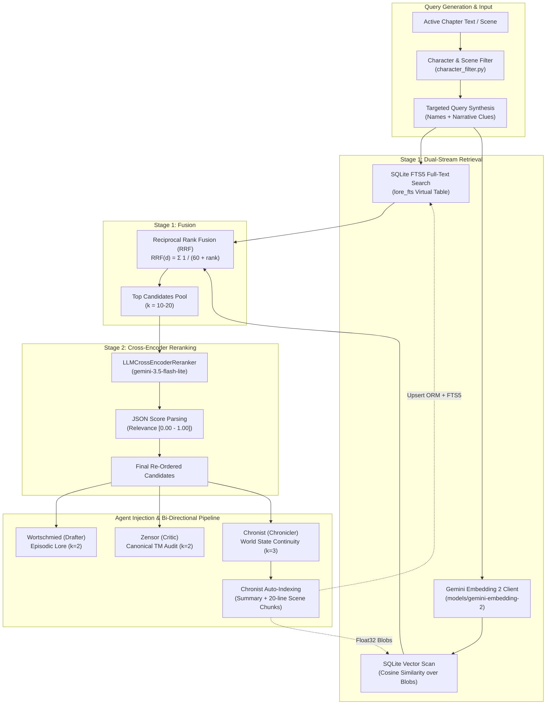
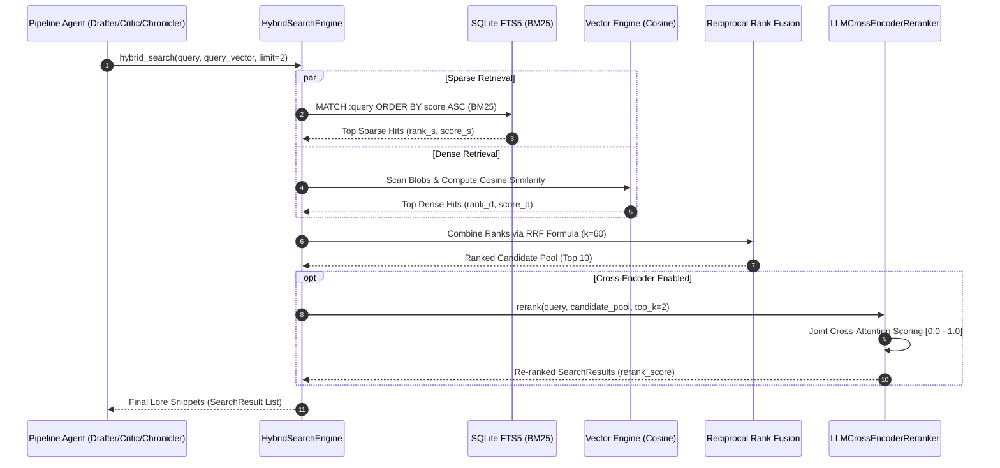
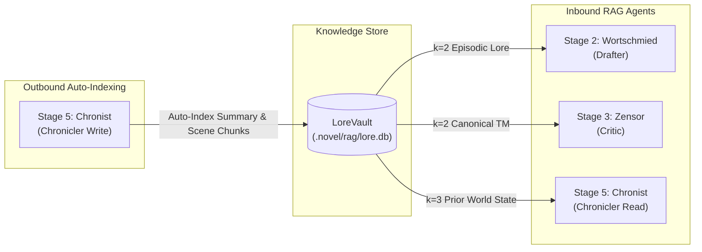

# Hybrid Search RAG: Workflow & Architecture Handbook

## 1. Overview & Architectural Motivation

In long-running literary translation pipelines for East Asian webnovels and light novels (often spanning hundreds of chapters and millions of characters), standard LLM context windows face critical failure modes:
1. **Context Bloat & Token Cost**: Stuffing entire novel histories into prompt contexts exceeds sliding-window rate limits and inflates inference expenses.
2. **Context Drift & Hallucination**: Distant plot promises, specialized cultivation realms, historical oaths, and obscure character relationships fade from immediate memory.
3. **Pure Dense Search Blind Spots**: Dense vector embeddings alone frequently fail on rare proper nouns, localized Chinese cultivation terms (*chengyu*, martial arts techniques), and exact romanized character names.
4. **Pure Lexical Search Blind Spots**: Pure BM25 keyword matching fails when narrative queries paraphrase past events or describe thematic concepts without exact word overlaps.

To overcome these challenges, **NouSetsu** incorporates a zero-daemon, enterprise-grade **Hybrid Search Retrieval-Augmented Generation (RAG)** knowledge store called **LoreVault**. LoreVault fuses:
- **Sparse Lexical Search**: Powered by SQLite **FTS5** (BM25 ranking with `unicode61` tokenization).
- **Dense Semantic Vector Search**: Powered by **Gemini Embedding 2** (`models/gemini-embedding-2`, 3072 dimensions) and cosine similarity.
- **Reciprocal Rank Fusion (RRF)**: A mathematically robust, score-agnostic candidate fusion algorithm ($k=60$).
- **Cross-Encoder Reranking**: A joint cross-attention LLM evaluation stage (`LLMCrossEncoderReranker`) that scores deep narrative continuity, character fidelity, and contextual relevance.



---

## 2. Storage Architecture & Relational Schema

LoreVault operates on a zero-daemon, serverless architecture using a dedicated SQLite database located at:
```text
.novel/rag/lore.db
```
The database is managed through **SQLAlchemy 2.0 ORM** with write-ahead logging (WAL) support, providing ACID-compliant multi-threaded concurrency across batch translation workers.

### A. Relational Table: `lore_documents`
Implemented by [`LoreDocumentORM`](file:///D:/Code/novel_translation_Agent/src/nousetsu/rag/db_models.py#L17-L74) in [`src/nousetsu/rag/db_models.py`](file:///D:/Code/novel_translation_Agent/src/nousetsu/rag/db_models.py):

| Column | Type | Nullable | Description |
|:---|:---|:---:|:---|
| `doc_id` | `VARCHAR(255)` | ❌ (PK) | Unique namespaced document identifier (e.g. `summary:Villainess_04:0012`, `chunk:Villainess_04:0012:003`, `character:Aria`). |
| `doc_type` | `VARCHAR(50)` | ❌ | Document category: `summary`, `chunk`, `character`, `glossary`. |
| `chapter_num` | `INTEGER` | ❌ | Associated chapter sequence number ($0$ for project-level Bible lore). |
| `folder` | `VARCHAR(100)` | ✔ | Associated volume/folder scope (e.g. `Villainess_04`). |
| `title` | `VARCHAR(500)` | ✔ | Human-readable title or headline. |
| `content` | `TEXT` | ❌ | Full indexed text payload. |
| `metadata_json` | `TEXT` | ✔ | Serialized arbitrary metadata (attributes, roles, arc numbers). |
| `embedding` | `BLOB` | ✔ | Raw IEEE 754 float32 byte array (packed binary vector). |
| `created_at` | `FLOAT` | ❌ | Unix timestamp of creation/indexing. |

**Indexes**:
- `idx_lore_chapter`: Composite B-Tree index on `(chapter_num, folder)`.
- `idx_lore_type`: Single index on `doc_type`.

### B. Full-Text Search Virtual Table: `lore_fts`
A native SQLite **FTS5** virtual table created alongside the relational table:
```sql
CREATE VIRTUAL TABLE IF NOT EXISTS lore_fts USING fts5(
    doc_id UNINDEXED,
    content,
    title,
    folder,
    doc_type,
    tokenize = 'unicode61'
);
```
- **Tokenization**: Uses `unicode61` to support multilingual CJK characters, Thai, Hangul, Kana, and Latin scripts.
- **Synchronization**: Handled atomically during upserts via [`HybridSearchEngine.index_documents()`](file:///D:/Code/novel_translation_Agent/src/nousetsu/rag/engine.py#L90-L157):
  1. `sqlite_insert(LoreDocumentORM).on_conflict_do_update(...)` guarantees relational idempotency.
  2. `DELETE FROM lore_fts WHERE doc_id = :doc_id` purges existing entries.
  3. `INSERT INTO lore_fts (...)` writes updated text tokens.

### C. Binary Embedding Storage & Vector Calculations
Rather than requiring complex external vector databases (e.g. Pinecone, Milvus, Chroma), NouSetsu stores dense vectors directly as binary blobs (`LargeBinary`):
- **Packing**: Normalized float vectors are converted into byte streams via `struct.pack(f"{len(vec)}f", *vec)`.
- **Unpacking**: During vector search, blobs are unpacked into float lists via `struct.unpack(f"{dim}f", blob)`.
- **Cosine Similarity**: Computed via [`_cosine_similarity()`](file:///D:/Code/novel_translation_Agent/src/nousetsu/rag/engine.py#L32-L46):
  $$\text{Cosine Similarity}(u, v) = \frac{\mathbf{u} \cdot \mathbf{v}}{\|\mathbf{u}\|_2 \|\mathbf{v}\|_2}$$

---

## 3. Document Taxonomy (`DocumentType`)

LoreVault categorizes knowledge into four distinct document types defined in [`DocumentType`](file:///D:/Code/novel_translation_Agent/src/nousetsu/rag/models.py#L7-L12):

| Document Type | ID Pattern | Source | Granularity | Purpose |
|:---|:---|:---|:---:|:---|
| `SUMMARY` | `summary:<folder>:<chapter:04d>` | Chapter Summaries | Macro | Tracks overarching chapter synopses, key plot twists, and character state shifts. |
| `CHUNK` | `chunk:<folder>:<chapter:04d>:<chunk:03d>` | Translated Chapters | Micro (~20 lines) | Stores exact dialogue exchanges, spell incantations, action scenes, and sensory details. |
| `CHARACTER` | `character:<name>` | Novel Bible | Entity | Records canonical aliases, original names, gender, speech quirks, and relationship maps. |
| `GLOSSARY` | `glossary:<source_term>` | Novel Bible | Term | Stores source $\to$ target translations, categories, and cultural localization notes. |

---

## 4. Two-Stage Retrieval & Reranking Workflow

LoreVault executes a coarse-to-fine two-stage retrieval pipeline:



### Stage 1A: Sparse Lexical Retrieval (BM25)
Implemented in [`HybridSearchEngine.search_sparse()`](file:///D:/Code/novel_translation_Agent/src/nousetsu/rag/engine.py#L189-L243):
- **Query Sanitization**: [`_sanitize_fts_query()`](file:///D:/Code/novel_translation_Agent/src/nousetsu/rag/engine.py#L22-L30) strips non-alphanumeric punctuation and builds an `OR`-delimited term phrase matching up to 12 keywords.
- **Scoring**: SQLite FTS5 computes native BM25 rank scores via `bm25(lore_fts)`. Lower BM25 values indicate stronger relevance.

### Stage 1B: Dense Semantic Retrieval (Embeddings)
Implemented in [`HybridSearchEngine.search_dense()`](file:///D:/Code/novel_translation_Agent/src/nousetsu/rag/engine.py#L244-L282):
- **Embedding Provider**: Managed by [`EmbeddingClient`](file:///D:/Code/novel_translation_Agent/src/nousetsu/rag/embeddings.py#L49-L117). Defaults to Google GenAI `models/gemini-embedding-2` (`text-multilingual-embedding-002`).
- **Offline & Testing Isolation**: If running under `pytest` or if model begins with `"mock"`, generates deterministic 64-dimensional pseudo-vectors via MD5 hashing and unit normalization, eliminating live API consumption during CI test runs.

### Stage 1C: Reciprocal Rank Fusion (RRF)
Implemented in [`HybridSearchEngine.hybrid_search()`](file:///D:/Code/novel_translation_Agent/src/nousetsu/rag/engine.py#L283-L353):
Instead of normalizing and adding disparate raw scores (BM25 is unbounded negative/positive whereas Cosine is in $[-1, 1]$), RRF evaluates rank positions:
$$RRF(d) = \sum_{m \in \{\text{sparse}, \text{dense}\}} \frac{1}{k + r_m(d)}$$
where:
- $r_m(d)$ is the 1-based rank of document $d$ within search modality $m$.
- $k = 60$ is the standard smoothing constant preventing high ranks from dominating.

If a document appears in both sparse and dense candidate lists, its RRF score compounds, elevating it above single-stream matches.

### Stage 2: Cross-Encoder Reranking
Implemented in [`LLMCrossEncoderReranker`](file:///D:/Code/novel_translation_Agent/src/nousetsu/rag/reranker.py#L66-L155):
Bi-encoder architectures (embeddings) encode query and document independently. A **Cross-Encoder** evaluates query and candidate documents simultaneously under joint cross-attention.

1. **Candidate Pool**: Takes the top $10$ candidates from Stage 1 RRF.
2. **Structured LLM Assessment**: Submits the current chapter scene query and candidate snippets to `gemini-3.5-flash-lite` (or designated model) under temperature 0.1.
3. **Strict Evaluation Criteria**:
   - *Character Identity*: Accurate tracking of honorifics, titles, and secret aliases.
   - *Direct Continuity*: Checks historical oaths, previous battles, and hidden artifacts.
   - *Situational Alignment*: Evaluates thematic match with current scene tension.
4. **JSON Parsing & Re-Ranking**: Extracts relevance scores in $[0.00, 1.00]$, sorts candidates descending, and returns the top $k$ items.
5. **Robust Fallback**: If the LLM call fails or times out, the reranker safely falls back to the Stage 1 RRF ranking without aborting translation.

---

## 5. Bi-Directional Pipeline Integration

Unlike standard read-only RAG systems, NouSetsu's RAG architecture is **bi-directional**: three agents consume episodic context, while the chronicler actively enriches the knowledge store at every chapter milestone.



### 1. `Wortschmied` (ContextAwareDrafterAgent)
- **Query Synthesis**: Gathers the names of up to 5 scene characters (via [`filter_characters_for_scene`](file:///D:/Code/novel_translation_Agent/src/nousetsu/utils/character_filter.py)) and the first 3 lines of the source chapter.
- **Context Injection**: Retrieves $k=2$ episodic lore entries. Injected into the drafting prompt under `## EPISODIC LORE CONTEXT (Historical Memory)`, anchoring zero-anaphora pronoun resolution and narrative continuity.

### 2. `Zensor` (CritiqueAgent)
- **Query Synthesis**: Focuses on character names paired with `"dialogue style canonical translation"` and `"terminology canon"`.
- **Context Injection**: Retrieves $k=2$ translation memory canon references to audit terminology compliance, tone consistency, and dialogue cadence.

### 3. `Chronist` (ChroniclerAgent)
- **Pre-Chronicle Retrieval**: Queries scene characters and the opening lines of the finalized polished prose to fetch $k=3$ preceding lore entries, verifying that character state changes (wounds, breakthroughs) align with history.
- **Post-Chronicle Auto-Indexing**: Implemented in [`NovelTranslationWorkflow._index_chapter_into_rag()`](file:///D:/Code/novel_translation_Agent/src/nousetsu/graph/workflow.py#L943-L1001):
  1. Formats validated `ChapterSummary` into a `summary` document.
  2. Splits final polished text into ~20-line scene chunks (`chunk` documents).
  3. Computes dense embeddings via `EmbeddingClient.embed_documents()`.
  4. Upserts all records atomically into `lore.db` and `lore_fts`.

---

## 6. CLI Commands & Operations

NouSetsu provides dedicated CLI subcommands and options for managing and inspecting LoreVault.

### 1. Interactive Lore Search (`nousetsu lore`)
Search the knowledge store directly from your terminal using the hybrid search pipeline:
```bash
# Search using default Hybrid RAG + Cross-Encoder
uv run nousetsu lore "magic sword of shadows"

# Restrict search to a specific volume folder
uv run nousetsu lore "oath of fealty" -F Villainess_04

# Limit number of returned results
uv run nousetsu lore "Aria Duke engagement" --limit 5
```
Output displays sparse BM25 ranks, dense cosine similarity, combined RRF scores, and Cross-Encoder relevance rankings in a Rich formatted table.

### 2. Backfill & Migration (`nousetsu migrate-rag`)
Backfill historical chapters, story arcs, and Novel Bible entities into LoreVault:
```bash
# Preview documents to be indexed without writing to database (dry run)
uv run nousetsu migrate-rag --dry-run

# Run migration and compute dense vector embeddings
uv run nousetsu migrate-rag --embed

# Target a specific volume folder with custom batch size
uv run nousetsu migrate-rag -F Villainess_05 --batch-size 100 --embed

# Re-index only Novel Bible characters and glossary items
uv run nousetsu migrate-rag --no-include-chunks --no-include-summaries --embed
```

### 3. Translation Batch Flags
Enable or disable RAG and Cross-Encoder reranking during batch translation:
```bash
# Standard batch translation with Hybrid RAG enabled (default)
uv run nousetsu batch --limit 5

# Disable Cross-Encoder reranking (use Stage 1 RRF only for faster throughput)
uv run nousetsu batch --limit 5 --no-rerank

# Disable RAG entirely (rely exclusively on Novel Bible rolling summaries)
uv run nousetsu batch --limit 5 --no-rag
```

---

## 7. Configuration Reference

RAG behavior is configured in `.novel/config.yaml` or overridden via environment variables in `.env`:

| Key in `.novel/config.yaml` | `.env` Variable | Default | Description |
|:---|:---|:---:|:---|
| `enable_rag` | `NOVEL_ENABLE_RAG` | `true` | Master toggle for Hybrid Search RAG context retrieval. |
| `rag_top_k` | `NOVEL_RAG_TOP_K` | `2` | Number of lore snippets injected into drafting and critique prompts. |
| `rag_embedding_model` | `NOVEL_RAG_EMBEDDING_MODEL` | `text-multilingual-embedding-002` | Canonical Google GenAI embedding model. |
| `enable_rag_reranker` | `NOVEL_ENABLE_RAG_RERANKER` | `true` | Enables Stage 2 Cross-Encoder LLM reranking. |
| `rag_reranker_model` | `NOVEL_RAG_RERANKER_MODEL` | `gemini-3.5-flash-lite` | Model driving Cross-Encoder narrative scoring. |
| `candidate_pool_size` | - | `10` | Size of Stage 1 RRF candidate pool passed to Cross-Encoder. |
| `chunk_size_lines` | - | `20` | Line threshold per scene chunk when indexing chapters. |

---

## 8. Summary of Source Files

| Component | Source File | Core Responsibility |
|:---|:---|:---|
| ORM Database Model | [`src/nousetsu/rag/db_models.py`](file:///D:/Code/novel_translation_Agent/src/nousetsu/rag/db_models.py) | SQLAlchemy 2.0 declarative models (`LoreDocumentORM`) and binary blob translation. |
| Domain Models | [`src/nousetsu/rag/models.py`](file:///D:/Code/novel_translation_Agent/src/nousetsu/rag/models.py) | Pydantic v2 domain schemas (`LoreDocument`, `SearchResult`, `RAGConfig`, `DocumentType`). |
| Search Engine | [`src/nousetsu/rag/engine.py`](file:///D:/Code/novel_translation_Agent/src/nousetsu/rag/engine.py) | Core engine coordinating SQLite FTS5 (BM25), vector cosine search, and RRF ($k=60$). |
| Embeddings Client | [`src/nousetsu/rag/embeddings.py`](file:///D:/Code/novel_translation_Agent/src/nousetsu/rag/embeddings.py) | Google GenAI embedding connector and hermetic offline pseudo-vector generator. |
| Cross-Encoder Reranker | [`src/nousetsu/rag/reranker.py`](file:///D:/Code/novel_translation_Agent/src/nousetsu/rag/reranker.py) | Joint cross-attention LLM reranking engine (`LLMCrossEncoderReranker`). |
| Migration Engine | [`src/nousetsu/rag/migration.py`](file:///D:/Code/novel_translation_Agent/src/nousetsu/rag/migration.py) | Backfill engine importing legacy summaries, story arcs, Novel Bible, and scene chunks. |
| Workflow Integration | [`src/nousetsu/graph/workflow.py`](file:///D:/Code/novel_translation_Agent/src/nousetsu/graph/workflow.py) | LangGraph nodes integrating query synthesis, lore retrieval, and chronicler auto-indexing. |
