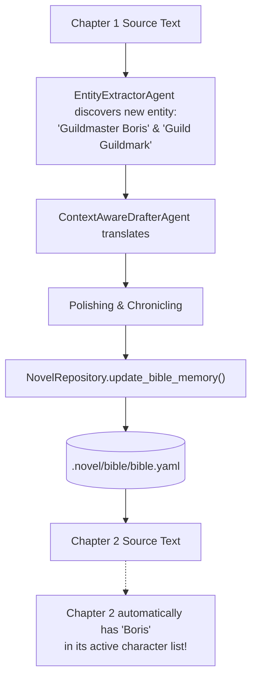

# 📖 Novel Bible, Character Voices & Zero-Anaphora Guide

The **Novel Bible** is the core memory foundation of **NouSetsu**. Unlike standard machine translation engines that treat every sentence or chapter as an isolated snapshot, NouSetsu maintains an evolving, persistent world bible that grows with each translated chapter.

---

## 🏛️ Novel Bible Architecture & Storage

The Novel Bible is stored in `.novel/bible/bible.yaml` inside each project root:

```yaml
title: "The Villainess Wants to Live Peacefully"
source_language: "Japanese"
target_language: "English"
characters:
  - name: "Clara von Amber"
    original_name: "クララ・フォン・アンバー"
    role: "Protagonist"
    gender: "Female"
    voice: "Calm, aristocratic, slightly cynical internal monologue, polite outward speech"
    aliases:
      - "Clara"
      - "Lady Amber"
glossary:
  - source: "魔導具"
    target: "magic tool"
    category: "item"
    notes: "General term for mana-powered technology"
style_guide:
  target_reading_level: "light_novel"
  tense: "past"
  pov: "third_person"
  honorific_mode: "adapt"
  custom_rules:
    - "Render internal monologue in italics"
    - "Translate kingdom currency 'ルクス' as 'lux'"
```

---

## 🌐 Automatic Source Language Detection

NouSetsu features a high-speed, zero-dependency Unicode script and lexical frequency analyzer engine ([`nousetsu.utils.language`](file:///D:/Code/novel_translation_Agent/src/nousetsu/utils/language.py)) that automatically recognizes source languages from raw chapter text:

* **CJK Scripts**: Deterministically detects **Japanese** (Hiragana/Katakana presence), **Korean** (Hangul blocks), and **Chinese** (CJK Unified Ideographs without Kana).
* **Other Non-Latin Scripts**: Recognizes **Thai** (`\u0e00-\u0e7f`) and **Russian / Cyrillic** (`\u0400-\u04ff`).
* **Latin Scripts**: Differentiates **English**, **Spanish**, **French**, and **German** using characteristic stop-word frequency heuristics.

### When Auto-Detection Triggers
1. **Project Initialization (`init`)**: If `--source-lang auto` or `Auto` is chosen in CLI/TUI, the engine scans the raw chapter files in the project directory, samples text, and pre-populates `bible.source_language`.
2. **Batch Translation Execution (`batch`)**: If `bible.source_language` is `"auto"`, the batch runner automatically samples the first available chapter, identifies the language, and writes the detected language back into `bible.yaml`.
3. **TUI Novel Bible Modal**: Clicking the **"🔍 Auto-Detect from Raw Chapters"** button in the Languages tab samples the raw chapters and updates the source language field instantly.

---

## 👥 Character Profiles & Voice Preservation

Character voice drift is the #1 flaw of automated translation. In long web novels, a character may sound casual in chapter 1, overly formal in chapter 5, and like an Elizabethan monarch in chapter 10.

### Character Profile Fields
* **`name`**: Canonical target language translation (e.g. `Lord Raymond`).
* **`original_name`**: Original script spelling (e.g. `レイモンド卿`).
* **`role`**: Narrative function (`Protagonist`, `Villain`, `Supporting`, `Merchant`).
* **`gender`**: Informs pronoun resolution when subjects are omitted.
* **`voice`**: Speech register, tone, sentence endings, and vocal idiosyncrasies.
* **`aliases`**: Nicknames and title variations recognized by the extractor.

### How Voice Ingestion Works
During Stage 2 (`ContextAwareDrafterAgent`), all active characters in the chapter are injected directly into the LLM system prompt:
```text
ACTIVE CHARACTERS & VOICE REGISTERS:
- Clara von Amber (Original: クララ・フォン・アンバー, Gender: Female, Role: Protagonist): 
  Voice=Calm, aristocratic, slightly cynical internal monologue, polite outward speech
- Raymond (Original: レイモンド, Gender: Male, Role: Prince): 
  Voice=Authoritative, blunt, speaks with noble pride
```
The model translates dialogue to match these exact linguistic fingerprints.

---

## 🎯 Zero-Anaphora Subject Resolution

### The Problem
In Japanese, Chinese, and Korean prose, sentence subjects are frequently omitted when the speaker considers them "obvious":

```text
Japanese original:
部屋に入った。剣を抜いた。驚いた。

Literal machine translation:
Entered the room. Drew the sword. Was surprised.
(Who entered? Who drew? Who was surprised? Machine translation guesses wildly: "I entered... He drew... It was surprised.")
```

### The NouSetsu Solution
NouSetsu's drafter resolves zero-anaphora using a 3-tier contextual triangulation:
1. **Scene Context & Rolling Summaries**: The drafter knows who was present in the preceding scene and what their current objectives are.
2. **Honorific & Speech Verb Morphology**: In Japanese, verbs like `仰った` (respectful speech) or `申した` (humble speech) indicate speaker status. The drafter maps these speech markers against the registered character hierarchy in the Novel Bible.
3. **Plausibility & Animacy Filtering**: Syntactic subjects are inferred and cross-checked against character genders and roles before the English prose is drafted.

---

## 📚 Canonical Glossary Management

The glossary prevents the same term from being translated inconsistently across chapters (e.g. translating a magic technique as "Flame Slash" in chapter 1, "Fire Cut" in chapter 3, and "Blazing Strike" in chapter 5).

### Glossary Item Fields
* **`source`**: The original term (e.g. `魔導炉`).
* **`target`**: The mandatory translated target term (e.g. `mana furnace`).
* **`category`**: Classification (`item`, `spell`, `location`, `title`, `organization`).
* **`notes`**: Translation guidelines or contextual exceptions.

### Glossary Ingestion & Enforcement
* **Drafting Phase**: Injected as strict translation constraints into the system prompt:
  ```text
  GLOSSARY CONSTRAINTS:
  - '魔導炉' MUST be translated as 'mana furnace' (item)
  ```
* **Critique Phase**: The `CritiqueAgent` verifies glossary adherence and reports the `glossary_compliance_pct` in the quality audit.

---

## 🔄 Cross-Chapter Memory Evolution

As chapters are translated, the Novel Bible is not static—it evolves automatically:



---

## 🎨 Style Guide Customization

The `style_guide` section controls prose tone and conventions:

* **`target_reading_level`**:
  * `light_novel`: Conversational, fast-paced, accessible vocabulary.
  * `literary_fiction`: Richer metaphor, varied cadence, literary vocabulary.
  * `webnovel`: High readability, dramatic paragraph breaks.
* **`tense`**:
  * `past`: Standard English fiction past tense ("He took the sword").
  * `present`: Immediate action present tense ("He takes the sword").
* **`pov`**:
  * `third_person`: Limited third-person or omniscient.
  * `first_person`: Intimate first-person perspective.
* **`honorific_mode`**:
  * `retain`: Retains foreign honorifics (e.g. `-san`, `-sama`, `-senpai`, `gege`, `shifu`).
  * `adapt`: Translates honorifics into English approximations (e.g. `Lady Clara`, `Sir`, `Brother`).
  * `drop`: Omits honorifics in favor of natural Western fiction conventions.
* **`custom_rules`**: A list of freeform translation rules injected directly into the drafter and critique prompts.
