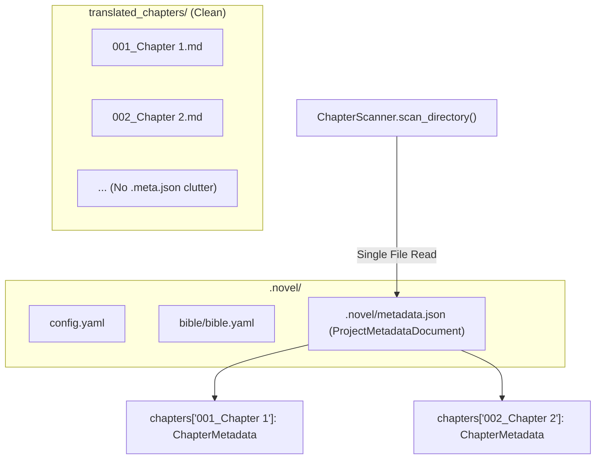
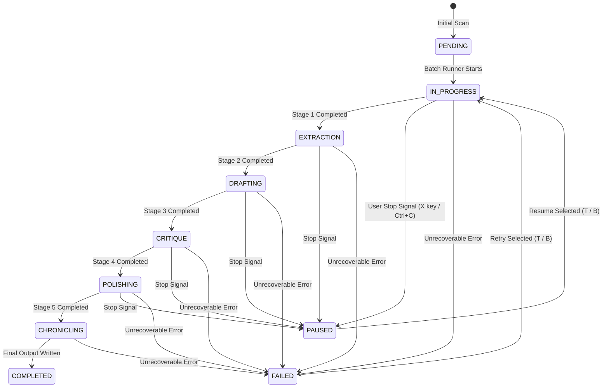

# 💾 Storage & Checkpoint Architecture

This document describes the filesystem layout, single project metadata architecture, checkpointing mechanism, and error diagnostic logs implemented in **NouSetsu**.

---

## 📂 Project Filesystem Layout

Each novel project managed by NouSetsu contains the following structure:

```
<project_root>/
├── .novel/                         # Hidden project configuration & storage
│   ├── config.yaml                 # Folder paths, languages, model settings
│   ├── metadata.json               # Consolidated single metadata document
│   ├── bible/
│   │   └── bible.yaml              # Novel Bible (characters, glossary, style guide)
│   └── summaries/
│       ├── chapter_0001.json       # Episodic chapter synopses
│       └── chapter_0002.json
├── raw_chapters/                   # Input folder (user-configurable name)
│   ├── 001 - Awakening.txt
│   └── 002 - Magic Beast.txt
└── translated_chapters/            # Output folder (clean .md translations only)
    ├── 001 - Awakening.md
    └── 002 - Magic Beast.md
```

---

## 📦 Single Project Metadata Architecture (`.novel/metadata.json`)

### Why Consolidate into a Single File?
In early versions, every translated chapter output an accompanying `.meta.json` file in the output directory (e.g. `001.md` and `001.meta.json`). For a 122-chapter novel, this cluttered the output folder with 244 files. Furthermore, discovering chapter statuses required opening and parsing 122 individual JSON files on disk.

In NouSetsu, all chapter metadata is stored in a single, high-performance project document located at `.novel/metadata.json`.



### Performance Benefits
* **Clean Output Folders**: Output folders contain only publication-ready `.md` translations.
* **Instant Batch Scanning**: The `ChapterScanner` reads `.novel/metadata.json` once, reducing I/O operations from $O(N)$ file reads to $O(1)$.
* **Atomic Updates**: Updates to individual chapters are written safely with zero cross-chapter lock contention.

---

## 🔄 Automatic Legacy Migration

To ensure 100% backward compatibility, `NovelRepository.load_metadata()` includes automatic transparent migration:

1. When loading metadata for an output file, `NovelRepository` first inspects `.novel/metadata.json`.
2. If the chapter is not found, it checks for a legacy `<output_file.stem>.meta.json` file in the output folder.
3. If found, it automatically ingests the legacy metadata into `.novel/metadata.json`, writes the project document, and returns the metadata.
4. Legacy files can then be safely deleted without losing any checkpoint history or audit scores.

---

## 📑 Checkpoint Schema & State Machine

Each chapter tracks its progression through a `CheckpointData` object:



### `CheckpointData` Pydantic Model
```python
class CheckpointData(BaseModel):
    status: StageStatus = Field(default=StageStatus.PENDING)
    last_completed_stage: PipelineStage = Field(default=PipelineStage.NONE)
    failed_stage: Optional[PipelineStage] = None
    last_error_type: Optional[str] = None
    last_error: Optional[str] = None
    last_error_traceback: Optional[str] = None
    retry_count: int = Field(default=0)
    stage_artifacts: StageArtifacts = Field(default_factory=StageArtifacts)
    error_logs: List[ErrorLogEntry] = Field(default_factory=list)

    def is_resumable(self) -> bool:
        """Returns True if chapter was paused or failed and has intermediate artifacts."""
        return self.status in [StageStatus.PAUSED, StageStatus.FAILED] and bool(
            self.stage_artifacts.draft_text or self.stage_artifacts.extracted_characters
        )
```

### `StageArtifacts` Model
Preserves intermediate outputs so cancelled or paused runs never lose completed work:
* `extracted_characters`: List of character profiles identified in Stage 1.
* `extracted_terms`: Glossary items identified in Stage 1.
* `draft_text`: Complete raw draft generated in Stage 2.
* `critique_notes`: Audit feedback generated in Stage 3.
* `polished_text`: Best literary prose candidate generated in Stage 4.

---

## 🚨 Error Diagnostics & Stack Trace Logging

When translation encounters an unrecoverable failure (or exhausts its exponential backoff retries), NouSetsu captures complete forensic diagnostics.

### `ErrorLogEntry` Schema
```python
class ErrorLogEntry(BaseModel):
    timestamp: str          # ISO 8601 UTC timestamp
    stage: PipelineStage    # Stage where failure occurred (e.g. PipelineStage.CRITIQUE)
    error_type: str         # Exception class name (e.g. 'InternalServerError')
    message: str            # Detailed error message string
    traceback: Optional[str]# Full Python traceback via traceback.format_exc()
    retry_attempt: int      # Number of retries attempted
    model: Optional[str]    # Model name in use (e.g. 'gemini-2.5-pro')
    details: Dict[str, Any] # Upstream API diagnostic payload
```

### Inspected in TUI Checkpoint Inspector
When a chapter fails, the TUI immediately renders:
* **Sidebar Badge**: `[bold red][FAILED][/]`
* **Inspector Status**: `Status: FAILED (InternalServerError)`
* **Failed Stage**: `Failed at: CRITIQUE`
* **Error Message Snippet**: `❌ 500 INTERNAL: Internal error encountered...`
* **Log Count & Retries**: `(Retries: 3, Logs: 1)`

Users can press `T` to retry failed chapters immediately from the exact failure stage.
