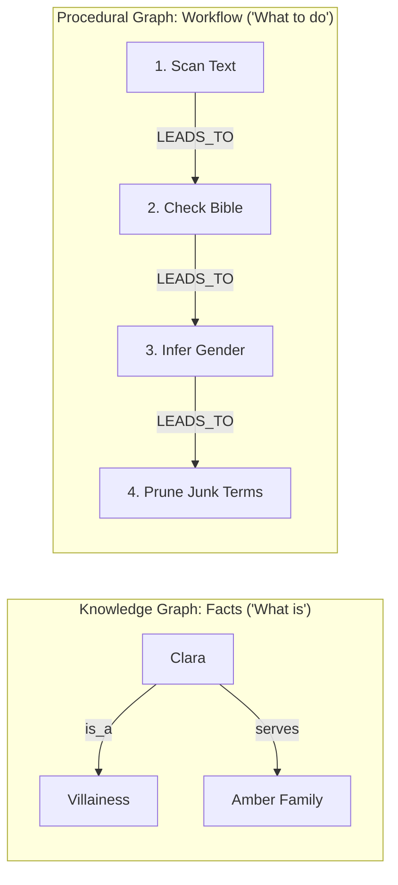

# 📖 NouSetsu User Guide

> **The Complete End-User Manual for Agentic Document-Level Novel Translation**  
> Powered by LangGraph, Textual, and Rich.

---

## 📑 Table of Contents

1. [Introduction](#-1-introduction)
2. [Installation & Setup](#-2-installation--setup)
3. [60-Second Quickstart (The Textual TUI Dashboard)](#-3-60-second-quickstart-the-textual-tui-dashboard)
4. [Headless CLI & Batch Automation](#-4-headless-cli--batch-automation)
5. [Agent Skills System](#-5-agent-skills-system)
6. [Procedural Graph Execution (Zero-Token Overhead)](#-6-procedural-graph-execution-zero-token-overhead)
7. [Managing the Novel Bible & Lore](#-7-managing-the-novel-bible--lore)
8. [Enterprise Safety Guards](#-8-enterprise-safety-guards)
9. [Gemini Interactions API & Granular Token Tracking](#-9-gemini-interactions-api--granular-token-tracking)
10. [Troubleshooting & FAQ](#-10-troubleshooting--faq)

---

## 🌟 1. Introduction

Traditional machine translation tools (e.g. Google Translate, DeepL) process texts sentence-by-sentence or paragraph-by-paragraph. While serviceable for short technical documents, this approach fails disastrously for literary novels:
* **Pronoun Disappearance (*Zero-Anaphora*)**: In East Asian languages (Japanese, Chinese, Korean), subjects and pronouns are frequently omitted in dialogue and narration. Generic MT engines guess blindly or invent random pronouns ("he/she/it"), destroying immersion.
* **Character Voice Drift**: A haughty tsundere villainess sounds identical to an ancient martial arts grandmaster.
* **Term Inconsistency**: A martial arts technique or magical artifact changes spelling every three paragraphs.
* **Memory Loss**: MT engines have zero awareness of events that took place in preceding chapters.

**NouSetsu** solves this with a collaborative 5-stage agent pipeline coordinated by **LangGraph**:
1. **Schriftdetektiv** (*EntityExtractorAgent*): Discovers new character names, factions, and terms before translation.
2. **Wortschmied** (*ContextAwareDrafterAgent*): Resolves omitted pronouns (*Zero-Anaphora*) and character voices using the persistent **Novel Bible**.
3. **Zensor** (*CritiqueAgent*): Audits the draft against the full raw source text for fidelity (0-10) and prose style (0-10).
4. **Feinschliff** (*PolishingAgent*): Refines draft prose into literary, publication-grade target language fiction using critique notes and source text reference.
5. **Chronist** (*ChroniclerAgent*): Summarizes chapter turning points, updates rolling lore memory, and compiles checkpoint metadata into `.novel/metadata.json`.

---

## 🛠️ 2. Installation & Setup

### Prerequisites
* **Python 3.13+** installed on your system.
* Optional but recommended: [uv](https://github.com/astral-sh/uv) (ultra-fast Python package installer).

### Option A: Install from Local Repository / Pip (Recommended)
You can install NouSetsu directly into your Python environment:

```bash
# Clone the repository
git clone https://github.com/Checkmartyr/NouSetsu.git
cd NouSetsu

# Install with pip
pip install .

# Or install with uv
uv pip install .
```

Once installed, two console commands are available globally in your terminal:
* `nousetsu`: Primary command.
* `novel`: Convenient shorthand alias.

### Option B: Run from Source with `uv`
If you prefer running from source without global installation:
```bash
git clone https://github.com/Checkmartyr/NouSetsu.git
cd NouSetsu
uv sync
```

### Configuring API Keys
NouSetsu supports Google Gemini (default), OpenAI, Anthropic, or an offline mock model:

```bash
# Windows PowerShell
$env:GEMINI_API_KEY = "AIzaSy..."

# Linux / macOS Bash
export GEMINI_API_KEY="AIzaSy..."
```

> [!NOTE]
> If no API key is provided, NouSetsu automatically operates with a deterministic offline mock model (`mock-novel-llm`), allowing you to test UI navigation, batch scanning, and checkpoint resumption without consuming API tokens!

---

## 🖥️ 3. 60-Second Quickstart (The Textual TUI Dashboard)

The fastest and most intuitive way to translate novels is via the interactive **Textual Terminal User Interface (TUI)**.

### Launching the TUI
Simply open your terminal and type:
```bash
nousetsu
```
*(Or use the shortcut `novel`).*

If you have an active novel project, it loads immediately. If you are in a new or uninitialized directory, the dashboard opens ready for you to create or pick a project!

```text
┌─ NouSetsu ──────────────────────────────────────────────────────────── [12:00:00] ─┐
│ 📚 Chapters (85% Height)          │ 📖 Dual Reader Pane (80% Viewport)             │
│  ✓ Ch.001 - Awakening             │ ┌────────────────────────┬───────────────────┐ │
│  ⏸ Ch.002 - Magic Beast           │ │ 🇺🇸 English Source      │ 🇹🇭 Thai Polished  │ │
│  · Ch.003 - Forest Encounter      │ │ The boy stepped out.   │ เด็กหนุ่มก้าวเดิน..│ │
│  · Ch.004 - Kingdom Royal Gate    │ └────────────────────────┴───────────────────┘ │
│  · Ch.005 - Ancient Dragon        ├────────────────────────────────────────────────┤
│                                   │ ⚡ Progress: 📖 Ch.002 [████████░░░░░░░░] 50%    │
│                                   │ Stage: [2/5 DRAFTING] | Status: Translating... │
│                                   ├────────────────────────────────────────────────┤
│                                   │ 📊 Inspector: Fidelity: 9.5 | Style: 9.2       │
│                                   │ Tokens: 1,284 in 3.9s | Status: COMPLETED      │
├───────────────────────────────────┴────────────────────────────────────────────────┤
│ [▶ Translate (T)]   [⚡ Batch All (B)]   [⏹ Stop (X)]       [📖 Bible (E)]          │
│ [📁 Projects (P)]   [✨ New (N)]          [⚙ Settings (S)]   [✖ Quit (Q)]           │
└────────────────────────────────────────────────────────────────────────────────────┘
```

### TUI Keyboard Shortcuts

| Key | Action | Description |
|:---:|:---|:---|
| `T` | **Translate Selected** | Triggers the 5-stage agentic translation graph on the highlighted chapter. |
| `B` | **Run All Batch** | Batches through all untranslated or resumed chapters in order. |
| `X` | **Stop Translation** | Safely pauses the active translation, saves a `PAUSED` checkpoint, and halts. |
| `E` | **Novel Bible** | Opens the in-terminal editor to inspect/add characters, relationships, and glossary terms. |
| `P` | **Projects** | Opens the Project Selector modal to switch between novel projects. |
| `F` | **Folder** | Opens the Folder Selector modal to switch between translation volumes/folders (e.g. Volume 4 vs Volume 5). |
| `N` | **New Project** | Opens the Project Creator modal to configure novel title, languages, and genre. |
| `S` | **Settings** | Opens the Settings modal to tune TPM/RPM rate limits, review loop caps, and model choices. |
| `M` | **Tokens** | Toggles the dedicated Token & Duration Analytics dashboard. |
| `Q` | **Quit** | Exits the application cleanly. |

### Step-by-Step Workflow in TUI

1. **Create a Project**: Press `N`. Enter your novel's title (e.g. *Villainess Reversal*), source language (e.g. *Japanese*, *Chinese*, *Korean*, or *auto*), target language (e.g. *English*, *Thai*), and genre (*isekai*, *wuxia*, *romance*, *general*).
2. **Add Raw Chapters**: Drop your raw text files (`.txt` or `.md`) into the project's `raw_chapters/` directory.
3. **Translate Single Chapter**: Highlight a chapter in the left sidebar and press `T`. Watch the live progress panel transition across Extraction, Drafting, Critique, Polishing, and Chronicling!
4. **Translate Entire Novel**: Press `B` to translate all chapters sequentially.
5. **Interrupt Safely**: If you need to stop, press `X` or click **Stop Translation**. The current chapter is immediately saved with status `[PAUSED:STAGE]`. When you restart or press `T`, it resumes exactly where it stopped without repeating completed stages!

---

## ⚡ 4. Headless CLI & Batch Automation

For headless Linux servers, Docker containers, or automated scripts, NouSetsu provides a full suite of CLI subcommands.

### CLI Command Summary

```bash
# 1. Automatic TUI Dashboard (Default)
nousetsu

# 2. Project Initialization
nousetsu init --title "My Novel" --source-lang "Japanese" --target-lang "English" --genre "isekai"

# 3. Headless Batch Translation
nousetsu batch --input-dir raw_chapters --output-dir translated_chapters --limit 10

# 4. Agent Domain Skills Catalog
nousetsu skills --agent drafter --genre isekai

# 5. Inspect Procedural Execution Graphs (Rich Tree)
nousetsu graph-info
nousetsu graph-info --agent drafter

# 6. Inspect 3-Tier Hierarchical Story Memory (Rich Tree)
nousetsu narrative
nousetsu narrative -p ./my_novel

# 7. Migrate Legacy Summaries to 3-Tier Hierarchy
nousetsu migrate-summaries -p ./my_novel

# 8. Explicit TUI Launch with Custom Paths
nousetsu tui --project-dir ./my_novel
```

### Full `nousetsu batch` Flags

| Flag | Shorthand | Default | Description |
|:---|:---:|:---:|:---|
| `--project-dir` | `-p` | Current directory | Root folder of the novel project |
| `--folder` | `-F` | None | Translation volume/folder within project (auto-resolves input and output folders, e.g. `-F Villainess_05`) |
| `--input-dir` | `-i` | `raw_chapters` | Folder containing raw chapter text files |
| `--output-dir` | `-o` | `translated_chapters` | Folder where translated markdown files are written |
| `--source-lang` | | `auto` | Override source language (`Japanese`, `Chinese`, `Korean`, `English`, etc.) |
| `--target-lang` | | `English` | Override target language (`English`, `Thai`, `Spanish`, etc.) |
| `--genre` | `-g` | `general` | Novel genre (`xianxia`, `wuxia`, `isekai`, `litrpg`, `romance`, `general`) |
| `--model` | `-m` | `gemini-3.1-flash-lite` | Primary LLM model name (or set `DEFAULT_MODEL` in `.env`) |
| `--fallback-model` | | `gemini-3.5-flash-lite` | Automatic fallback model used upon HTTP 429 quota exhaustion |
| `--extractor-model` | | `gemini-3.1-flash-lite` | Model for Stage 1: Entity Extractor (*Schriftdetektiv*) |
| `--drafter-model` | | `gemini-3.5-flash-lite` | Model for Stage 2: Context-Aware Drafter (*Wortschmied*) |
| `--critic-model` | | `gemma-4-26b-a4b-it` | Model for Stage 3: Critique Agent (*Zensor*) |
| `--polisher-model` | | `gemini-3.5-flash-lite` | Model for Stage 4: Prose Polisher (*Feinschliff*) |
| `--chronicler-model` | | `gemma-4-26b-a4b-it` | Model for Stage 5: Lore Chronicler (*Chronist*) |
| `--limit` | `-l` | None (all) | Maximum number of chapters to process in this run |
| `--force` | `-f` | False | Force re-translation even if chapter is already marked `COMPLETED` |
| `--max-loops` | | `3` | Maximum review reflection loops between Critic and Polisher (1–5) |
| `--quality-threshold` | | `8.5` | Target quality score (fidelity & style) to exit review loop early |
| `--max-tpm` | | `32000` | Sliding-window Tokens Per Minute rate limit quota |
| `--max-rpm` | | `60` | Sliding-window Requests Per Minute rate limit quota |
| `--interactions / --no-interactions` | | True | Enable or disable Gemini Interactions API (`/v1beta/interactions`) with fallback |
| `--chunking / --no-chunking` | | True | Enable or disable line-based semantic chunking for long chapters |
| `--chunk-threshold-lines` | | `85` | Minimum non-empty lines to trigger chunked translation |
| `--target-chunk-lines` | | `70` | Target line count per chunk |
| `--auto-update-bible` | | True | Automatically merge newly discovered characters and terms into Novel Bible |

> [!TIP]
> Pressing `Ctrl+C` (`SIGINT`) during headless CLI batch translation will gracefully pause the active chapter, flush `.novel/metadata.json`, and exit without data corruption.

---

## 🥋 5. Agent Skills System

NouSetsu equips agents with **domain-specific translation skills** that automatically inject targeted directives into agent prompts based on the novel's source language and genre:

```bash
# View all registered skills
nousetsu skills

# Filter by agent and genre
nousetsu skills --agent drafter --genre wuxia
```

### Built-in Skills (20 Total)

| Agent | Skill Name | Genre / Language Scope | Description |
|:---|:---|:---:|:---|
| **Extractor** | `entity_disambiguation` | All genres / All languages | Distinguishes family names, given names, and honorific suffixes. |
| **Extractor** | `cultivation_hierarchies` | Xianxia, Wuxia, LitRPG / CJK | Discovers martial/magic realms and meridians. |
| **Extractor** | `relationship_mapping` | All genres / All languages | Maps master-disciple, senpai-kouhai, and clan hierarchies. |
| **Drafter** | `zero_anaphora_resolution` | Japanese, Chinese, Korean | Reconstructs omitted subjects and pronouns from context. |
| **Drafter** | `name_address_fidelity` | All genres / All languages | Enforces strict dialogue address registers; preserves nicknames without arbitrary full-name substitution. |
| **Drafter** | `character_voice_differentiation` | All genres / All languages | Enforces distinct dialogue registers for each character. |
| **Drafter** | `idiom_localization` | Chinese, Japanese, Korean | Localizes 4-character idioms (Chengyu/Yojijukugo) naturally. |
| **Drafter** | `isekai_fantasy_tropes` | Isekai, Fantasy / All languages | Formats adventurer guild ranks, quest boards, and stat windows. |
| **Drafter** | `wuxia_martial_arts` | Wuxia, Xianxia / All languages | Formats qi flow, stances, and martial arts combat exchanges. |
| **Drafter** | `litrpg_system_interface` | LitRPG, GameLit / All languages | Formats status screens, inventory logs, and system notifications. |
| **Critic** | `omission_detector` | All genres / All languages | Audits for skipped sentences or condensed descriptions. |
| **Critic** | `glossary_auditor` | All genres / All languages | Enforces exact canonical terms from Novel Bible. |
| **Critic** | `hallucination_guard` | All genres / All languages | Flags fabricated plot events or unnatural additions. |
| **Critic** | `nickname_disparity_auditor` | All genres / All languages | Flags unprovoked name/nickname swaps and register mismatches. |
| **Critic** | `tone_consistency_auditor` | All genres / All languages | Audits narrative register against established tone. |
| **Polisher** | `translationese_filter` | All genres / All languages | Purges clunky passive voice and repetitive translation tropes. |
| **Polisher** | `prose_cadence_enhancer` | All genres / All languages | Crafts dynamic sentence rhythm and sensory prose. |
| **Polisher** | `address_form_preservation` | All genres / All languages | Strictly forbids normalizing intimate pet names and emotional address forms. |
| **Polisher** | `show_dont_tell` | All genres / All languages | Converts flat emotional labels into physical actions. |
| **Polisher** | `dialogue_flow` | All genres / All languages | Ensures spoken dialogue sounds natural and fluid. |
| **Polisher** | `otome_court_etiquette` | Romance, Otome, Drama / All | Refines aristocratic court banter and villainess poise. |

### Adding Custom Markdown Skills
You can add custom skills simply by dropping a markdown file with YAML frontmatter into `src/nousetsu/skills/catalog/` or your project folder:

```markdown
---
name: grimdark_horror_atmosphere
agent: polisher
title: Grimdark Horror & Sensory Dread
languages: [all]
genres: [horror, grimdark, dark-fantasy]
priority: 110
---

### Grimdark Atmosphere Directives:
- Sharpen visceral sensory cues: metallic tang of blood, oppressive damp chill, guttering candles.
- Emphasize character exhaustion, paranoia, and psychological dread.
```

---

## 🧠 6. Procedural Graph Execution (Zero-Token Overhead)

NouSetsu integrates an innovative **Procedural Graph** engine based on Google DeepMind research (*Procedural Graphs: Self-Evolving Execution Structures for LLM Agents*, Lu et al., arXiv:2609.09153v1).

### 💡 The Core Idea: Knowledge Graph vs. Procedural Graph in Plain English

Most AI systems know **facts**, but get lost on **procedures** (what to do next):

| Graph Type | What Question It Answers | Example Triplet | Real-World Analogy |
|:---|:---|:---|:---|
| **Knowledge Graph (KG)** | *"What is this thing?"* (Facts) | `(Clara, IS_A, Noble)`<br>`(Excalibur, LOCATED_IN, Stone)` | An Encyclopedia |
| **Procedural Graph (PG)** | *"What should I do next?"* (Actions) | `(Scan Candidates, LEADS_TO, Filter Known)` | A Flight Checklist / GPS |



### 🗝️ The 3 Magic Attributes on Every Edge

In a simple diagram, arrows just say "leads to". In a **Procedural Graph**, every transition edge carries three vital pieces of operational advice:

$$\Phi(e) = (\text{Condition}, \text{Guidance}, \text{Pitfalls})$$

1. **Condition**: *When* should this step trigger?  
   *(e.g., "When a candidate character name appears in the scene")*
2. **Guidance**: *How* should the model solve it?  
   *(e.g., "Inspect speech honorifics like -sama or -kun to determine gender and status before guessing")*
3. **Pitfalls (The Secret Weapon)**: *What mistakes* must the model NOT make?  
   *(e.g., "DO NOT extract common conversational verbs, everyday adjectives, or greetings as novel terms!")*

### ⚡ The Research Paper's Flaw vs. NouSetsu's Token-Frugal Architecture

In the original academic paper:
* At **every single step**, the agent asks a separate online "Guidance LLM": *"Look at the graph and tell me what to do."*
* **The Problem**: Token consumption exploded by **+55% to +430%** (consuming up to 367,000 tokens on large tasks)!

**NouSetsu's Lightweight Solution**:
1. **Deterministic Localization (0 Extra LLM Calls, 0ms Latency)**:  
   Fast Python code tracks pipeline state:
   * Extractor running? $\rightarrow$ Select `Scan_Candidates` edge.
   * Drafter translating Chunk 1? $\rightarrow$ Select `Scene_Init` edge.
   * Drafter translating Chunk 2+? $\rightarrow$ Select `Boundary_Continuity` edge.
2. **Compact Serialized Injection (< 80 Tokens)**:  
   Only the active edge's guidance and pitfalls are injected into the agent's prompt.
3. **Net Token Reduction (We Actually Save Tokens!)**:  
   By giving the Extractor a strict anti-bloat pitfall rule (*"Do not extract everyday conversational vocabulary"*), the model stops outputting dozens of useless JSON dictionary entries.
   * Prompt overhead: **+60 tokens**.
   * Output reduction: **-300 to -800 tokens**.
   * **Net Result: Translation uses FEWER tokens than without the graph!**

### 🎬 Concrete Examples in Action

#### Example A: In the Extractor (`Schriftdetektiv`)
* **Without PG**: The model reads a Japanese sentence, finds common descriptive phrasing, and extracts everyday words ("quickly", "good", "run") into the glossary. The output is bloated with 1,200 tokens of junk.
* **With PG**: The prompt injects:
  > **Step $\rightarrow$ Prune Trivial Terms**: Extract only domain-specific martial ranks, spells, and unique items.  
  > **Pitfalls to Avoid**: Strictly exclude ordinary conversational vocabulary, everyday verbs, and greetings.
* **Result**: The LLM outputs only valid novel lore (`Azure Thunder Blade`, `Clara`), saving 300–800 output tokens.

#### Example B: In the Drafter (`Wortschmied`) across Chunks
* **Chunk 1**: Localizes at `Scene_Init`. Tells model: *"Anchor character POV, establish narrative past tense, and identify opening speakers."*
* **Chunk 2+**: Localizes at `Boundary_Continuity`. Tells model:
  > **Step $\rightarrow$ Boundary Continuity**: Read Preceding Scene Context to identify active speaker. Resume translating immediately.  
  > **Pitfalls to Avoid**: DO NOT repeat or re-translate preceding text. DO NOT restart the scene or re-introduce known characters.
* **Result**: Eliminates the classic chunk boundary bug where Chunk 2 re-translates lines from Chunk 1 or greets characters as if meeting them for the first time.

### 🔍 Terminal Inspection Tool (`nousetsu graph-info`)

You can inspect all active procedural graphs directly in your terminal using the built-in Rich tree viewer:

```bash
# View all active agent procedural graphs
nousetsu graph-info

# Filter by a specific agent with verbose edge attributes
nousetsu graph-info --agent drafter --verbose
```

Terminal output displays the execution flow, transitions, guidance notes, and pitfall guards in colorful Rich trees:

```text
📦 NouSetsu Procedural Graph Inspection
├── 🎭 Stage 1: Extractor (Schriftdetektiv)
│   ├── [Scan_Candidates] ──(text_received)──> [Filter_Known]
│   ├── [Filter_Known] ──(unregistered_found)──> [Deduce_Profiles]
│   └── [Deduce_Profiles] ──(entities_resolved)──> [Prune_Trivial_Terms]
│       └── ⚠️ Pitfall: Strictly exclude ordinary conversational vocabulary, everyday verbs, and greetings.
└── ✍️ Stage 2: Drafter (Wortschmied)
    ├── [Scene_Init] ──(chunk_1_or_single)──> [Zero_Anaphora_Resolution]
    ├── [Boundary_Continuity] ──(chunk_gt_1)──> [Zero_Anaphora_Resolution]
    │   └── ⚠️ Pitfall: DO NOT repeat or re-translate preceding text. DO NOT restart scene.
    ├── [Zero_Anaphora_Resolution] ──(subjects_resolved)──> [Voice_Modulation]
    └── [Voice_Modulation] ──(voices_locked)──> [Glossary_Lock]
```

### 🧬 Offline Self-Evolution (Learning Without Inference Costs)

NouSetsu includes an offline refiner ([`pg_refiner.py`](file:///D:/Code/novel_translation_Agent/src/nousetsu/graph/pg_refiner.py)) based on Algorithm 1 of the paper:
1. When `Zensor` (`CritiqueAgent`) flags translation flaws (e.g. pronoun drift or glossary omissions), a `DiagnosticTrace` records the failure.
2. An offline evolution process compares successful vs. failed chapter runs and refines graph edge attributes (e.g. appending new specific pitfalls).
3. Changes are committed only if structural validation passes and regression tests succeed.
4. **Inference Token Cost: 0 tokens** (runs offline or post-batch).

---

## 📖 7. Managing the Novel Bible & Lore

All persistent memory is stored in human-readable YAML at:
```text
.novel/bible/bible.yaml
```

### Structure of the Novel Bible

```yaml
title: Reincarnated as a Swordmaster
source_language: Japanese
target_language: English
genre: isekai

characters:
  - name: Allen
    original_name: アレン
    gender: male
    role: protagonist
    voice: humble, determined, polite with elders, fierce in combat
    relationships:
      Seraphina: companion

glossary:
  - source: 蒼雷剣
    target: Azure Thunder Blade
    category: item
    notes: Legendary katana forged from storm dragon scales

style_guide:
  reading_level: literary_fiction
  tense: past
  pov: third_person
  honorific_mode: retain   # 'retain' (-san/-sama), 'translate' (Mr./Lord), or 'omit'

summaries:
  - chapter_num: 1
    title: The Departure
    synopsis: Allen leaves his hometown after awakening his dragon lineage.
```

> [!TIP]
> You can edit the Novel Bible directly in the Textual TUI by pressing `E`. Changes take effect on the next translated chapter!

---

## 🛡️ 8. Enterprise Safety Guards

1. **Sliding-Window Rate Limiter (32K TPM / 60 RPM)**:
   - Tracks token and request quotas across a rolling 60-second window.
   - Automatically pauses before API calls to guarantee your quota is never exceeded.
   - On Google API 429 quota exhaustion, performs an intelligent 25s–65s window rollover wait.
2. **Automatic Fallback Model Guard (429 Failover)**:
   - When any agent stage encounters HTTP 429 or `RESOURCE_EXHAUSTED` errors, `FallbackChatModel` automatically fails over to the designated `fallback_model` (default: `gemini-3.5-flash-lite`).
   - Ensures continuous batch translation even during sudden API tier limits.
3. **Language Regression Guard**:
   - Polisher and Critic verify that outputs match `target_language` using offline Unicode script analysis (`detect_language`).
   - If an LLM attempts to translate back to `source_language`, the regression is immediately rejected and the valid target draft is preserved.
4. **Best-Candidate Regression Guard**:
   - During multi-pass reflection loops, the system tracks the highest-scoring version. If a later loop pass scores lower, the best version is automatically restored.
5. **Single-File Checkpoints (`.novel/metadata.json`)**:
   - All chapter checkpoints, error traces, and quality audits are stored in a single JSON file.
   - Enables fast directory scanning and instant resume.
6. **Line-Based Semantic Chunking (32K TPM Rate-Limit Guard)**:
   - Scans non-empty lines in source chapters. If line count exceeds `chunk_threshold_lines` (default: 85), automatically divides chapters into ~70-line chunks.
   - Snaps to scene break lines (`***`, `---`, `◆◆◆`) and paragraph boundaries while strictly preserving multi-line dialogue quotes (`「...」`, `"..."`).
   - Keeps individual chunk requests under ~3,500 total tokens (under 12% of the 32,000 TPM limit), completely preventing 60-second sliding-window freezes.
   - Passes sliding translation context (last 3 lines of preceding translation) to guarantee zero-anaphora pronoun continuity and character voice.
7. **Active Chapter Glossary Optimization**:
   - Dynamically filters the Novel Bible glossary to terms actually present in the chapter text before sending prompts to Critic and Polisher.
   - Prevents prompt bloat and eliminates false-positive compliance warnings.

---

## ⚡ 9. Gemini Interactions API & Granular Token Tracking

NouSetsu natively integrates Google's cutting-edge **Gemini Interactions API** (`/v1beta/interactions`) to coordinate stateful multi-turn agent conversations, stream model thoughts, and provide high-fidelity token accounting across all pipeline stages.

### Interactions API Architecture
* **Native SDK Integration**: Interacts directly through `google.genai.Client.interactions.create` with support for `model`, `input`, and structured thought tokens.
* **Resilient HTTP REST Fallback**: Automatically falls back to standard direct REST (`https://generativelanguage.googleapis.com/v1beta/interactions`) if the SDK method is unavailable or in transitional environments.
* **Toggle via Configuration**: Controlled via `--interactions / --no-interactions` in CLI or `use_interactions_api: true/false` in `ProjectConfig`.

### Granular Per-Task & Per-Step Token Metrics
NouSetsu tracks 5 precise token dimensions across every pipeline stage:
* `input_tokens`: Raw prompt and context tokens fed to the agent.
* `output_tokens`: Final generated tokens produced by the agent.
* `thought_tokens`: Internal reasoning / chain-of-thought tokens consumed by reasoning models (e.g. Gemini 2.5 Flash Thinking / Gemini 2.5 Pro).
* `cached_tokens`: Tokens retrieved from prompt cache contexts.
* `total_tokens`: Grand total of all token usage for that step.

### Monitored Pipeline Steps
1. `extracting`: Entity discovery pass.
2. `drafting`: Initial narrative translation pass.
3. `critiquing (loop #1, #2, ...)`: Fidelity and prose evaluation pass.
4. `polishing (loop #1, #2, ...)`: Literary rewriting pass.
5. `chronicling`: Narrative summary extraction and metadata consolidation.

### Viewing Token & Duration Metrics
* **TUI Checkpoint Inspector**: Highlight any chapter in the TUI to view live aggregated metrics including duration:
  ```text
  Tokens: 1,284 in 3.9s (In: 820 Out: 364)
  ```
* **Rich CLI Batch Table**: At the conclusion of `nousetsu batch`, a comprehensive summary table displays token and execution duration breakdowns by task and step:
  ```text
  📊 Token & Duration Breakdown by Pipeline Step
  Chapter / Step       Extraction   Drafting      Critique      Polishing     Chronicle     Thought   Total Tokens   Time (s)
  ────────────────────────────────────────────────────────────────────────────────────────────────────────────────────────
  Ch.1                 200 (0.5s)   340 (1.2s)    324 (0.9s)    310 (1.1s)    110 (0.4s)    100       1,284          4.1
  ────────────────────────────────────────────────────────────────────────────────────────────────────────────────────────
  GRAND TOTAL          -            -             -             -             -             100       1,284          4.1
  ```
* **Persistent Metadata (`.novel/metadata.json`)**: Every chapter's `stats` object stores the complete cumulative metrics alongside the `step_usage` array (recording `duration_seconds` for every pipeline pass) for automated billing, latency monitoring, or profiling analytics.

---

## ❓ 10. Troubleshooting & FAQ

### Q: What should I do if I get a `429 Resource Exhausted` error?
**A**: NouSetsu's sliding-window rate limiter automatically catches 429 errors, pauses execution until the current 60-second window clears, and retries with exponential backoff. If you are on a restricted tier, lower your TPM via CLI:
```bash
nousetsu batch --max-tpm 10000 --max-rpm 30
```

### Q: How do I resume a batch translation that was stopped?
**A**: Simply run `nousetsu batch` again (or open `nousetsu` and press `B`). NouSetsu automatically skips completed chapters and resumes paused or failed chapters from their last completed stage!

### Q: Can I translate from English to Thai, Spanish, or Japanese?
**A**: Yes! NouSetsu supports arbitrary language pairs. Configure `--source-lang` and `--target-lang` during initialization:
```bash
nousetsu init --title "Villainess" --source-lang "English" --target-lang "Thai"
```
The Polisher and Critic dynamically adapt their prompts and enforce target language fidelity.

### Q: How do I force re-translation of a chapter?
**A**: Use the `--force` flag in CLI:
```bash
nousetsu batch --force --limit 1
```
Or in the TUI, select the chapter and press `T`.

---

*NouSetsu is maintained by Checkmartyr. Contributions and issues welcome on [GitHub](https://github.com/Checkmartyr/NouSetsu).*
