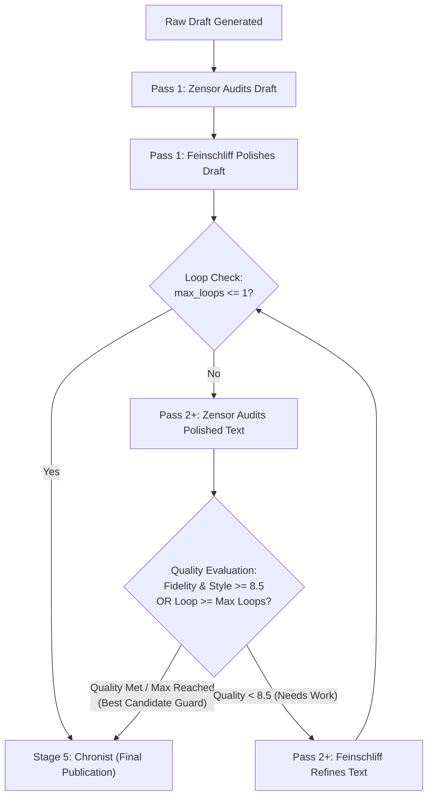

# 🔄 Multi-Agent Workflow & Translation Pipeline

This document explains the document-level, multi-stage translation workflow implemented in **NouSetsu**. Powered by **LangGraph**, the pipeline routes chapter text through five specialized AI agent stages with an automated review reflection loop to produce publication-grade novel prose.

---

## 🏛️ Chronological Workflow Sequence

The following sequence diagram illustrates the chronological execution flow from raw input file discovery through the multi-pass review loop to final polished Markdown and updated Novel Bible lore:

```mermaid
sequenceDiagram
    autonumber
    actor User as "User / CLI / TUI"
    participant Scanner as "ChapterScanner"
    participant Workflow as "NovelTranslationWorkflow"
    participant Extractor as "Stage 1: Schriftdetektiv (Extractor)"
    participant Drafter as "Stage 2: Wortschmied (Drafter)"
    participant Critic as "Stage 3: Zensor (Critic)"
    participant Polisher as "Stage 4: Feinschliff (Polisher)"
    participant Chronicler as "Stage 5: Chronist (Chronicler)"
    participant Repo as "NovelRepository"

    User->>Scanner: "Scan input folder"
    Scanner->>Scanner: "Auto-detect source language (JA / ZH / KO)"
    Scanner->>Repo: "load_all_metadata() (Single I/O Read)"
    Repo-->>Scanner: "ProjectMetadataDocument (.novel/metadata.json)"
    Scanner-->>User: "Discovered ChapterTasks (status, checkpoints)"

    User->>Workflow: "run(initial_state)"
    
    rect rgb(20, 30, 45)
        note over Workflow,Extractor: "Stage 1: Extraction (15%)"
        Workflow->>Extractor: "extract(source_text, bible)"
        Extractor-->>Workflow: "new_characters, new_terms, active_glossary"
    end

    rect rgb(25, 35, 55)
        note over Workflow,Drafter: "Stage 2: Drafting (35%)"
        Workflow->>Drafter: "draft(source_text, bible, characters, glossary, summaries)"
        Drafter-->>Workflow: "draft_text (zero-anaphora resolved)"
    end

    loop Review Reflection Cycle (Max 3 Loops)
        rect rgb(35, 45, 25)
            note over Workflow,Critic: "Stage 3: Critique Audit (60%)"
            Workflow->>Critic: "evaluate(source_text, text_to_audit, bible)"
            Critic-->>Workflow: "quality_audit (fidelity score, style score, warnings)"
        end

        opt Quality Threshold Met (Fidelity >= 8.5 & Style >= 8.5)
            note over Workflow: "Early Exit: Quality threshold achieved!"
        end

        rect rgb(45, 30, 45)
            note over Workflow,Polisher: "Stage 4: Prose Polishing (80%)"
            Workflow->>Polisher: "polish(draft_text, critique_notes, glossary, bible)"
            Polisher-->>Workflow: "polished_text (cadence refined, translationese removed)"
        end
    end

    rect rgb(45, 40, 20)
        note over Workflow,Chronicler: "Stage 5: Chronicling (95%)"
        Workflow->>Chronicler: "chronicle(chapter_num, best_polished_text)"
        Chronicler-->>Workflow: "new_chapter_summary (synopsis, events, state changes)"
        Workflow->>Chronicler: "assemble_metadata(...)"
        Chronicler-->>Workflow: "ChapterMetadata with CheckpointData"
    end

    Workflow->>Repo: "update_bible_memory(characters, terms, summary)"
    Repo-->>Repo: "Atomically save .novel/bible/bible.yaml"
    Workflow->>Repo: "save_metadata(metadata, output_file)"
    Repo-->>Repo: "Atomically update .novel/metadata.json"
    Workflow-->>User: "TranslationState (completed, duration, audit)"
```



---

## 🧭 Agent Function Quick Reference

| Stage | German Codename | Agent Class | Primary Function | Plain-English Role |
|:---:|:---|:---|:---|:---|
| **1** | **Schriftdetektiv** | `EntityExtractorAgent` | `extract(...)` | **The Detective**: Discovers unknown character names, ranks, and magic terms before translation starts. |
| **2** | **Wortschmied** | `ContextAwareDrafterAgent` | `draft(...)` | **The Wordsmith**: Writes the initial complete translation, resolving omitted pronouns (*Zero-Anaphora*) and honoring character voice registers. |
| **3** | **Zensor** | `CritiqueAgent` | `evaluate(...)` | **The Inspector**: Line-by-line quality auditor scoring fidelity and style (0-10) and generating actionable critique notes. |
| **4** | **Feinschliff** | `PolishingAgent` | `polish(...)` | **The Stylist**: Rewrites drafted prose into natural, immersive literary English, eliminating machine-translation tropes. |
| **5** | **Chronist** | `ChroniclerAgent` | `chronicle(...)`<br>`assemble_metadata(...)` | **The Memory Keeper**: Summarizes chapter events for future chapters and archives stats into `.novel/metadata.json`. |

---

## 🔍 Stage-by-Stage Function Breakdown

### Stage 1: Entity Extraction (`EntityExtractorAgent` / *Schriftdetektiv*)
* **Source Module**: [`src/nousetsu/agents/extractor.py`](file:///D:/Code/novel_translation_Agent/src/nousetsu/agents/extractor.py)
* **Function**:
  ```python
  def extract(
      self,
      source_text: str,
      bible: NovelBible
  ) -> Tuple[List[CharacterProfile], List[GlossaryItem], List[str]]:
  ```
* **Plain English Explanation**:
  Scans the raw source text *before* translation begins to discover unknown people names, titles, magical items, and fantasy terminology that are not yet recorded in the Novel Bible.
* **Inputs**:
  | Argument | Type | Purpose |
  |:---|:---|:---|
  | `source_text` | `str` | Raw chapter text (first 12,000 characters). |
  | `bible` | `NovelBible` | Existing character profiles and glossary terms to avoid duplicates. |
* **Outputs**:
  A tuple containing:
  1. `List[CharacterProfile]`: Newly discovered characters with estimated gender, role, and voice.
  2. `List[GlossaryItem]`: Newly discovered glossary items with source term, target translation, and category.
  3. `List[str]`: Active glossary terms that appear in this specific chapter.
* **Why It Matters**: Prevents character names from being mistranslated or inconsistently spelled across chapters (e.g. "Clara" turning into "Kurara" in chapter 5).

---

### Stage 2: Context-Aware Drafting (`ContextAwareDrafterAgent` / *Wortschmied*)
* **Source Module**: [`src/nousetsu/agents/drafter.py`](file:///D:/Code/novel_translation_Agent/src/nousetsu/agents/drafter.py)
* **Function**:
  ```python
  def draft(
      self,
      source_text: str,
      bible: NovelBible,
      active_characters: List[CharacterProfile],
      active_glossary: List[GlossaryItem],
      rolling_summaries: List[ChapterSummary]
  ) -> str:
  ```
* **Plain English Explanation**:
  Produces the first complete narrative translation of the entire chapter, solving East Asian pronoun omission and adhering to character registers and style guide rules.
* **Inputs**:
  | Argument | Type | Purpose |
  |:---|:---|:---|
  | `source_text` | `str` | Full chapter source text to translate. |
  | `bible` | `NovelBible` | Language settings, reading level, tense, POV, and honorific mode. |
  | `active_characters`| `List[CharacterProfile]` | Character cards containing canonical English names and voice tone guidelines. |
  | `active_glossary` | `List[GlossaryItem]` | Mandatory term translations that must appear in the text. |
  | `rolling_summaries`| `List[ChapterSummary]` | Synopses of the past 3 chapters providing immediate plot context. |
* **Outputs**:
  `str`: Raw narrative English draft translation.
* **Key Innovations**:
  * **Line-Based Semantic Chunking**: Chapters exceeding `chunk_threshold_lines` (default: 85 lines) are partitioned into ~70-line semantic chunks with 3-line overlap. Chunks are drafted sequentially with rolling sliding context.
  * **Zero-Anaphora Resolution**: In Japanese, Chinese, and Korean, subjects ("I", "he", "she") are routinely dropped. The drafter examines who is speaking and present in the scene to insert accurate pronouns without hallucinating actors.
  * **Character Voice Preservation**: Distinct dialogue registers ensure a noble villain sounds haughty while a young apprentice sounds eager.

---

### Stage 3: Critique & Quality Audit (`CritiqueAgent` / *Zensor*)
* **Source Module**: [`src/nousetsu/agents/critic.py`](file:///D:/Code/novel_translation_Agent/src/nousetsu/agents/critic.py)
* **Function**:
  ```python
  def evaluate(
      self,
      source_text: str,
      draft_text: str,
      bible: NovelBible,
      active_characters: List[CharacterProfile],
      active_glossary: List[GlossaryItem]
  ) -> Tuple[QualityAudit, str]:
  ```
* **Plain English Explanation**:
  Acts as an independent literary editor and quality inspector. Compares the translation candidate line-by-line against the original source text.
* **Inputs**:
  | Argument | Type | Purpose |
  |:---|:---|:---|
  | `source_text` | `str` | Raw source text excerpt. |
  | `draft_text` | `str` | Translation candidate to evaluate (raw draft in Pass 1, polished prose in Pass 2+). |
  | `bible` | `NovelBible` | Source and target language specifications. |
  | `active_characters`| `List[CharacterProfile]` | Character cards for pronoun and voice verification. |
  | `active_glossary` | `List[GlossaryItem]` | Mandatory glossary terms checked programmatically against text. |
* **Outputs**:
  A tuple containing:
  1. `QualityAudit`: Structured audit containing `fidelity_score` (0-10), `style_score` (0-10), `glossary_compliance_pct` (0-100%), warnings list, and `passed` boolean.
  2. `str`: Actionable `critique_notes` describing specific pacing, fidelity, or vocabulary issues for the polisher.
* **Role in Review Loop**: If both fidelity and style scores reach `>= 8.5/10`, the chapter is approved for publication; otherwise, the notes are passed to `Feinschliff` for another polish pass.

---

### Stage 4: Prose Cadence Polishing (`PolishingAgent` / *Feinschliff*)
* **Source Module**: [`src/nousetsu/agents/polisher.py`](file:///D:/Code/novel_translation_Agent/src/nousetsu/agents/polisher.py)
* **Function**:
  ```python
  def polish(
      self,
      draft_text: str,
      critique_notes: str,
      active_glossary: List[GlossaryItem],
      bible: NovelBible
  ) -> str:
  ```
* **Plain English Explanation**:
  Takes the translation and the Critic's correction notes and rewrites the prose into natural, immersive, publication-grade literary English.
* **Inputs**:
  | Argument | Type | Purpose |
  |:---|:---|:---|
  | `draft_text` | `str` | The text to polish (raw draft in Pass 1; previous polished prose in Pass 2+). |
  | `critique_notes` | `str` | Specific corrections identified by the Critic. |
  | `active_glossary` | `List[GlossaryItem]` | Mandatory terminology that must remain intact. |
  | `bible` | `NovelBible` | Target reading level and tone guidelines. |
* **Outputs**:
  `str`: Refined, publication-ready literary English text.
* **Key Innovations**:
  * **Chunk-Aware Polishing**: Refines prose across chunk boundaries maintaining emotional resonance and cadence consistency.
  * **Eliminate Translationese**: Removes awkward machine-translation structures (e.g., overusing "in order to", "it cannot be helped", robotic passive voice).
  * **Cadence Balancing**: Varies sentence length to match scene tension (punchy in action scenes, lyrical in descriptive scenes).

---

### Stage 5: Narrative Lore Chronicling (`ChroniclerAgent` / *Chronist*)
* **Source Module**: [`src/nousetsu/agents/chronicler.py`](file:///D:/Code/novel_translation_Agent/src/nousetsu/agents/chronicler.py)
* **Functions**:
  1. **`chronicle(...)`**:
     ```python
     def chronicle(
         self,
         chapter_num: int,
         chapter_title: str,
         translated_text: str
     ) -> ChapterSummary:
     ```
     * **Plain English**: Reads the finished translation and writes a concise episodic synopsis, recording major story events and character state changes (e.g. rank promotions, injuries, alliance shifts).
  2. **`assemble_metadata(...)`**:
     ```python
     def assemble_metadata(
         self,
         chapter_id: str,
         chapter_num: int,
         source_file: str,
         source_sha256: str,
         output_file: str,
         source_text: str,
         final_text: str,
         model_name: str,
         duration_seconds: float,
         quality_audit: QualityAudit,
         active_characters: List[CharacterProfile],
         active_glossary: List[GlossaryItem],
         draft_text: str,
         critique_notes: str,
         polished_text: str,
         status: StageStatus = StageStatus.COMPLETED
     ) -> ChapterMetadata:
     ```
     * **Plain English**: Packages token usage statistics, duration, audit scores, and checkpoint artifacts into a consolidated `ChapterMetadata` object to be atomically saved into `.novel/metadata.json`.

---

## 🔄 Automated Reflection Review Loop & Regression Guard

Inside [`src/nousetsu/graph/workflow.py`](file:///D:/Code/novel_translation_Agent/src/nousetsu/graph/workflow.py), LangGraph manages conditional routing between `Feinschliff` and `Zensor`:



### Best-Candidate Regression Guard
* The workflow continuously tracks `best_polished_text` and `best_audit` based on average quality: `(fidelity + style) / 2.0`.
* If a subsequent polish pass degrades prose or introduces hallucinated details, the system automatically discards the regression and selects the highest-scoring candidate for final publication.

---

## ⚡ Sliding-Window Rate Limiting Engine (32K TPM / 60 RPM) & Fallback Model

NouSetsu protects upstream API quotas with a proactive sliding-window rate limiter in [`src/nousetsu/utils/rate_limiter.py`](file:///D:/Code/novel_translation_Agent/src/nousetsu/utils/rate_limiter.py):

* **Mixed CJK/Latin Token Estimator** (`estimate_tokens`):
  * CJK characters (Japanese Kanji/Kana, Chinese Hanzi, Korean Hangul): ~1.7 tokens per character.
  * Latin words: ~1.3 tokens per word.
  * Operates offline with zero external dependencies.
* **Rolling 60-Second Window**: Tracks request timestamps and cumulative tokens. If quota is projected to exceed 32,000 TPM or 60 RPM, the limiter sleeps until the rolling window clears.
* **Smart 429 Quota Rollover Backoff & FallbackChatModel**:
  * Upstream HTTP 429 or `RESOURCE_EXHAUSTED` errors trigger failover via `FallbackChatModel` to the configured fallback model (e.g. `gemini-3.5-flash-lite`).
  * If both models exhaust quotas, the system applies 25s–65s window rollover cooldowns (`25.0 * (1.5 ** attempt)`), allowing rolling quotas to completely reset before retrying.

---

## 🛑 Thread-Safe Graceful Stop & Resumption

* **Interruptible Sleep**: Rate-limit pauses sleep in 200–250ms increments while testing `stop_event.is_set()`, ensuring user-initiated stops remain instantaneous.
* **Intra-Chapter Stop**: If stopped mid-chapter (via `SIGINT` / Ctrl+C or `X` shortcut in TUI), the workflow raises `BatchStoppedException`.
* **Checkpoint Preservation**: Intermediate stage artifacts (`draft_text`, `critique_notes`, `extracted_terms`, `best_polished_text`) are safely saved to `.novel/metadata.json` with status `StageStatus.PAUSED`.
* **Instant Resumption**: Subsequent runs skip completed stages and resume immediately from the paused stage.
