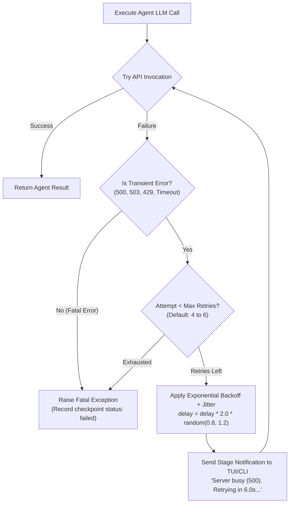
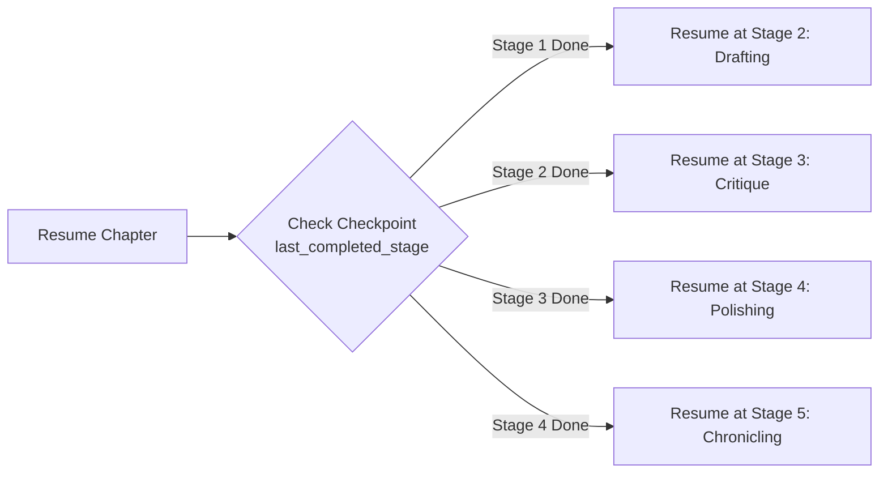

# 🔄 Multi-Agent Workflow & Translation Pipeline

This document explains the document-level, multi-stage translation workflow implemented in **NouSetsu**. Powered by **LangGraph**, the pipeline routes chapter text through five specialized AI agent stages to produce publication-grade novel prose.

---

## 🏛️ Chronological Workflow Sequence

The following sequence diagram illustrates the chronological execution flow from raw input file to final polished Markdown and updated Novel Bible lore:

```mermaid
sequenceDiagram
    autonumber
    actor User as "User / CLI / TUI"
    participant Scanner as "ChapterScanner"
    participant Workflow as "NovelTranslationWorkflow"
    participant Extractor as "Stage 1: EntityExtractor"
    participant Drafter as "Stage 2: ContextAwareDrafter"
    participant Critic as "Stage 3: CritiqueAgent"
    participant Polisher as "Stage 4: PolishingAgent"
    participant Chronicler as "Stage 5: ChroniclerAgent"
    participant Repo as "NovelRepository"

    User->>Scanner: "Scan input folder"
    Scanner->>Repo: "load_all_metadata() (Single I/O Read)"
    Repo-->>Scanner: "ProjectMetadataDocument (.novel/metadata.json)"
    Scanner-->>User: "Discovered ChapterTasks (status, checkpoints)"

    User->>Workflow: "run(initial_state)"
    
    rect rgb(20, 30, 45)
        note over Workflow,Extractor: "Stage 1: Extraction (15%)"
        Workflow->>Extractor: "extract(source_text, novel_bible)"
        Extractor-->>Workflow: "new_characters, new_terms, active_glossary"
    end

    rect rgb(25, 35, 55)
        note over Workflow,Drafter: "Stage 2: Drafting (35%)"
        Workflow->>Drafter: "draft(source_text, bible, characters, glossary, summaries)"
        Drafter-->>Workflow: "draft_text (zero-anaphora resolved)"
    end

    rect rgb(35, 45, 25)
        note over Workflow,Critic: "Stage 3: Critique Audit (60%)"
        Workflow->>Critic: "evaluate(source_text, draft_text, bible)"
        Critic-->>Workflow: "quality_audit (fidelity score, style score, warnings)"
    end

    rect rgb(45, 30, 45)
        note over Workflow,Polisher: "Stage 4: Prose Polishing (80%)"
        Workflow->>Polisher: "polish(draft_text, critique_notes, glossary, bible)"
        Polisher-->>Workflow: "polished_text (cadence refined, translationese removed)"
    end

    rect rgb(45, 40, 20)
        note over Workflow,Chronicler: "Stage 5: Chronicling (95%)"
        Workflow->>Chronicler: "chronicle(chapter_num, polished_text)"
        Chronicler-->>Workflow: "new_chapter_summary (synopsis, events, state changes)"
        Workflow->>Chronicler: "assemble_metadata(...)"
        Chronicler-->>Workflow: "ChapterMetadata with CheckpointData"
    end

    Workflow->>Repo: "update_bible_memory(characters, terms, summary)"
    Repo-->>Repo: "Atomically save .novel/bible/bible.yaml"
    Workflow->>Repo: "save_metadata(metadata, output_file)"
    Repo-->>Repo: "Atomically update .novel/metadata.json"
    Workflow-->>User: "TranslationState (completed, duration, audit)"
```

---

## 🔍 Stage-by-Stage Breakdown

### Stage 1: Entity Extraction (`EntityExtractorAgent`)
* **Source Module**: `src/agents/extractor.py`
* **Purpose**: Prevents character name and terminology inconsistencies *before* translation begins.
* **Operation**:
  1. Inspects raw source text alongside the current **Novel Bible** (`novel_bible.characters` and `novel_bible.glossary`).
  2. Detects previously unseen named entities, magical items, locations, honorific titles, and monster names.
  3. Returns structured JSON containing newly discovered characters, glossary candidates, and active terminology present in this chapter.
* **Checkpoint Optimization**: If `state.extracted_terms` or `state.extracted_characters` already exists from a previous run, this stage skips LLM re-extraction.

---

### Stage 2: Context-Aware Drafting (`ContextAwareDrafterAgent`)
* **Source Module**: `src/agents/drafter.py`
* **Purpose**: Produces an initial faithful, narrative-fluent translation addressing East Asian language challenges.
* **Key Innovations**:
  * **Zero-Anaphora Resolution**: In languages like Japanese, Chinese, and Korean, subjects ("he", "she", "the captain") are routinely omitted. The drafter analyzes character presence and scene context to correctly supply missing subjects without hallucinating actors.
  * **Character Voice Preservation**: Injects active character sheets (`Voice / Tone`, `Gender`, `Role`) into the prompt so dialogue sounds authentic to each speaker.
  * **Rolling Episodic Context**: Injects the synopses of the preceding 3 chapters (`novel_bible.summaries[-3:]`), ensuring the model remembers where the characters currently are and recent plot twists.
  * **Custom Style Rules**: Enforces user-configured POV (first person / third person), narrative tense (past / present), and honorific mode (`retain`, `adapt`, `drop`).

---

### Stage 3: Critique & Quality Audit (`CritiqueAgent`)
* **Source Module**: `src/agents/critic.py`
* **Purpose**: Acts as an independent quality auditor comparing the draft against the original raw source.
* **Audit Dimensions**:
  * **Fidelity Score (0.0 to 10.0)**: Checks for dropped sentences, mistranslated idioms, or hallucinated content.
  * **Style Score (0.0 to 10.0)**: Evaluates prose rhythm, dialogue naturalness, and vocabulary suitability.
  * **Glossary Compliance (%)**: Calculates percentage compliance against canonical glossary targets.
  * **Warnings List**: Flags ambiguous pronouns, unverified terms, or awkward turns of phrase.
* **Output**: Generates a structured `QualityAudit` and actionable critique guidance (`critique_notes`) passed directly to the polisher.

---

### Stage 4: Prose Cadence Polishing (`PolishingAgent`)
* **Source Module**: `src/agents/polisher.py`
* **Purpose**: Elevates the draft into published novel quality.
* **Polishing Objectives**:
  * **Eliminate Translationese**: Removes robotic sentence structures (e.g. overusing "in order to", "it was then that", unnatural passive voice).
  * **Prose Rhythm & Cadence**: Balances varied sentence lengths to match the emotional tempo (punchy in action scenes, lyrical in descriptive scenes).
  * **Critique Remediation**: Specifically rectifies any issues highlighted by the `CritiqueAgent`.
  * **Glossary Preservation**: Ensures stylistic polishing does not accidentally rewrite canonical terminology.

---

### Stage 5: Narrative Lore Chronicling (`ChroniclerAgent`)
* **Source Module**: `src/agents/chronicler.py`
* **Purpose**: Maintains cross-chapter memory so the novel never forgets its history.
* **Responsibilities**:
  * Summarizes the polished chapter into an episodic synopsis.
  * Extracts key narrative milestones and character state changes (e.g. rank promotions, injuries, alliance shifts).
  * Assembles the final `ChapterMetadata` record with word counts, duration stats, and audit scores.
  * Updates `.novel/bible/bible.yaml` and appends to the rolling summaries.

---

## ⚡ Transient Error Resilience & Backoff

Under high loads or when processing complex chapters with deep reasoning models (such as `gemini-2.5-pro` or `gemma-4-31b-it`), upstream APIs can encounter transient errors.

NouSetsu implements an automatic retry mechanism via `invoke_with_retry` in `src/agents/llm.py`:

### Detected Transient Error Indicators
* HTTP `500 INTERNAL` (Google upstream server hiccup)
* HTTP `503 UNAVAILABLE` (temporary server overload)
* HTTP `429` & `RESOURCE_EXHAUSTED` (API rate limit exceeded)
* Socket timeouts and connection resets

### Diagnostic Capture
If retries are exhausted, the runner captures:
* Exact `failed_stage` (e.g. `PipelineStage.POLISHING`)
* Exception class name (`last_error_type`)
* Complete Python traceback (`traceback.format_exc()`)
* Saved into `.novel/metadata.json` for one-click resumption from the TUI.

---

## 🔄 Checkpoint Resumption Flow

Because each stage saves its intermediate output into `TranslationState`, chapters that failed or were cancelled mid-run can be resumed instantly:

No tokens or time are wasted re-running completed stages.
