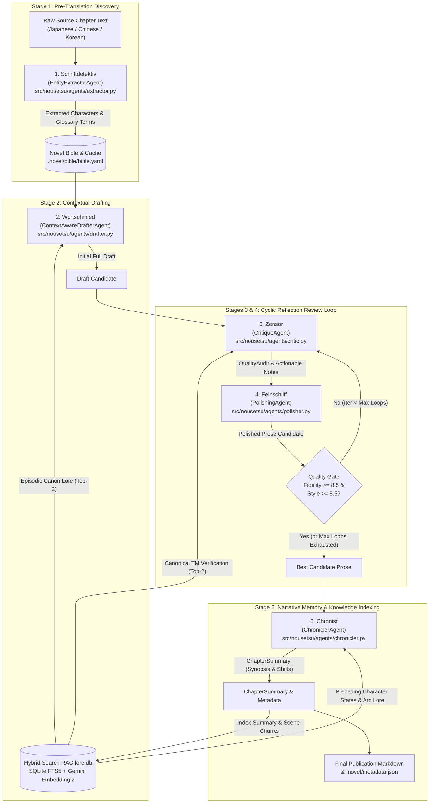

# NouSetsu Agent Architecture & Pipeline Technical Handbook

Welcome to the definitive architectural handbook and technical reference for the **NouSetsu** (`novel_translation_Agent`) multi-agent literary translation pipeline.

This document provides a deep, file-by-file breakdown of each of the five specialized pipeline agents, the orchestration workflow, the LangGraph reflection review cycle, and the supporting hybrid search RAG knowledge engine.

---

## 1. System Topology & Pipeline Overview

NouSetsu models novel translation as an enterprise collaborative publishing house. Rather than relying on naive single-prompt LLM generation or segment-by-segment machine translation, NouSetsu orchestrates five specialized agents within a cyclic **LangGraph** reflection review workflow.



---

## 2. Orchestration Layer: `NovelTranslationWorkflow`

- **Source File**: [`src/nousetsu/graph/workflow.py`](file:///D:/Code/novel_translation_Agent/src/nousetsu/graph/workflow.py)
- **Core Class**: `NovelTranslationWorkflow`
- **State Schema**: [`TranslationState`](file:///D:/Code/novel_translation_Agent/src/nousetsu/models/state.py)

### Workflow Lifecycle & State Transitions
The workflow manages transitions across stages encapsulated by `PipelineStage`:

$$\text{NONE} \longrightarrow \text{EXTRACTION} \longrightarrow \text{DRAFTING} \longrightarrow \text{CRITIQUE} \rightleftharpoons \text{POLISHING} \longrightarrow \text{CHRONICLING} \longrightarrow \text{COMPLETED}$$

If interrupted or encountering unrecoverable errors, state transitions to `PAUSED` or `FAILED`, preserving all `StageArtifacts` to disk for immediate stage-level resumption.

### Reflection Review Loop Rules
1. **Pass 1 Transition**: The raw draft from `Wortschmied` is audited by `Zensor`, which yields a `QualityAudit` and detailed critique notes. `Feinschliff` applies these notes to generate candidate 1.
2. **Pass 2+ Re-Audit**: `Zensor` inspects the polished text directly against the original source text.
3. **Quality Threshold Exit**: The loop exits immediately once both `fidelity_score >= 8.5` and `style_score >= 8.5` are satisfied.
4. **Best-Candidate Regression Guard**: If a subsequent polishing iteration scores lower than an earlier pass, the system automatically retains the highest-scoring candidate (`best_polished_text` and `best_audit`), preventing stylistic degeneration.

---

## 3. Per-File Agent Technical Reference

---

### Agent 1: Schriftdetektiv (Entity Extractor)

- **Source File**: [`src/nousetsu/agents/extractor.py`](file:///D:/Code/novel_translation_Agent/src/nousetsu/agents/extractor.py)
- **Class**: `EntityExtractorAgent`
- **Production Model**: `gemini-3.1-flash-lite` (Fallback: `gemini-3.5-flash-lite`)
- **German Codename**: **Schriftdetektiv** (*The Detective*)

#### Architectural Mission
Analyzes raw chapter text *before translation begins* to detect unknown proper nouns, character names, factions, and cultivation/magic terms not yet cataloged in the Novel Bible.

#### Method Contracts
```python
def extract(
    self,
    source_text: str,
    bible: NovelBible,
    chunks: Optional[List[Any]] = None,
    notify_callback: Optional[Any] = None,
    rate_limiter: Optional[Any] = None,
    stop_event: Optional[Any] = None,
    **kwargs: Any
) -> Tuple[List[CharacterProfile], List[GlossaryItem]]
```

#### Key Technical Mechanisms
1. **Task Framing Safety Defense**: Rather than submitting raw novel text directly, inputs are enveloped in explicit analytical task framing (`"Extract fictional characters, factions, and world terminology from this novel excerpt..."`). This eliminates false-positive commercial AI safety blocks on sensitive scenes.
2. **Semantic Chunked Extraction (`extract_chunked`)**: When chapters exceed the chunk threshold, the text is split into semantic line chunks. Extracted entities from all chunks are deduplicated and merged with existing Novel Bible entries.
3. **Procedural Graph Pruning**: Governed by procedural constraints that prune conversational junk words, everyday greetings, and generic adjectives, preserving only high-density worldbuilding terminology.
4. **Domain Skills**:
   - `entity_disambiguation`: Separates identical names across different clans or contexts.
   - `cultivation_realm_extractor`: Identifies martial stages, mana tiers, and power systems.
   - `relationship_mapper`: Maps family titles and interpersonal connections.

---

### Agent 2: Wortschmied (Context-Aware Drafter)

- **Source File**: [`src/nousetsu/agents/drafter.py`](file:///D:/Code/novel_translation_Agent/src/nousetsu/agents/drafter.py)
- **Class**: `ContextAwareDrafterAgent`
- **Production Model**: `gemini-3.5-flash-lite`
- **German Codename**: **Wortschmied** (*The Wordsmith*)

#### Architectural Mission
Generates the complete initial translation draft in publication-grade literary prose, resolving omitted pronouns (zero-anaphora) and differentiating character voices.

#### Method Contracts
```python
def draft(
    self,
    source_text: str,
    bible: NovelBible,
    active_characters: List[CharacterProfile],
    active_glossary: List[GlossaryItem],
    rolling_summaries: Optional[List[str]] = None,
    genre: Optional[str] = None,
    chunks: Optional[List[Any]] = None,
    rag_results: Optional[List[SearchResult]] = None,
    ...
) -> str
```

#### Key Technical Mechanisms
1. **Zero-Anaphora Resolution**: Analyzes scene context and the active character roster to accurately restore omitted subjects and pronouns in East Asian languages without gender flipping or perspective hallucinations.
2. **RAG Episodic Lore Ingestion**: Ingests up to $k=2$ top-ranked historical lore snippets from the hybrid knowledge store, maintaining cross-chapter continuity for ongoing promises, oaths, and power rankings.
3. **Dual-Resilience AI Safety Bisection**:
   - When encountering commercial AI safety blocks (`prohibited_content` HTTP 400), triggers recursive binary bisection (`bisect_text`) down to $\le 8$ lines or depth 4.
   - Safe portions are translated by the LLM in full literary prose.
   - The minimal sensitive sub-block routes to **Google Translate fallback** (`deep-translator`) followed by literary polishing.
4. **Sliding Context Chunking**: For long chapters, chunks are translated sequentially with running 300-word overlap context to prevent scene boundary discontinuities.

---

### Agent 3: Zensor (Critique Agent)

- **Source File**: [`src/nousetsu/agents/critic.py`](file:///D:/Code/novel_translation_Agent/src/nousetsu/agents/critic.py)
- **Class**: `CritiqueAgent`
- **Production Model**: `gemma-4-26b-a4b-it` (Fallback: `gemini-3.5-flash-lite`)
- **German Codename**: **Zensor** (*The Inspector*)

#### Architectural Mission
Line-by-line quality auditor comparing drafted or polished prose against the original raw source text. Scores fidelity (0–10) and style (0–10), verifies glossary compliance, and catches subtle omissions or voice flattening.

#### Method Contracts
```python
def evaluate(
    self,
    source_text: str,
    draft_text: str,
    bible: NovelBible,
    active_characters: List[CharacterProfile],
    active_glossary: List[GlossaryItem],
    genre: Optional[str] = None,
    chunks: Optional[List[Any]] = None,
    rag_context: Optional[List[SearchResult]] = None,
    ...
) -> Tuple[QualityAudit, str]
```

#### Key Technical Mechanisms
1. **Paired Line-Semantic Chunking (`_build_paired_chunks`)**: Aligns source lines and draft lines into synchronized semantic chunk pairs, enabling parallel auditing of long chapters without context truncation.
2. **Canonical Translation Memory (TM) Verification**: On Pass 1, retrieves canonical translation snippets from RAG ($k=2$) to verify that character dialogue registers and recurring terms match earlier published volumes. Re-uses cached state on Pass 2+.
3. **Programmatic Language Regression Guard**: If the draft text reverts to the source language, the audit automatically fails (`fidelity = 1.0`, `style = 1.0`), forcing a clean regeneration.
4. **Programmatic Glossary Verification**: Scans draft text to ensure every source-present glossary term appears in canonical form.
5. **Domain Skills**:
   - `omission_detector`: Flags skipped subordinate clauses, descriptive beats, or internal monologues.
   - `nickname_disparity_auditor`: Catches unprompted name-to-nickname substitutions or intimacy flattening.
   - `hallucination_guard`: Identifies fabricated actions or swapped speaker dialogue.

---

### Agent 4: Feinschliff (Polishing Agent)

- **Source File**: [`src/nousetsu/agents/polisher.py`](file:///D:/Code/novel_translation_Agent/src/nousetsu/agents/polisher.py)
- **Class**: `PolishingAgent`
- **Production Model**: `gemini-3.5-flash-lite`
- **German Codename**: **Feinschliff** (*The Stylist*)

#### Architectural Mission
Transforms drafted prose into publication-grade English literature based on the critique editor's notes, eliminating machine translation tropes while preserving precise terminology.

#### Method Contracts
```python
def polish(
    self,
    draft_text: str,
    critique_notes: str,
    active_glossary: List[GlossaryItem],
    bible: NovelBible,
    source_text: Optional[str] = None,
    genre: Optional[str] = None,
    chunks: Optional[List[Any]] = None,
    ...
) -> str
```

#### Key Technical Mechanisms
1. **Translationese Purging**: Systematically detects and removes mechanical translation artifacts:
   - *"Couldn't help but..."* $\to$ Direct physical or emotional action.
   - *"As expected of..."* $\to$ Natural dialogue praise or admiration.
   - Stiff passive voice constructions $\to$ Active, visceral prose verbs.
2. **Source Text Nuance Disambiguation**: Receives the original source text as a read-only reference to clarify ambiguous phrasing or emotional subtext without re-translating from scratch.
3. **Cadence & Sensory Enhancement**: Enhances sentence variety (alternating short impactful beats with flowing compound descriptions) and optimizes dialogue pacing.
4. **Domain Skills**:
   - `translationese_filter`: Eliminates literal idiom calques and clunky phrasing.
   - `prose_cadence_enhancer`: Balances rhythm, clause length, and emotional resonance.
   - `show_dont_tell`: Replaces dry summary narration with sensory details.

---

### Agent 5: Chronist (Chronicler Agent)

- **Source File**: [`src/nousetsu/agents/chronicler.py`](file:///D:/Code/novel_translation_Agent/src/nousetsu/agents/chronicler.py)
- **Class**: `ChroniclerAgent`
- **Production Model**: `gemma-4-26b-a4b-it` (Fallback: `gemini-3.5-flash-lite`)
- **German Codename**: **Chronist** (*The Memory Keeper*)

#### Architectural Mission
Synthesizes chapter plot progression into 3-tier narrative memory, detects story arc boundaries, tracks character status shifts, and compiles metadata audit records.

#### Method Contracts
```python
def chronicle(
    self,
    chapter_num: int,
    chapter_title: str,
    translated_text: str,
    genre: Optional[str] = None,
    source_lang: Optional[str] = None,
    bible: Optional[NovelBible] = None,
    rag_context: Optional[List[SearchResult]] = None,
    ...
) -> ChapterSummary

def assemble_metadata(...) -> ChapterMetadata
```

#### Key Technical Mechanisms
1. **3-Tier Narrative Memory Synthesis**:
   - **Micro (`ChapterSummary`)**: Synopsis, key plot points, and character state changes (injuries, deaths, breakthroughs, item acquisitions).
   - **Meso (`ArcSummary`)**: Detects arc boundaries, tracks core conflict milestones, and triggers arc completion archiving.
   - **Macro (`whole_story_summary`)**: Overarching synthesis of the entire novel so far.
2. **Bi-Directional RAG Integration**:
   - **Inbound**: Retrieves preceding character conditions and active arc milestones ($k=3$) prior to summarization, allowing `continuity_auditor` to cross-examine lingering injuries or recovered abilities.
   - **Outbound**: Automatically converts the generated `ChapterSummary` and 20-line translated scene chunks into `LoreDocument`s, generates dense embeddings with Gemini Embedding 2, and upserts them into `lore.db` and SQLite FTS5.
3. **Metadata & Token Metrics Compilation**: Assembles granular token telemetry (`prompt_tokens`, `completion_tokens`, `thought_tokens`, `cached_tokens`, `duration_seconds`) into unified `.novel/metadata.json`.

---

## 4. Supporting Infrastructure & Utility Subsystems

### 1. Hybrid Search RAG Knowledge Engine
- **Engine**: [`src/nousetsu/rag/engine.py`](file:///D:/Code/novel_translation_Agent/src/nousetsu/rag/engine.py) (`HybridSearchEngine`)
- **ORM Models**: [`src/nousetsu/rag/db_models.py`](file:///D:/Code/novel_translation_Agent/src/nousetsu/rag/db_models.py) (`LoreDocumentORM` via SQLAlchemy 2.0)
- **Embeddings**: [`src/nousetsu/rag/embeddings.py`](file:///D:/Code/novel_translation_Agent/src/nousetsu/rag/embeddings.py) (`models/gemini-embedding-2`, 3072 dimensions)
- **Reranker**: [`src/nousetsu/rag/reranker.py`](file:///D:/Code/novel_translation_Agent/src/nousetsu/rag/reranker.py) (`LLMCrossEncoderReranker`)
- **Storage**: Zero-daemon, local SQLite database (`.novel/rag/lore.db`) featuring binary vector storage and native SQLite FTS5 virtual tables (`lore_fts`) with BM25 ranking fused via Reciprocal Rank Fusion (RRF, $k=60$).

### 2. Sliding Window Rate Limiter
- **Source File**: [`src/nousetsu/utils/rate_limiter.py`](file:///D:/Code/novel_translation_Agent/src/nousetsu/utils/rate_limiter.py)
- Enforces strict rolling 60-second quotas: **32,000 Tokens Per Minute (TPM)** and **60 Requests Per Minute (RPM)**.
- Offline token estimator evaluates CJK ideographs (1.3x ratio) and Latin words (1.4x ratio) in $<1\text{ms}$.
- Automatically calculates millisecond sleep delays to rollover quota windows smoothly without triggering HTTP 429 exceptions.

### 3. Line-Semantic Chunker
- **Source File**: [`src/nousetsu/utils/chunker.py`](file:///D:/Code/novel_translation_Agent/src/nousetsu/utils/chunker.py)
- Evaluates line density (default threshold: 85 lines).
- Partitions text into ~70-line semantic chunks with 3-line overlaps at natural paragraph boundaries.
- Enables Drafter, Critic, and Polisher to process long chapters without exceeding token limits or triggering context degradation.

---

## 5. Summary Matrix of Pipeline Agents

| Stage | German Codename | Class Name | Production Model | Fallback Model | RAG Interaction | Primary Output |
|:---:|:---|:---|:---|:---|:---:|:---|
| **1** | **Schriftdetektiv** | `EntityExtractorAgent` | `gemini-3.1-flash-lite` | `gemini-3.5-flash-lite` | Feeds Bible Terms | `List[CharacterProfile]`, `List[GlossaryItem]` |
| **2** | **Wortschmied** | `ContextAwareDrafterAgent` | `gemini-3.5-flash-lite` | `gemini-3.5-flash-lite` | Inbound ($k=2$) | Full initial `draft_text` |
| **3** | **Zensor** | `CritiqueAgent` | `gemma-4-26b-a4b-it` | `gemini-3.5-flash-lite` | Inbound TM ($k=2$) | `QualityAudit` + `critique_notes` |
| **4** | **Feinschliff** | `PolishingAgent` | `gemini-3.5-flash-lite` | `gemini-3.5-flash-lite` | Indirect via Notes | Publication-grade `polished_text` |
| **5** | **Chronist** | `ChroniclerAgent` | `gemma-4-26b-a4b-it` | `gemini-3.5-flash-lite` | Bi-directional (Read $k=3$ / Write) | `ChapterSummary` + `ChapterMetadata` |
