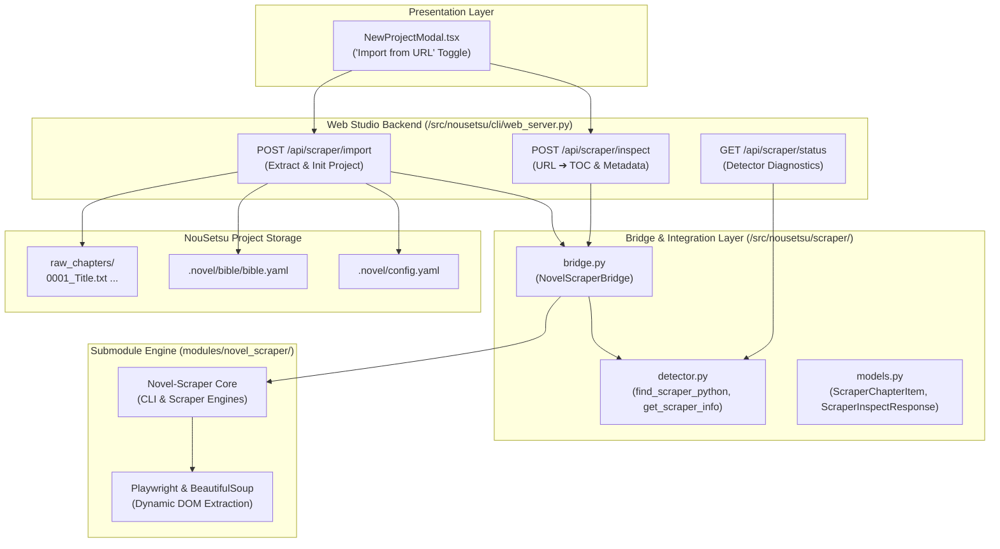

# 🌐 Automated Web Novel Scraper Integration Guide

> **Architecture, Submodule Setup, and Web Studio Ingestion for Online Fiction**  
> Powered by `Novel-Scraper`, [`NovelScraperBridge`](file:///D:/Code/novel_translation_Agent/src/nousetsu/scraper/bridge.py), and React 19 Web Studio.

---

## 📑 Table of Contents

1. [Executive Overview](#-1-executive-overview)
2. [Supported Webnovel Platforms](#-2-supported-webnovel-platforms)
3. [Architecture & Submodule Integration](#-3-architecture--submodule-integration)
4. [Python Environment & Auto-Detection](#-4-python-environment--auto-detection)
5. [Title Romanization & Slug Normalization](#-5-title-romanization--slug-normalization)
6. [Web Studio Ingestion Workflow](#-6-web-studio-ingestion-workflow)
7. [REST API Specifications](#-7-rest-api-specifications)
8. [Headless CLI & Scripting Usage](#-8-headless-cli--scripting-usage)
9. [Troubleshooting & FAQs](#-9-troubleshooting--faqs)

---

## 🌟 1. Executive Overview

Translating online serial web novels often requires tedious manual extraction: copying chapter HTML, cleaning up navigation links and author footnotes, reformatting dialogue, and organizing files into clean numbering sequences.

NouSetsu integrates an automated, headless scraping subsystem powered by **`Novel-Scraper`** (embedded as a Git submodule in `modules/novel_scraper`). Through [`NovelScraperBridge`](file:///D:/Code/novel_translation_Agent/src/nousetsu/scraper/bridge.py), NouSetsu enables:
* **Zero-Touch Table of Contents (TOC) Discovery**: Instantly fetches novel metadata, total available chapters, titles, and publication dates directly from novel landing page URLs.
* **Granular Chapter Range Extraction**: Ingest specific volume slices (e.g. chapters `1` to `50`) without downloading the entire multi-hundred chapter backlog.
* **Automatic Title Romanization**: Converts East Asian novel titles (Japanese Kanji/Kana, Chinese, Korean) into clean filesystem directory slugs (e.g. `douyara-tensei...`).
* **Seamless Project Pipeline Setup**: Automatically initializes the target novel project, creates `raw_chapters/` or volume subfolders (e.g. `raw_chapters/0001_Chapter 1.txt`), and generates the initial **Novel Bible** (`bible.yaml`) in a single click.

---

## 🌐 2. Supported Webnovel Platforms

The underlying scraper engine supports major East Asian web novel publishing portals:

| Platform | Domain | Primary Language | Features & Notes |
| :--- | :--- | :---: | :--- |
| **Shousetsuka ni Narou (小説家になろう)** | `ncode.syosetu.com` | Japanese | Full TOC parsing, episode extraction, author notes cleanup. |
| **Kakuyomu (カクヨム)** | `kakuyomu.jp` | Japanese | Episode parsing, volume division preservation. |
| **Hameln (ハーメルン)** | `syosetu.org` | Japanese | Fanfiction & original webnovels, episode extraction. |
| **Pixiv Novels (ピクシブ文芸)** | `pixiv.net` | Japanese | Series and standalone novel extraction (requires cookies if private). |
| **Alphapolis (アルファポリス)** | `alphapolis.co.jp` | Japanese | Rental/free episode parsing. |
| **General Webnovel Sites** | *Various* | ZH / KO / EN | Extensible scrapers via modular scrapers catalog. |

---

## 🏛️ 3. Architecture & Submodule Integration



### Component Breakdown
* [`src/nousetsu/scraper/detector.py`](file:///D:/Code/novel_translation_Agent/src/nousetsu/scraper/detector.py): Auto-discovers the `modules/novel_scraper` directory across standard repository paths and resolves a working Python interpreter equipped with the scraper's dependencies.
* [`src/nousetsu/scraper/bridge.py`](file:///D:/Code/novel_translation_Agent/src/nousetsu/scraper/bridge.py): Spawns headless sub-processes to execute scraper commands, parses JSON output streams, handles error recovery, and converts East Asian titles into filesystem-safe slugs.
* [`src/nousetsu/scraper/models.py`](file:///D:/Code/novel_translation_Agent/src/nousetsu/scraper/models.py): Strongly-typed Pydantic schemas validating inspect requests, TOC chapter items, and extraction jobs.

---

## 🐍 4. Python Environment & Auto-Detection

The scraper bridge automatically locates a valid Python execution environment using a 4-tier cascade in [`find_scraper_python`](file:///D:/Code/novel_translation_Agent/src/nousetsu/scraper/detector.py):

1. **Submodule Dedicated Virtualenv**: Checks `modules/novel_scraper/.venv/Scripts/python.exe` (Windows) or `modules/novel_scraper/.venv/bin/python` (Unix).
2. **Main Application Virtualenv**: Checks `.venv/Scripts/python.exe` at the NouSetsu root directory.
3. **Active Running Interpreter**: Uses `sys.executable` (the currently executing Python process).
4. **System Path Fallback**: Resolves `python` or `python3` from the system `PATH`.

### Submodule Initialization
When cloning NouSetsu for the first time, initialize the submodule:
```bash
git submodule update --init --recursive
```

If the scraper submodule uses standalone dependencies, you can install them in the main virtual environment:
```bash
uv pip install -e modules/novel_scraper
# Or install required browser binaries if needed:
playwright install chromium
```

---

## 🔤 5. Title Romanization & Slug Normalization

Web novel titles frequently contain Kanji, Katakana, Hangul, or special punctuation that can cause encoding or path length issues across different operating systems.

The scraper bridge automatically converts original East Asian titles into clean project directory slugs:
* **Japanese**: Uses `pykakasi` (when installed) or ASCII character transliteration (e.g. `どうやら異世界に転生したらしい` $\to$ `douyara-isekai-ni-tensei-shitarashii`).
* **Chinese**: Uses `pypinyin` or unicode decomposition.
* **Korean**: Uses `korean-romanizer` or syllable decomposition.
* **Path Sanitization**: Strips invalid filesystem characters (`:`, `?`, `*`, `"`, `<`, `>`, `|`, `/`, `\`), collapses whitespace into hyphens (`-`), and enforces a 64-character limit to avoid Windows `MAX_PATH` collisions.

---

## 🎨 6. Web Studio Ingestion Workflow

The React 19 Web Studio (`nousetsu web`) provides a graphical setup flow in the **New Project Modal** (`NewProjectModal.tsx`):

```text
┌─ Create New Novel Project ──────────────────────────────────────┐
│                                                                 │
│  Project Mode: [ Manual Local ]  [● Import from Web URL ]       │
│                                                                 │
│  Novel URL: [ https://ncode.syosetu.com/n1234xx/        ] [🔍]  │
│                                                                 │
│  📖 Title:    どうやら転生した悪役令嬢のようです                  │
│  ✍️ Author:   Author Name                                       │
│  📑 Chapters: 142 chapters found                                │
│                                                                 │
│  Import Range: [ 1 ] to [ 50 ]  (Volume 1 Slice)                │
│  Project Slug: [ douyara-tensei-akuyaku-reijou         ]        │
│  Source Lang:  [ Japanese   ▼ ]    Target Lang: [ English   ▼ ] │
│  Genre:        [ Isekai     ▼ ]                                 │
│                                                                 │
│  [ Cancel ]                                  [ ⚡ Import Novel ] │
└─────────────────────────────────────────────────────────────────┘
```

### Steps to Ingest a Novel:
1. Open the Web Studio in your browser (`http://localhost:5173`) and click **`+ New Project`**.
2. Select the **Import from Web URL** tab.
3. Paste the webnovel series landing page URL and click the **Inspect (🔍)** button.
4. The backend calls `POST /api/scraper/inspect`, returning the book title, author, description, and TOC list.
5. Specify the **Chapter Range** (e.g. `1` to `50` for Volume 1, or `1` to all).
6. Click **`⚡ Import Novel`**. The backend will:
   - Scrape the selected chapter text and clean HTML tags.
   - Format chapters into `raw_chapters/{index:04d}_{title}.txt`.
   - Initialize `.novel/config.yaml` with title, languages, and genre.
   - Initialize `.novel/bible/bible.yaml` with initial series metadata.
   - Automatically switch Web Studio to the newly created project!

---

## 🔌 7. REST API Specifications

The Web Studio backend (`src/nousetsu/cli/web_server.py`) exposes three dedicated scraper endpoints:

### 1. `GET /api/scraper/status`
Queries the availability and configuration of the scraper engine.

**Response**:
```json
{
  "available": true,
  "scraper_dir": "D:/Code/novel_translation_Agent/modules/novel_scraper",
  "python_executable": "D:/Code/novel_translation_Agent/.venv/Scripts/python.exe",
  "supported_domains": ["ncode.syosetu.com", "kakuyomu.jp", "syosetu.org"]
}
```

---

### 2. `POST /api/scraper/inspect`
Inspects a web novel landing page and returns the parsed table of contents.

**Request Body**:
```json
{
  "url": "https://ncode.syosetu.com/n1234xx/"
}
```

**Response**:
```json
{
  "title": "どうやら異世界に転生したらしい",
  "author": "田中太郎",
  "description": "トラックに轢かれた主人公が...",
  "suggested_slug": "douyara-isekai-ni-tensei-shitarashii",
  "source_language": "Japanese",
  "total_chapters": 120,
  "chapters": [
    {
      "index": 1,
      "title": "プロローグ：終わりの始まり",
      "url": "https://ncode.syosetu.com/n1234xx/1/"
    },
    {
      "index": 2,
      "title": "第１話：目覚めと違和感",
      "url": "https://ncode.syosetu.com/n1234xx/2/"
    }
  ]
}
```

---

### 3. `POST /api/scraper/import`
Executes asynchronous batch extraction and creates the project.

**Request Body**:
```json
{
  "url": "https://ncode.syosetu.com/n1234xx/",
  "project_name": "douyara-isekai",
  "title": "どうやら異世界に転生したらしい",
  "start_chapter": 1,
  "end_chapter": 50,
  "source_lang": "Japanese",
  "target_lang": "English",
  "genre": "isekai"
}
```

**Response**:
```json
{
  "status": "success",
  "project_dir": "D:/Code/novel_translation_Agent/projects/douyara-isekai",
  "chapters_extracted": 50,
  "first_chapter": "0001_プロローグ：終わりの始まり.txt",
  "last_chapter": "0050_第４９話：決戦前夜.txt"
}
```

---

## 💻 8. Headless CLI & Scripting Usage

You can also use [`NovelScraperBridge`](file:///D:/Code/novel_translation_Agent/src/nousetsu/scraper/bridge.py) programmatically in custom automation scripts:

```python
from nousetsu.scraper.bridge import NovelScraperBridge

bridge = NovelScraperBridge()

# 1. Check readiness
info = bridge.get_info()
print(f"Scraper ready: {info.available} using {info.python_executable}")

# 2. Inspect TOC
toc = bridge.inspect_url("https://ncode.syosetu.com/n1234xx/")
print(f"Found {len(toc.chapters)} chapters for '{toc.title}' by {toc.author}")

# 3. Extract range into directory
output_dir = "raw_chapters/Vol_01"
result = bridge.extract_chapters(
    url="https://ncode.syosetu.com/n1234xx/",
    output_dir=output_dir,
    start_chapter=1,
    end_chapter=25,
)
print(f"Extracted {result.chapters_extracted} chapters into {output_dir}")
```

---

## ❓ 9. Troubleshooting & FAQs

### Q1: The scraper status says `available: false`.
* Ensure the submodule is checked out:
  ```bash
  git submodule update --init --recursive
  ```
* Verify that the directory `modules/novel_scraper` contains `scraper` or `novel_scraper` python source files.

### Q2: Scraping Kakuyomu or Cloudflare-protected sites times out.
* Some sites require Playwright headless browser rendering to pass anti-bot JavaScript challenges. Ensure browser binaries are installed:
  ```bash
  playwright install chromium
  ```
* If running behind a corporate proxy, set the standard `HTTP_PROXY` and `HTTPS_PROXY` environment variables before launching NouSetsu.

### Q3: Romanized slug is just "novel-project" instead of the romaji title.
* Install `pykakasi` (for Japanese) or `pypinyin` (for Chinese) into your virtual environment:
  ```bash
  uv pip install pykakasi pypinyin
  ```
* If these optional libraries are absent, the bridge falls back to safe transliteration or standard default slugs.
