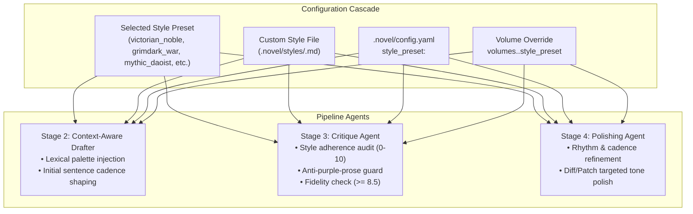

# Feature Proposal: Literary Style Transfer & Tone Presets

**Status**: Proposed / Design Specification  
**Target Version**: NouSetsu v0.6.0+  
**Component**: Core Pipeline (`Drafter`, `Polisher`, `Critic`), Skills Engine, Project Configuration, Web Studio  

---

## 1. Executive Summary

Standard machine translation and generic large language model (LLM) translations inevitably gravitate toward **homogenized prose**: flat sentence structures, overused clichés, and an identical neutral tone regardless of genre. A gritty post-apocalyptic mercenary novel ends up reading with the exact same voice and cadence as an aristocratic Regency villainess drama or a Daoist cultivation epic.

The **Literary Style Transfer & Tone Presets** system equips NouSetsu with modular, switchable stylistic voices. It allows translators and readers to select a predefined literary tone (e.g. *Victorian Noble Intrigue*, *Grimdark Pulp*, *Mythic Xianxia*, *Snappy Modern LN*, *Technical LitRPG*) or define custom style files, steering the narrative voice, vocabulary palette, and sentence cadence without compromising source fidelity or character registers.

---

## 2. System Architecture & Multi-Agent Flow



### The Four Stylistic Levers

1. **Lexical Palette (Vocabulary)**:
   - Dictates choice of nouns, adjectives, and descriptive imagery.
   - *Example*: Archaic formal terms for noble court intrigue vs visceral, physical, grounded terms for grimdark war.
2. **Syntactic Cadence (Rhythm & Sentence Length)**:
   - Dictates sentence structure, parataxis vs hypotaxis, and punctuation flow.
   - *Example*: Short, staccato clauses for punchy combat vs sweeping, balanced periodic sentences for royal contemplation.
3. **Narrative Distance & Interiority**:
   - Dictates closeness of perspective: intimate third-person free indirect discourse vs omniscient mythical chronicler.
4. **Dialogue Vernacular & Idiom Localization**:
   - Shapes how idioms and vernacular are localized into English while preserving the underlying character speech registers defined in the Novel Bible.

---

## 3. Built-In Tone Presets

### A. 👑 Victorian Noble Intrigue / Regency Romance (`victorian_noble`)
- **Primary Genres**: Villainess, Otome Isekai, Royal Court Intrigue, Historical Fantasy.
- **Inspirations**: Jane Austen, Emily Brontë, classic aristocratic court drama.
- **Prose Characteristics**: Elegant, restrained, emotionally nuanced, rich in social formality and veiled subtext.
- **Sample Translation**:
  > *"With fingers coiled around cold steel, he lingered upon the threshold of the grand ballroom. Behind those gilded doors drank the very men whose treachery had undone his house; tonight, courtly decorum would yield to reckoning."*

### B. ⚔️ Grimdark / Hardboiled Pulp (`grimdark_war`)
- **Primary Genres**: Dark Fantasy, Survival, Mercenary War, Post-Apocalyptic, Cyberpunk.
- **Inspirations**: Joe Abercrombie, Glen Cook (*The Black Company*), Raymond Chandler.
- **Prose Characteristics**: Visceral, cynical, grounded, short sharp sentences, heavy sensory focus on mud, iron, grease, and sweat.
- **Sample Translation**:
  > *"His grip bit into the notched hilt. Beyond the oak doors, laughter and spiced wine. Traitors, the lot of them. He drew breath through clenched teeth and kicked the door open."*

### C. 📜 Mythic Xianxia / Grand Daoist Mythos (`mythic_daoist`)
- **Primary Genres**: Cultivation, Wuxia, Eastern Xuanhuan, High Ancient Myth.
- **Inspirations**: Classic Chinese vernacular epics, mythological grand prose.
- **Prose Characteristics**: Grandiose, philosophical, cosmological balance, evocative poetic parallelism.
- **Sample Translation**:
  > *"Sword light pooled like frost beneath his palm. Beyond the vermilion gates, the scheming elders toasted their petty ambitions under heaven's indifferent gaze. The karmic debt of a fallen clan was due; and steel would be the scribe."*

### D. ⚡ Snappy Modern Light Novel (`snappy_modern_ln`)
- **Primary Genres**: Modern Urban Fantasy, Rom-Com, Isekai Comedy, Slice-of-Life.
- **Inspirations**: Modern Dengeki Bunko light novels, dynamic web serials.
- **Prose Characteristics**: High energy, snappy comedic timing, natural conversational English dialogue, vivid pop immersion.
- **Sample Translation**:
  > *"Sword in hand, I took a stand right outside the ballroom doors. The snakes inside were still partying like they hadn't stabbed my family in the back. Time to crash the party."*

### E. 🖥️ Technical LitRPG / System Apocalypse (`technical_litrpg`)
- **Primary Genres**: LitRPG, Progression Fantasy, Dungeon Crawlers, Solo Leveling tropes.
- **Inspirations**: *Dungeon Crawler Carl*, *Cradle*, Korean regression / hunter webnovels.
- **Prose Characteristics**: Tactical, precise spatial awareness, clean HUD/stat framing, visceral mechanical progression.
- **Sample Translation**:
  > *"Blade drawn, he held his position at the banquet threshold. Target markers pulsed crimson in his peripheral vision—seven high-tier conspirators within aggro range. He checked his stamina gauge and initiated combat."*

---

## 4. Configuration & Storage Schema

### Project Configuration ([`.novel/config.yaml`](file:///D:/Code/novel_translation_Agent/.novel/config.yaml))
```yaml
title: "The Remarried Empress"
genre: "romance"
style_preset: "victorian_noble"  # Default series preset

# Per-volume or arc overrides
volumes:
  "Volume_01":
    style_preset: "victorian_noble"
  "Volume_03_War_Arc":
    style_preset: "grimdark_war"   # Flips tone during war campaign
```

### Custom Style Files ([`.novel/styles/<name>.md`](file:///D:/Code/novel_translation_Agent/.novel/styles/))
Users can define project-specific or custom styles using simple Markdown files with YAML frontmatter:

```markdown
---
name: gothic_melancholy
title: Gothic Melancholy
description: Dark, atmospheric prose evoking Victorian ghost stories and Poe.
target_agents: ["drafter", "polisher", "critic"]
priority: 95
---

### Lexical Directives:
- Favor shadowy, sensory atmospheric terms (dusk, spectral, pallor, clockwork, hollow).
- Avoid cheerful colloquialisms or modern slang.

### Cadence & Syntax:
- Employ periodic sentences where emotional impact resolves at the end of the clause.
- Balance contemplative descriptions with sudden, haunting dialogue.
```

---

## 5. Quality Safeguards: Anti-"Purple Prose" & Fidelity Gating

Style transfer must never corrupt core literary meaning or introduce AI hallucinations. NouSetsu enforces strict safeguards:

1. **Fidelity Score Gate ($\ge 8.5/10$)**:
   - `CritiqueAgent` independently evaluates factual correspondence between raw source text and stylized draft.
   - If style embellishment omits key details or invents ungrounded imagery, `fidelity_score` drops below 8.5, forcing a corrective reflection loop.
2. **Style Adherence vs. Natural Readability**:
   - `CritiqueAgent` audits against adjective stuffing and excessive ornamentation. If a sentence becomes convoluted, the critic marks it for simplification in Stage 4 (`PolishingAgent`).
3. **Character Register Immunity**:
   - Style presets govern **narrative exposition**. Character spoken dialogue registers defined in `NovelBible.characters` retain absolute precedence. A vulgar bandit will still speak coarsely even under the *Victorian Noble* preset!

---

## 6. Implementation Roadmap

1. **Data Model**:
   - Add `style_preset: Optional[str]` to `ProjectConfig` and `volume_configs`.
   - Add `StylePresetDefinition` Pydantic model with catalog loader.
2. **Prompt Templates**:
   - Add `{style_directives}` slot into Drafter, Critic, and Polisher system prompts.
3. **Skill Engine Integration**:
   - Map built-in style presets as first-class domain skills in `src/nousetsu/skills/catalog/`.
4. **Web Studio & Settings UI**:
   - Add **Literary Tone Preset** selector dropdown in Novel Settings with live preview snippets.
   - Add custom style editor in Web Studio.
5. **Automated Test Suite**:
   - Test style loading, volume override cascade, and fidelity enforcement under heavy style presets.
